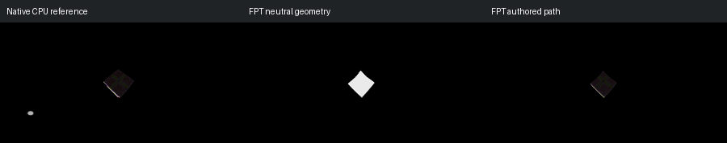

# 568: box-deuce-deuce

[Reviewed gallery](README.md) | [Needs-work audit](needs-work.md) | [Full catalogue](../mandel-catalog/README.md)

**needs-work**. Both native and FPT beauty images show only a tiny dark central object, so the historical darkness warning is not by itself proof of an FPT regression. FPT also lacks the small native white source at the left. Authored framing gives too little readable structure for gallery acceptance; do not claim a confirmed geometry failure.

FPT: 300x150, 32 SPP; FPT scene/config default; metadata records effective configuration.
Native CPU: authored sampling/lighting, not an identical integrator. Neutral FPT uses a white geometry control, not matched authored lighting.

Capture: **captured-2026-09-13**, renderer revision `1752a41553338cd1cbe02c2ebcc53c417b943c51`.
Renderer SHA256: `698f2967631d743065e1b9101921a52f70e954560ef0aecb6a88b5e17ec294e1`.

Review: 2026-09-13, Codex visual comparison of native CPU, neutral FPT and authored FPT captures. Geometry: uncertain; illumination: needs-work.

[Upstream scene](https://github.com/buddhi1980/mandelbulber2/blob/230456cee40968cbaa7f301bba91daa4865a29db/mandelbulber2/deploy/share/mandelbulber2/examples/Robert%20Pancoast%20collection%20-%20license%20Creative%20Commons%20%28CC-BY%204.0%29/box-deuce-deuce.fract) | Collection credit: Robert Pancoast collection - license Creative Commons (CC-BY 4.0)
Source SHA256: `dd066c35cd74f51dbf1b4630e6188ddd603812731a057d91d7295316f1c65338`.

This acceptance applies to these captures. It is not exact native parity or NAADF/CVOX certification. Colours, skies and unsupported volumes may differ. No new timing claim.

[Source/capture evidence](../mandel-catalog/review-evidence.json) | [Explicit decisions](../mandel-catalog/reviews.json)
