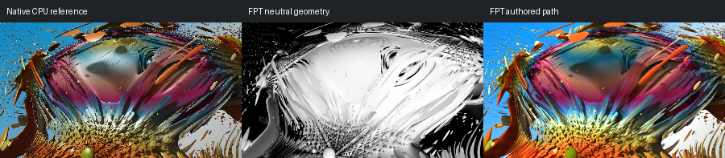

# 570: coastalbrot_smilin

[Reviewed gallery](README.md) | [Needs-work audit](needs-work.md) | [Full catalogue](../mandel-catalog/README.md)

**accepted-with-limitations**. Bowl-like structure, large openings and framing align. Reflections, brightness and fine edge detail differ.

FPT: 300x169, 32 SPP; FPT scene/config default; metadata records effective configuration.
Native CPU: authored sampling/lighting, not an identical integrator. Neutral FPT uses a white geometry control, not matched authored lighting.

Capture: **historical-2026-09-10**, renderer revision `029c3bc9faff9f8c15ad0b39d20b3ebcdced92ab`.
Renderer SHA256: `cf8b020ae682eef515020dc2dfda3178f963b1e12b39f1df2cec4169aa53cbcb`.

Review: 2026-09-11, Codex visual comparison of reference/neutral/authored sheets; colour differences allowed by user. Geometry: acceptable; illumination: acceptable.

[Upstream scene](https://github.com/buddhi1980/mandelbulber2/blob/230456cee40968cbaa7f301bba91daa4865a29db/mandelbulber2/deploy/share/mandelbulber2/examples/Robert%20Pancoast%20collection%20-%20license%20Creative%20Commons%20%28CC-BY%204.0%29/coastalbrot_smilin.fract) | Collection credit: Robert Pancoast collection - license Creative Commons (CC-BY 4.0)
Source SHA256: `4228a08591dc75c0795330fadf127c166380928757a1bb56e56535834ff206b8`.

This acceptance applies to these captures. It is not exact native parity or NAADF/CVOX certification. Colours, skies and unsupported volumes may differ. No new timing claim.

[Source/capture evidence](../mandel-catalog/review-evidence.json) | [Explicit decisions](../mandel-catalog/reviews.json)
