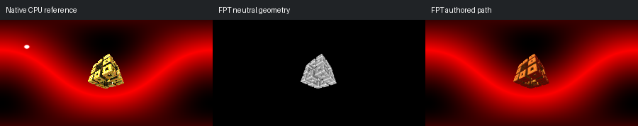

# 582: menger-coastn

[Reviewed gallery](README.md) | [Needs-work audit](needs-work.md) | [Full catalogue](../mandel-catalog/README.md)

**accepted-with-limitations**. The small perforated gold structure, camera framing and broad red environment band align. FPT is darker/oranger and omits the small native white source at the upper left. Acceptance covers the readable central object at authored scale, not source-disc or exact lighting parity; the dark neutral screen mostly reflects the small object coverage.

FPT: 300x150, 32 SPP; FPT scene/config default; metadata records effective configuration.
Native CPU: authored sampling/lighting, not an identical integrator. Neutral FPT uses a white geometry control, not matched authored lighting.

Capture: **captured-2026-09-13**, renderer revision `1752a41553338cd1cbe02c2ebcc53c417b943c51`.
Renderer SHA256: `698f2967631d743065e1b9101921a52f70e954560ef0aecb6a88b5e17ec294e1`.

Review: 2026-09-13, Codex visual comparison of native CPU, neutral FPT and authored FPT captures. Geometry: acceptable; illumination: acceptable.

[Upstream scene](https://github.com/buddhi1980/mandelbulber2/blob/230456cee40968cbaa7f301bba91daa4865a29db/mandelbulber2/deploy/share/mandelbulber2/examples/Robert%20Pancoast%20collection%20-%20license%20Creative%20Commons%20%28CC-BY%204.0%29/menger-coastn.fract) | Collection credit: Robert Pancoast collection - license Creative Commons (CC-BY 4.0)
Source SHA256: `5897c68149c88517054f0ae4109d42563b3a02cb277ea8558bc12af5c46e1e35`.

This acceptance applies to these captures. It is not exact native parity or NAADF/CVOX certification. Colours, skies and unsupported volumes may differ. No new timing claim.

[Source/capture evidence](../mandel-catalog/review-evidence.json) | [Explicit decisions](../mandel-catalog/reviews.json)
