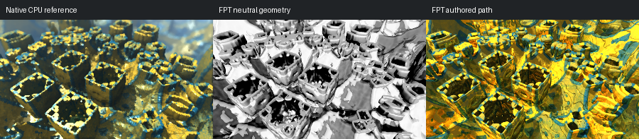

# 662: mandelbox002

[Reviewed gallery](README.md) | [Needs-work audit](needs-work.md) | [Full catalogue](../mandel-catalog/README.md)

**accepted-with-limitations**. The hollow square towers, large foreground openings and central angled structure correspond. FPT is sharper and more reflective, with stronger gold saturation and darker cavities; native depth blur and blue atmospheric softness are not matched. The main forms remain readable. Fine-detail and exact authored-appearance parity are not certified.

FPT: 300x169, 32 SPP; FPT scene/config default; metadata records effective configuration.
Native CPU: authored sampling/lighting, not an identical integrator. Neutral FPT uses a white geometry control, not matched authored lighting.

Capture: **refreshed-2026-09-14-confirmation**, renderer revision `6359aa1976b24634796fbeb7a9b97e5fb2f0c5ad`.
Renderer SHA256: `b12a1b744287c1bc0d2f6e604d0f113d663e9c216cdb4832cbd75f180729ebd0`.

Review: 2026-09-14, Codex visual comparison of full-size native CPU, neutral FPT and authored FPT captures. Geometry: acceptable; illumination: acceptable.

[Upstream scene](https://github.com/buddhi1980/mandelbulber2/blob/230456cee40968cbaa7f301bba91daa4865a29db/mandelbulber2/deploy/share/mandelbulber2/examples/mandelbox002.fract) | Collection credit: Mandelbulber example collection
Source SHA256: `b16c0d7634af65156e2798ff19e76d8194e981c0a073a604c380747f2e62c498`.

This acceptance applies to these captures. It is not exact native parity or NAADF/CVOX certification. Colours, skies and unsupported volumes may differ. No new timing claim.

[Source/capture evidence](../mandel-catalog/review-evidence.json) | [Explicit decisions](../mandel-catalog/reviews.json)
