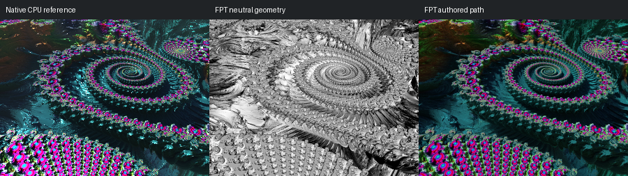

# 678: mandelbulb_power_2_001

[Reviewed gallery](README.md) | [Needs-work audit](needs-work.md) | [Full catalogue](../mandel-catalog/README.md)

**accepted**. The spiral arms, the magenta-studded bands and the teal surroundings match the native reference in layout, palette and brightness. The differences are limited to fine sampling noise.

FPT: 300x225, 32 SPP; FPT scene/config default; metadata records effective configuration.
Native CPU: authored sampling/lighting, not an identical integrator. Neutral FPT uses a white geometry control, not matched authored lighting.

Capture: **opencl-triage-2026-09-27**, renderer revision `6359aa1976b24634796fbeb7a9b97e5fb2f0c5ad`.
Renderer SHA256: `5773e21cb00821b7fa75fd88454f0f3d62f09c8260d5a952b87a151226688c4a`.

Review: 2026-09-27, Claude visual comparison of complete 300px authored native CPU / FPT neutral / FPT authored triplets. Geometry: acceptable; illumination: acceptable.

[Upstream scene](https://github.com/buddhi1980/mandelbulber2/blob/230456cee40968cbaa7f301bba91daa4865a29db/mandelbulber2/deploy/share/mandelbulber2/examples/mandelbulb_power_2_001.fract) | Collection credit: Mandelbulber example collection
Source SHA256: `02724a85d8801ebedbbce003d294cf9c7b72083c8d34c25b20d6ee5672c10c97`.

This acceptance applies to these captures. It is not exact native parity or NAADF/CVOX certification. Colours, skies and unsupported volumes may differ. No new timing claim.

[Source/capture evidence](../mandel-catalog/review-evidence.json) | [Explicit decisions](../mandel-catalog/reviews.json)
