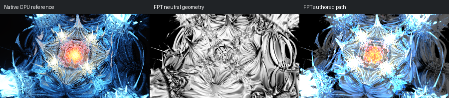

# 680: mandelnest pow 5

[Reviewed gallery](README.md) | [Needs-work audit](needs-work.md) | [Full catalogue](../mandel-catalog/README.md)

**accepted-with-limitations**. The blue petal structure and the orange-white central glow correspond in the native and authored views, and the neutral view confirms the geometry. FPT highlights on the outer petals are brighter and slightly more clipped. The native uses Monte Carlo global illumination, whose CPU brightness is recorded separately as over-counted; exact lighting parity is not claimed.

FPT: 300x169, 32 SPP; FPT scene/config default; metadata records effective configuration.
Native CPU: authored sampling/lighting, not an identical integrator. Neutral FPT uses a white geometry control, not matched authored lighting.

Capture: **opencl-triage-2026-09-27**, renderer revision `6359aa1976b24634796fbeb7a9b97e5fb2f0c5ad`.
Renderer SHA256: `5773e21cb00821b7fa75fd88454f0f3d62f09c8260d5a952b87a151226688c4a`.

Review: 2026-09-27, Claude visual comparison of complete 300px authored native CPU / FPT neutral / FPT authored triplets. Geometry: acceptable; illumination: acceptable.

[Upstream scene](https://github.com/buddhi1980/mandelbulber2/blob/230456cee40968cbaa7f301bba91daa4865a29db/mandelbulber2/deploy/share/mandelbulber2/examples/mandelnest%20pow%205.fract) | Collection credit: Mandelbulber example collection
Source SHA256: `8d24ba6ee4dc248f4ef71005d443fb054f681330d6b1205af86907dc97f89fc9`.

This acceptance applies to these captures. It is not exact native parity or NAADF/CVOX certification. Colours, skies and unsupported volumes may differ. No new timing claim.

[Source/capture evidence](../mandel-catalog/review-evidence.json) | [Explicit decisions](../mandel-catalog/reviews.json)
