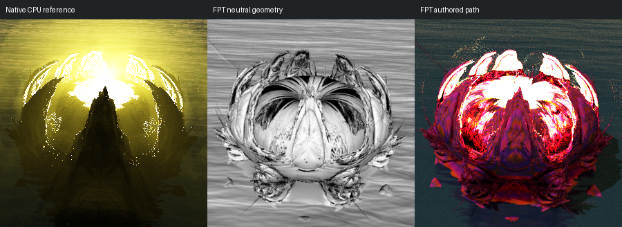

# 701: msltoe toroidal multi 001

[Reviewed gallery](README.md) | [Needs-work audit](needs-work.md) | [Full catalogue](../mandel-catalog/README.md)

**accepted-with-limitations**. The rounded toroidal crown, paired curved lobes, scalloped outer silhouette and central foreground spike correspond in the native, neutral and authored views. Both authored renders have very bright upper lobes against a dark foreground. FPT shifts the gold appearance to saturated red/magenta, expands some clipped highlight patches and shows more lower-surface detail against a darker teal background. The principal forms remain readable; exact colour, highlight and background-lighting parity is not claimed.

FPT: 300x300, 32 SPP; FPT scene/config default; metadata records effective configuration.
Native CPU: authored sampling/lighting, not an identical integrator. Neutral FPT uses a white geometry control, not matched authored lighting.

Capture: **experimental-95-2026-09-14**, renderer revision `6359aa1976b24634796fbeb7a9b97e5fb2f0c5ad`.
Renderer SHA256: `b12a1b744287c1bc0d2f6e604d0f113d663e9c216cdb4832cbd75f180729ebd0`.

Review: 2026-09-14, Codex visual comparison of complete 300px authored native / FPT neutral / FPT authored triplets. Geometry: acceptable; illumination: acceptable.

[Upstream scene](https://github.com/buddhi1980/mandelbulber2/blob/230456cee40968cbaa7f301bba91daa4865a29db/mandelbulber2/deploy/share/mandelbulber2/examples/msltoe%20toroidal%20multi%20001.fract) | Collection credit: Mandelbulber example collection
Source SHA256: `f3cfaf110c580e0b08687a954cfb9bcc1196b41369fe2c35a98b15f519ab80b4`.

This acceptance applies to these captures. It is not exact native parity or NAADF/CVOX certification. Colours, skies and unsupported volumes may differ. No new timing claim.

[Source/capture evidence](../mandel-catalog/review-evidence.json) | [Explicit decisions](../mandel-catalog/reviews.json)
