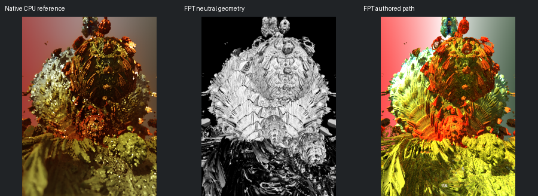

# 704: msltoe_julia_bulb_mod2_001

[Reviewed gallery](README.md) | [Needs-work audit](needs-work.md) | [Full catalogue](../mandel-catalog/README.md)

**accepted-with-limitations**. The central decorated dome, upper bulbs and layered lower foreground align broadly. FPT is substantially brighter yellow/orange and less blurred than native, but the main contours and decorated central surface remain readable. Depth of field, bright peripheral highlights and exact material response are not certified.

FPT: 225x300, 32 SPP; FPT scene/config default; metadata records effective configuration.
Native CPU: authored sampling/lighting, not an identical integrator. Neutral FPT uses a white geometry control, not matched authored lighting.

Capture: **captured-2026-09-12**, renderer revision `475b08ac075017713bd82f30546bdf63a7a12d50`.
Renderer SHA256: `698f2967631d743065e1b9101921a52f70e954560ef0aecb6a88b5e17ec294e1`.

Review: 2026-09-12, Codex visual comparison of native CPU, neutral FPT and authored FPT captures. Geometry: acceptable; illumination: acceptable.

[Upstream scene](https://github.com/buddhi1980/mandelbulber2/blob/230456cee40968cbaa7f301bba91daa4865a29db/mandelbulber2/deploy/share/mandelbulber2/examples/msltoe_julia_bulb_mod2_001.fract) | Collection credit: Mandelbulber example collection
Source SHA256: `47b494f4ad7b403a45fa4b87fbd293a0d4f3022cb313195acb21320f799e1f49`.

This acceptance applies to these captures. It is not exact native parity or NAADF/CVOX certification. Colours, skies and unsupported volumes may differ. No new timing claim.

[Source/capture evidence](../mandel-catalog/review-evidence.json) | [Explicit decisions](../mandel-catalog/reviews.json)
