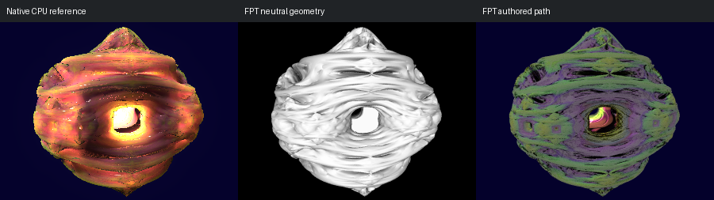

# 739: subsurface scattering 001

[Reviewed gallery](README.md) | [Needs-work audit](needs-work.md) | [Full catalogue](../mandel-catalog/README.md)

**needs-work**. The layered ring, central opening and top/bottom points correspond well, and the neutral capture makes the folds readable. The native authored object has broad warm translucency and glowing illumination through its layers. FPT instead has dark opaque purple/green surfaces with only a small bright central patch. This loses the scene-defining subsurface-lighting structure, so geometry correspondence alone is insufficient for acceptance.

FPT: 300x225, 32 SPP; FPT scene/config default; metadata records effective configuration.
Native CPU: authored sampling/lighting, not an identical integrator. Neutral FPT uses a white geometry control, not matched authored lighting.

Capture: **experimental-95-2026-09-14**, renderer revision `6359aa1976b24634796fbeb7a9b97e5fb2f0c5ad`.
Renderer SHA256: `b12a1b744287c1bc0d2f6e604d0f113d663e9c216cdb4832cbd75f180729ebd0`.

Review: 2026-09-14, Codex visual comparison of complete 300px authored native / FPT neutral / FPT authored triplets. Geometry: acceptable; illumination: needs-work.

[Upstream scene](https://github.com/buddhi1980/mandelbulber2/blob/230456cee40968cbaa7f301bba91daa4865a29db/mandelbulber2/deploy/share/mandelbulber2/examples/subsurface%20scattering%20001.fract) | Collection credit: Mandelbulber example collection
Source SHA256: `bb1736da19ba38f5bdc6dcf9ae12a8435b050d9dacf51427c0656bca3f2f1b33`.

This acceptance applies to these captures. It is not exact native parity or NAADF/CVOX certification. Colours, skies and unsupported volumes may differ. No new timing claim.

[Source/capture evidence](../mandel-catalog/review-evidence.json) | [Explicit decisions](../mandel-catalog/reviews.json)
