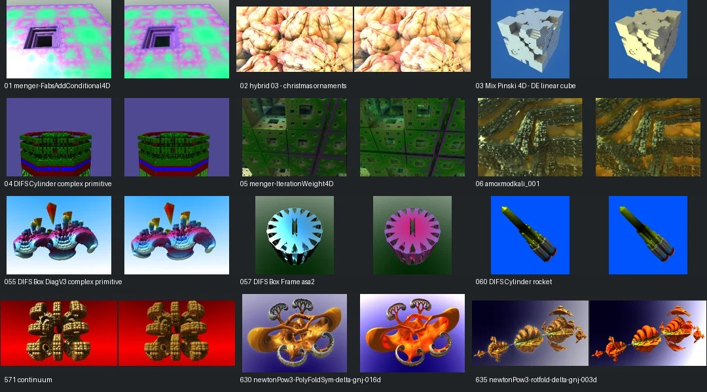

# Reviewed Mandel Showcase

[Back to FPT Metal](../../README.md) | [Experimental catalogue](../mandel-catalog/README.md) | [Needs-work audit](needs-work.md)

**138 visually accepted captures; 55 reviewed cases held back.** Colours need not match exactly. Significant geometry and illumination failures are excluded.

Continuous FPT Metal only, not NAADF voxel output. Captures use 300px max edge and 32 FPT SPP; native sampling differs. Individual pages label historical versus refreshed captures, renderer identity and reduced/monoscopic references.

[Page 1](page-01.md) | [Page 2](page-02.md) | [Page 3](page-03.md) | [Page 4](page-04.md) | [Page 5](page-05.md) | [Page 6](page-06.md) | [Page 7](page-07.md) | [Page 8](page-08.md) | [Page 9](page-09.md) | [Page 10](page-10.md) | [Page 11](page-11.md) | [Page 12](page-12.md) | [Page 13](page-13.md) | [Page 14](page-14.md)

## Review Policy

Promotion requires an explicit decision tied to the source hash and all three capture hashes. Execution success and gallery membership alone cannot promote a scene. Minor colour/material differences are allowed; missing geometry, uncertain framing and obscuring darkness need work.

The original ranked-50 gallery remains an unchanged historical record. This showcase excludes known failures rather than hiding their caveats among successful thumbnails.

Thumbnails are compressed navigation previews. Detail PNGs retain source RGB pixels at captured size, except labelled enlarged 96px native references. No colour correction, crop or orientation changes. Raw captures and generated voxel assets remain outside Git.

[Decisions](../mandel-catalog/reviews.json) | [Capture evidence](../mandel-catalog/review-evidence.json)
