# Needs-Work Audit

[Reviewed gallery](README.md) | [All experimental scenes](../mandel-catalog/scenes.md)

These rows are deliberately excluded from the showcase. Historical reviewed-gallery membership does not override a failed visual gate.

## [32: hybrid005](32.md)

[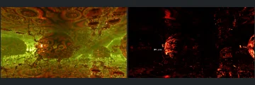](32.md)

Authored rendering is mostly black with red edge highlights; substantial scene content is obscured. Keep outside the showcase until illumination is repaired.

## [37: FoldIntPow2 2](37.md)

[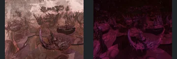](37.md)

Authored scene remains substantially underlit, especially upper and background structures. Preserve the historical comparison but exclude from the showcase.

## [46: iter fog 005](46.md)

[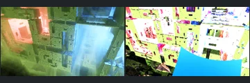](46.md)

Known production float32 position stalls leave unresolved geometry misses; the offline diagnostic is not a production fix.

## [48: RoadToExascale](48.md)

[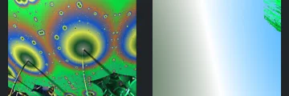](48.md)

Known major deep-zoom production geometry failure. Higher-precision diagnostic output is not substituted in the gallery.

## [051: EXR example](051.md)

[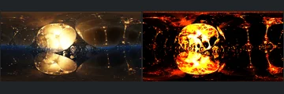](051.md)

Fresh FPT is no longer a single-colour image, but the native golden reflective environment becomes largely black with saturated red/yellow contours. The focal forms are recognizable; severe illumination and reflection changes prevent structural certification of the surrounding scene.

## [053: DIFS Box DiagV1 pseudoKl](053.md)

[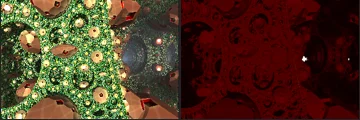](053.md)

Refreshed authored image is still dark red/black where native objects are clearly green/gold. Geometry is visible in neutral mode, but darkness obscures authored structure.

## [069: DIFS Torus polyhedron](069.md)

[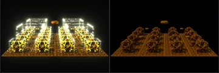](069.md)

Repeated rows and floating torus align, but the reference's bright reflective structures become dim brown in FPT and lose their intended separation from the black background.

## [076: KIFS_mandelbulb_trapLights](076.md)

[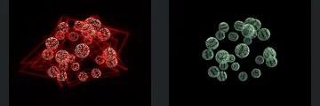](076.md)

The spherical arrangement aligns, but the native red trap-light line network disappears entirely and the spheres change to dim green. The defining authored lighting feature is missing.

## [093: OctahedronMandalayMenger](093.md)

[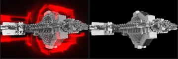](093.md)

The central stepped structure and horizontal supports broadly align, but the defining bright red surrounding light pattern and glow are absent in FPT, leaving the structure against black.

## [095: Scator Spikey Imaginary Pow2](095.md)

[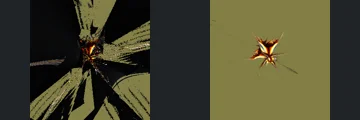](095.md)

The native central pointed form is surrounded by broad sweeping structures across the frame; FPT shows a much smaller isolated star and nearly uniform background. Major framing or geometric coverage differs, not only colour.

## [100: T-DifsCayley2_coloredByChessboard](100.md)

The four broad lobes and central connections align, but the defining dense black-and-white checkerboard material pattern disappears into almost uniform white in FPT. This material demonstration is not validated by matching the silhouette alone.

## [113: T-DifsTorusMenger_menger7](113.md)

[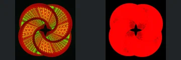](113.md)

The four curled lobes and central opening align in the neutral control, but authored FPT becomes almost uniformly red and loses the prominent yellow/green grid pattern and surface contrast visible in native. Hold the material/lighting interpretation.

## [114: T_DIFS Chessboard hybrid color](114.md)

[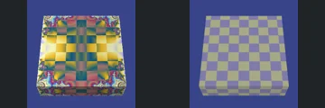](114.md)

The rectangular slab and its camera framing align, but the native multicoloured fractal/checker appearance becomes a plain grey-yellow checkerboard in FPT. The defining procedural material is not reproduced.

## [129: T_absAdd_sphInv4_menger](129.md)

[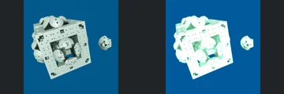](129.md)

The perforated cube, inner rounded structures and separate right-hand object align in the neutral control. Authored FPT washes much of the pale material to white/cyan, clipping smaller openings and surface contrast that remain visible in native.

## [139: T_sphInvV4 menger](139.md)

[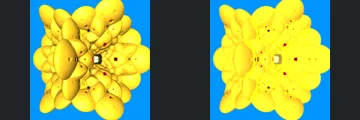](139.md)

The stacked rounded lobes and central receding opening align in the neutral control. Authored FPT flattens much of the interior to saturated yellow, erasing the native crease shading and small surface features; hold the material/exposure behaviour.

## [154: aboxMod11_for8cA](154.md)

[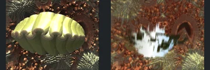](154.md)

The prominent solid-looking gold central form in native is absent from FPT, replaced by a hole-like dark region in the neutral control and a bright opening in authored output. Background detail also changes strongly. This is a major geometry/visibility mismatch, not a colour-only difference.

## [169: abox_mod11_rotBox](169.md)

[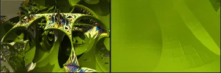](169.md)

Native contains an open branching structure with multiple curved openings. Both FPT controls instead show one close surface filling almost the entire image, without those openings. This is a major geometry/visibility or framing failure, not a colour-only difference.

## [170: abox_mod11_rotVary](170.md)

[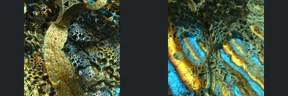](170.md)

The large bright native central curved body and surrounding openings do not read as the same dominant form in either FPT control. FPT instead emphasises diagonal blue/gold bands and differently visible surrounding detail. Geometry, occlusion and reflective transport cannot be separated confidently; this is not accepted as a colour-only difference.

## [181: amazingIFS cyl](181.md)

[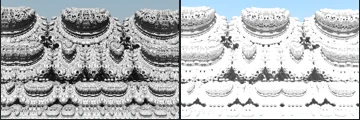](181.md)

Repeated rounded towers and detailed foreground bands align broadly, but authored FPT clips large white regions and loses the native shadow-defined relief. Neutral control preserves the forms; illumination needs correction.

## [184: amazingIFS hexprsm2_a](184.md)

[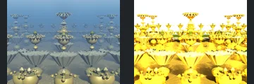](184.md)

The repeated stacked geometric towers align in silhouette and depth. Native muted gold/blue surfaces become intensely yellow clipped reflections and a white background, losing substantial surface readability.

## [189: amazing_surf_mod2_mandelbulb](189.md)

[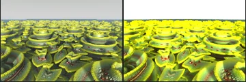](189.md)

Repeated stacked rounded forms and their ground arrangement match broadly. Authored FPT overexposes the distant upper rows into nearly flat yellow and changes the background to white, reducing the native relief.

## [194: asurf_fakelights_backgroundl](194.md)

Repeated horizon objects remain aligned, but the native red background glow and dark mirror-like lower field are replaced by black sky, a very bright horizon strip and grey ground. The authored lighting/reflection composition is not preserved.

## [198: asurf_klein sph](198.md)

[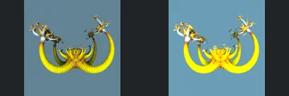](198.md)

Long curled arms and branching tips match structurally. Authored FPT overexposes the yellow foreground arms and central body, hiding their native segmented relief; illumination requires correction.

## [203: box4dBulb aab5](203.md)

[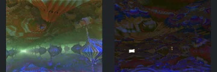](203.md)

Angular hanging and rising forms match broadly in the neutral control. Native green light fills the centre, whereas authored FPT reduces that region to dark blue/brown texture with a small white patch; major forms lose illumination.

## [216: fakeLights_JuliaBulb](216.md)

[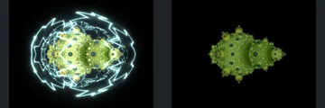](216.md)

The decorated two-lobed body is retained, but the large bright cyan enclosing filament network disappears entirely. This defining fake-light feature is absent, and the surviving body is much darker.

## [220: jos_kleinian_v4 sa1](220.md)

[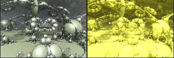](220.md)

The central rounded assemblage, surrounding large smooth lobes and curled branches align in the neutral view. Authored FPT clips the broad foreground and upper surfaces into flat yellow, losing important shading and relief.

## [233: mandelbox_menger_inv 001](233.md)

[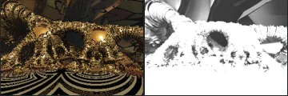](233.md)

Neutral FPT retains the connected rounded bodies, tube-like legs and central opening. Authored FPT turns most foreground surfaces into clipped white, losing both native gold shading and patterned floor relief.

## [246: mandelbulb_pow2V3 tglad](246.md)

[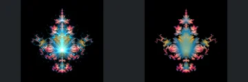](246.md)

Central branching silhouette is recognisable, but native thin enclosing curves, bright central star-like points and fine luminous strands disappear into a diffuse blue/pink mass. Those defining optical details prevent full visual acceptance.

## [249: mandelbulb_sin_cos_v2](249.md)

[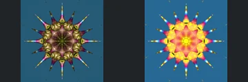](249.md)

Radial spikes and the central star retain their outline, but native shaded gold lobes become a largely saturated yellow/orange centre. Loss of surface shading obscures the layered inner relief.

## [256: mandelnestFull_boxTilingV3 aa2](256.md)

[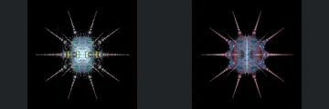](256.md)

Long radial spikes retain their placement, but the native solid-looking bright central body becomes a noisy dim lattice and loses its clear internal facial/panel-like features. Material visibility versus thin-geometry sampling needs a targeted control.

## [258: mandelnest_full](258.md)

[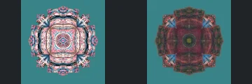](258.md)

Native crisp reflective square frame and concentric central rings become a dim noisy almost-filled body in both FPT controls. Clear panel/ring boundaries are lost; material visibility and dense-surface sampling need investigation.

## [259: mandelnest_full_001](259.md)

[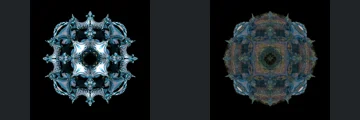](259.md)

The outer symmetric outline and central hole persist, but native bright open curved panels become a dark noisy, apparently filled surface. Missing visible separation and reflective definition prevent acceptance.

## [261: mbulbPow2_v1-001](261.md)

[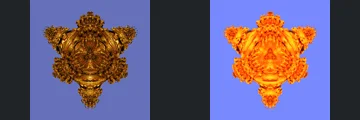](261.md)

Broad four-lobed pointed form aligns in the neutral control. Authored FPT flattens native shaded gold relief into saturated orange/yellow, reducing the definition of the central curved surfaces.

## [262: mbulbPow2_v1](262.md)

[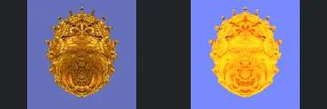](262.md)

Oval outline and nested lower hollow match, but broad yellow saturation removes the native dark/gold depth cues across the middle and upper relief. This exceeds a simple palette difference.

## [268: menger - DE linear cube](268.md)

[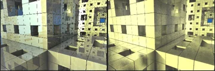](268.md)

Large cube framing is similar, but native fine perforated subdivisions across the foreground block and floor become broad solid squares in FPT. The neutral control also lacks that fine structure; this is not merely a lighting mismatch.

## [271: menger - smoothChebyshev](271.md)

[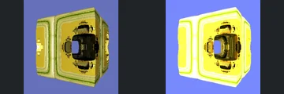](271.md)

Rounded square frame and central tunnel align, but native olive/yellow layered shading becomes broad clipped white/yellow bands in FPT. The frame's depth and contour cues are substantially reduced.

## [285: msltoe_sym3_mod5](285.md)

[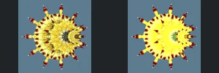](285.md)

The spiky asymmetric outline and offset central opening match broadly. Authored FPT clips much of the yellow inner body into a flat bright region, losing the native fine radial shading and relief.

## [300: pseudoKleinianMod3_prismDIFS](300.md)

[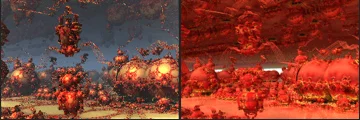](300.md)

Foreground sphere tower and larger side spheres are recognizable, but authored FPT turns much of the scene into a saturated red field and obscures the native grey openings. Background structural visibility is uncertain under the changed illumination.

## [301: pseudoKleinianMod3_torusDIFS](301.md)

[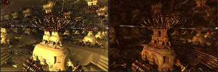](301.md)

Neutral geometry preserves the central decorated pedestal and radial crown. Authored FPT is substantially darker than the native golden image, hiding broad pedestal surfaces and surrounding relief.

## [309: pseudoKleinian_std_DE_flat_surfaces](309.md)

Large square slab and decorative border align, but FPT washes the native dark-bordered red mosaic into an almost uniform red face with clipped white edge highlights. Material pattern and surface readability are severely reduced.

## [310: pseudoKleinian_trig aa1](310.md)

[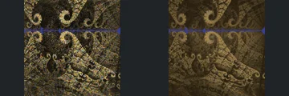](310.md)

Spiral outlines and central horizontal blue band align broadly. FPT removes much of the native bright gold illumination, leaving a dim brown relief field; the authored focal contrast is not retained.

## [312: pseudo_kleinian_mod6 sphInv](312.md)

[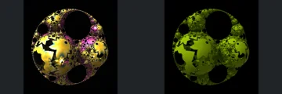](312.md)

Large circular openings and broken spherical panels align. Native bright gold and pink material response becomes uniformly dark green, losing the central illumination and important surface contrast.

## [322: sphereClusterV2 baa3](322.md)

[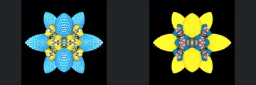](322.md)

Rounded radial lobes match the native arrangement, but blue textured lobes become broad saturated yellow areas with much weaker relief. This is more than a palette difference because fine surface readability is lost.

## [323: sphereClusterV3 aaa1](323.md)

[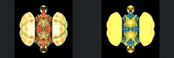](323.md)

Paired cut spherical lobes and central ornate strip retain their silhouette. The native detailed reflective side panels become almost featureless pale yellow surfaces, obscuring their authored pattern and internal shading.

## [325: sphereClusterV3 aaa3](325.md)

[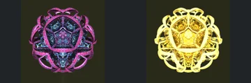](325.md)

Pentagonal centre and looping cage retain their shape. Authored FPT turns pink/blue surfaces into overbright yellow-white bands, flattening the cage and obscuring central material detail.

## [333: spheretree_1](333.md)

[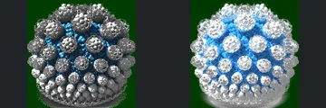](333.md)

Repeated spherical clusters align broadly, but neutral greys become clipped white and bright blue in authored FPT, losing substantial curved-surface relief and reflection detail.

## [334: spheretree_2](334.md)

[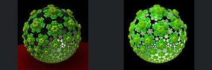](334.md)

Perforated green spherical body aligns, but the native red floor/background plane is absent or unlit in FPT. The cause cannot be determined from the beauty image alone; scene-wide agreement remains incomplete.

## [346: transfSinOrCos- pseudoKleinianV1](346.md)

[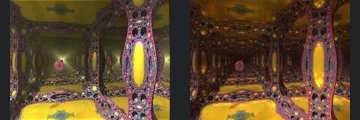](346.md)

Perforated corridor frames and distant coloured object align, but native focal glow and much of the corridor illumination are missing in authored FPT. The darkened interior is a substantive lighting mismatch.

## [348: transfSphereInvV3_abxTetra_OT](348.md)

[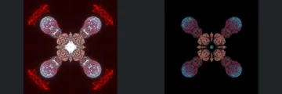](348.md)

Four chains of rounded bodies retain their placement, but native red outer light traces and bright central glow are absent in FPT. Much of the focal light-driven structure is missing and the remaining bodies are dark.

## [353: transf_abs_add_multi](353.md)

[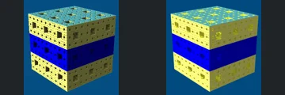](353.md)

Cube framing and broad blue band align, but many native dark square cavities become shallow-looking yellow patches in FPT, especially on the right face. Neutral geometry shows recesses, so depth visibility versus material response requires controlled follow-up.

## [354: transf_addCpixelTile_bulb](354.md)

[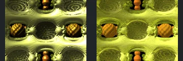](354.md)

Repeated round recesses align in the neutral control, but authored FPT replaces dark reflective interiors and structured glints with flatter yellow shading and plain orange side forms. Important depth cues and material detail are lost.

## [357: transf_dotFold_boxFrame](357.md)

Angular yellow frame and central openings align, but FPT substantially overbrightens the broad faces, losing inset edges and the native shading that separates stacked planes.

## [369: vicsek_001](369.md)

[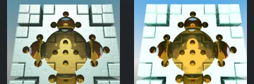](369.md)

Central gold circular body and surrounding block grid align, but FPT clips much of the pale background architecture toward white, reducing its panel edges and shadow separation.

## [372: IFS_001](372.md)

[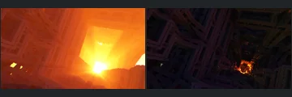](372.md)

Refreshed surface light is present, but native orange illumination remains absent across most of the view. Large regions stay too dark for the showcase; volumetric effects remain deferred.

## [373: IFS_002](373.md)

Only small cyan light patches remain bright in authored FPT, with most native blue-lit beams and surrounding structure lost in darkness. Neutral controls are needed for the ambiguous geometry.

## [374: Bristorbrot](374.md)

Central spiral is similarly placed, but FPT fills much more of the image with sharp structure. Depth-of-field versus actual geometry must be isolated before acceptance.

## [376: Construct by Ectoplaz 3](376.md)

Neutral FPT exposes rectangular architecture, but authored FPT is almost black and lacks the native bright yellow illuminated feature. The dark beauty capture cannot establish scene-wide geometry agreement.

## [377: FoldIntPow2 3](377.md)

Refreshed spheres align, but the warm native glass is heavily clipped yellow/white in FPT. Lost material contrast is more than an acceptable palette change.

## [382: IFS 19 - maxiter](382.md)

Large branches align, but much of the native atmospheric structure disappears into near-black areas. Bright foreground branches alone are insufficient for visual acceptance.

## [384: IFS 21](384.md)

Authored FPT loses the prominent bright overhead source and obscures the central structure in deep blue shadow. Neutral geometry alone is insufficient to accept the authored result.

## [385: IFS 21_2](385.md)

Native reference has a distinct overhead flame and atmospheric separation. FPT replaces this with bright red surface noise and loses the authored focal light, so the central geometry cannot be confidently assessed in the authored view.

## [386: IFS 23](386.md)

Native depth of field isolates a foreground rock against blue background, whereas FPT shows dark, sharp geometry across most of the frame. Framing/depth-of-field correspondence is unresolved and the authored image is substantially darker.

## [389: IFS 27](389.md)

City-like pillar framing matches the neutral control, but authored FPT renders nearly black towers against blue sky and loses the bright native sun/atmospheric separation.

## [390: IFS 28](390.md)

Tower layout and camera align, but FPT clips most foreground and left-side buildings to white, losing the native red surface shading and readable face contrast.

## [392: IFS 30_2](392.md)

Large sloping block arrangement matches the neutral control, but authored FPT loses the bright sky and renders most geometry in near-black shadow.

## [394: IFS 32](394.md)

Nested square frames and diagonal beams align, but authored FPT is dark grey/black instead of the illuminated blue native scene and loses substantial interior readability.

## [395: IFS 33](395.md)

Architectural frame layout aligns, but FPT turns softly lit native surfaces into cyan edge highlights against nearly black interiors, losing surface separation.

## [399: addcpixelinvert](399.md)

Cavern opening, hanging strands and foreground plane align, but the native bright yellow environment and red/gold patterned floor become dark desaturated surfaces in FPT.

## [401: aexion02](401.md)

Spire positions and stepped surfaces align, but FPT loses the illuminated horizon and much of the dark rear-spire separation. Thin features are harder to read in the authored result.

## [402: aexion04](402.md)

Floating stepped formations align in the neutral control, but FPT loses the native luminous boundaries and renders most surfaces nearly black against blue sky.

## [403: aexion05](403.md)

Some foreground ridges correspond, but the native distant atmospheric formations become strongly contrasting folded surfaces in FPT. Background geometry/depth correspondence and authored illumination remain unresolved.

## [409: box fold bulb v4](409.md)

Curved wall grids and foreground curling structures align, but the native green-lit upper region becomes nearly black and large surfaces lose separation. Authored lighting remains an outlier.

## [411: bug](411.md)

Central ridged form and surrounding spikes align, but native iridescent highlights largely disappear and FPT darkens the main body enough to obscure surface relief.

## [413: clouds 006](413.md)

Native red cloud-filled composition becomes exposed gold structure with a dark central region in FPT. Unsupported volumes and major appearance differences prevent a complete structural/beauty assessment.

## [414: clouds 007](414.md)

Native clouds and golden haze dominate the islands and horizon; FPT exposes coloured smooth islands under a cyan sky without those volumes. The hidden native surface cannot be fully compared, and authored atmosphere/lighting is substantially missing.

## [415: clouds 2_v2](415.md)

The broad islands and water are present, but native storm clouds and dark atmospheric occlusion are replaced by clear cyan sky and exposed multicoloured surfaces. Native obscured regions cannot be certified and the defining authored atmosphere is absent.

## [416: clouds 2_v3](416.md)

The island group and water horizon correspond, but the native scene is dominated by dense clouds and atmospheric shafts of light. FPT replaces that sky with a flat cyan gradient and renders the islands with strong rainbow reflections. The missing cloud and atmospheric illumination structure is a material appearance failure, not a colour-only difference.

## [423: fish eye](423.md)

The fisheye corridor walls and openings align, but native yellow illumination in the left opening and rear chamber is missing. FPT darkens the interior and floor substantially, reducing readable surface detail.

## [427: hybrid animacja - background](427.md)

The panoramic repeated frames and central chamber align, but FPT omits the bright white/green illumination panels visible in native and substantially darkens the main room.

## [428: hybrid14](428.md)

Native fine nested cavern structures are replaced by large smooth rounded surfaces in the neutral control, and the authored result is nearly black. This is a structural outlier as well as a lighting failure.

## [429: hybrid15](429.md)

The concentric petal/ribbon arrangement and central round region broadly align, but the defining native white/orange central illumination is absent, replaced by a dark blue interior. The outer palette alone does not validate the missing light.

## [434: hybrid21](434.md)

Neutral FPT retains the central angular cap and nested curved supports, but authored FPT clips a large central region to white and omits the visible pink light at upper left. The clipping obscures surface detail; not a palette-only difference.

## [435: hybrid22 - foldigIntPow v 2](435.md)

The large rounded foreground body, upper connection and neighbouring structures align in the neutral control. Authored FPT loses the bright yellow environmental illumination and makes much of the upper/background structure very dark; defer the shared lighting/atmosphere behaviour.

## [440: hybrid31](440.md)

Some large branches and right-hand rounded forms correspond, but native is heavily blurred/veiled while FPT exposes sharp blue/gold surfaces. The native optical effect obscures too much fine structure for confident complete comparison; defer optical/atmospheric behaviour rather than claiming a geometry match.

## [444: hybrid38](444.md)

Large round surrounding forms broadly correspond, but native bright yellow central pointed forms are replaced by a dark red recess with many smaller visible cones in FPT. Material/transmission versus actual structural differences are unresolved; the central illumination/readability change is too large to accept.

## [445: hybrid42](445.md)

The native central frame encloses a large bright sky opening; FPT instead fills that region with more nested structures, also visible in the neutral control. This is a significant opening/visibility mismatch, not merely the native blur or palette difference.

## [446: hypercomplex 01](446.md)

The isolated upper loop and larger lower forms broadly correspond, but FPT loses the native blue illuminated environment and renders most surfaces almost black against dark green. Authored readability is insufficient for acceptance; reflective silhouette details remain uncertain.

## [451: interior - mandelbulb power 8](451.md)

The bowl-like Mandelbulb, upper openings and lower rounded features align in the neutral control. Authored FPT is substantially darker, losing the bright native golden illumination and obscuring interior details.

## [452: iter fog 002_2](452.md)

The broad outer loop corresponds, but native central glow and surrounding fog become harsh white patches and black surfaces in FPT. Native obscuration prevents confident interior geometry comparison; the defining volume/light behaviour is not retained.

## [453: iter fog 004](453.md)

The main curved red/blue surfaces correspond, but native fog and a concentrated bright central light become sharp, strongly reflective surfaces with broad pale-blue illumination in FPT. The native veil obscures interior surfaces and the defining light distribution differs; defer optical/material interpretation rather than certify the full structure.

## [459: iter fog 1](459.md)

The decorated cube and main face features align in the neutral control, but the defining native green/blue/red glowing illumination is almost absent in FPT. Authored surfaces are too dark to read clearly.

## [460: iter fog 2](460.md)

The large cube and several face cavities align, but native pink/blue fog and luminous face detail become a hard red surface in FPT. The apparent central face feature differs under the native veil; volume versus surface interpretation needs investigation before complete geometry acceptance.

## [462: jos_kleinian 002](462.md)

The large rounded lobes, spiral junction and smaller foreground spheres align in neutral FPT. Authored output collapses to clipped yellow/red and black with lost gradients and many obscured surface features; a severe lighting/material failure rather than an acceptable hue change.

## [476: mandelbox20 - rotations](476.md)

The diagonally layered foreground, large right-hand curved surface and surrounding forms align in the neutral control. Authored FPT becomes nearly uniform orange, losing the native blue/gold illumination separation and obscuring much of the dark background structure.

## [479: mandelbox25_2](479.md)

The distant ridged walls and repeated lower spikes align in the neutral control. Authored FPT clips large foreground/left regions to bright green-yellow and turns the right wall almost black, losing native surface detail and balanced illumination.

## [483: mandelbox28](483.md)

Native shows an open red cavern with several light sources and separated foreground platforms. Both FPT controls instead show close vertical bands and a large circular opening; authored output is blue/black and omits the native lighting arrangement. This is a major geometry/framing mismatch, not a palette difference.

## [488: mandelbox34 - lights_2](488.md)

The four large rounded interior features, repeated central openings and enclosing curved walls align. Authored FPT loses the defining white light/reflection features inside those forms and replaces the native reflective response with saturated green and dark areas. The missing illumination/material behaviour remains a hold.

## [492: mandelbox40_2](492.md)

The enclosing cavern walls, central framed platform and lower crossing structure broadly align. The prominent native central round light/glow is replaced by a dark rectangular-looking opening and surrounding bright surfaces in FPT. The defining light/material behaviour is not preserved despite readable geometry.

## [496: mandelbox46](496.md)

The prominent curled shell and its immediate layered base correspond. Native haze conceals the lower scene, while FPT shows strongly separated strips and a large dark lower-right gap. Atmosphere versus genuinely missing surface cannot be distinguished confidently; the whole foreground is not certified.

## [497: mandelbox47](497.md)

The diagonal perforated bands and repeated large insets broadly correspond in the neutral view. Authored FPT loses the native blue illumination and bright lower-left region, leaving most surfaces nearly black and difficult to inspect.

## [498: mandelbox48](498.md)

The low corridor, rounded central form and crossing foreground beams align in the neutral control. Authored FPT clips most surfaces to saturated yellow/orange, losing the readable native gold gradients and detailed surface shading.

## [499: mandelbox49](499.md)

The large curved perforated structures and lower water boundary broadly align. The native bright round light and its long water reflection disappear in FPT, leaving much darker surfaces and a different red glow. Missing light transport is a substantial appearance failure.

## [504: mandelbox54_2](504.md)

The central opening and surrounding repeated curved structures broadly correspond. Native blue/violet illumination spreads through those surfaces, whereas FPT becomes mostly black/red with a clipped white central patch. The missing light spread obscures important structure.

## [508: mandelbox58](508.md)

Native jagged mountainous forms and diagonal open valley become a horizontal wall and central rectangular opening in both FPT controls. Authored FPT is also largely dark. This is not a palette-only difference.

## [509: mandelbox59](509.md)

The central perforated oval and right circular motif are recognisable, but native blue/pink illumination across the perforations disappears into dark orange outlines. Native optical highlights obscure exact surface comparison; lost defining illumination is more than a palette difference.

## [510: mandelbox60](510.md)

Curled large right-hand lobes and clustered centre are recognisable in the neutral control, but authored FPT loses the native pink illuminated ridges and makes most forms dark green. Broad geometry is retained; lighting obscures it.

## [511: mandelbox61](511.md)

Native upper-right illuminated arch becomes a largely black region while the lower-left opening is intensely yellow. Neutral FPT exposes broad surfaces but the reflective native view does not establish their exact agreement; severe illumination loss prevents acceptance.

## [512: mandelbox62](512.md)

The large looping ribs and foreground fan remain correctly arranged, but the bright native source at their base disappears and the authored ribs become dark brown. This is a missing illumination feature, not just colour variation.

## [516: mandelbulb power 2 - iter fog 03](516.md)

Native central glowing panel and surrounding illuminated forms collapse into near-black authored FPT silhouettes. Neutral shows some related outlines, but native fog/emission and absent authored light prevent confirmation of the full structure.

## [517: mandelbulb power 2 - iter fog 04](517.md)

Native luminous central object and surrounding rays become a small isolated solid and mostly black right-hand body. Missing volumetric/emissive appearance prevents visual agreement and masks exact boundary comparison.

## [518: mandelbulb power 2 - iter fog](518.md)

The upright body has a corresponding silhouette, but native glowing appendages and lower internal illumination disappear. FPT clips the upper-right highlights while most lower geometry is black; effects hide exact structural agreement.

## [520: mandelbulb power 2 - slice 3](520.md)

Foreground branches broadly correspond, but the bright native open/cloudy upper region becomes dense dark textured geometry in FPT. Native depth blur and atmosphere prevent deciding whether all differences are optical; structural visibility needs a dedicated comparison.

## [522: mandelbulb power 2 - slice 5](522.md)

The spiral ground motifs broadly align. Native bright distant haze and reflected illumination become nearly black in FPT, obscuring the upper half of the scene and flattening the relief.

## [525: mandelbulb power 4 - water](525.md)

The canyon walls, water channel and distant central ridges correspond in the neutral view. Native authored illumination creates a bright golden water surface and luminous atmospheric depth. FPT leaves the water and much of the foreground wall nearly dark, with substantially weaker readable ripples and no comparable distant glow. This materially changes water visibility and scene illumination, beyond a palette difference.

## [527: mandelbulb power 8 - 4_2](527.md)

Native clustered rounded forms become long diagonal streaks in both FPT controls. Most defining geometry is absent or severely distorted, independently of the changed lighting.

## [529: mandelbulb power 8 - 7 - volmetric fog](529.md)

Native volumetric glowing lobes become hard saturated green/blue surfaces with large black regions. Fog dominates the reference, preventing a reliable complete geometry comparison; the defining lighting is not reproduced.

## [532: mandelbulb_multi_001](532.md)

Native curved blue surfaces become severely clipped cyan/white regions. Neutral FPT has smooth broad surfaces with less apparent relief; reflective appearance prevents resolving geometry independently, and exposure is an obvious failure.

## [533: mandelnest](533.md)

The upright branching body is recognisable, but native blue emissive points and dark separating cavities become bright pink/orange continuous surfaces. Lighting and visibility differ substantially, so exact openings cannot be approved from these captures.

## [534: menger sponge 001](534.md)

Corridor framing and layered wall cells broadly align, but prominent bright native side windows are dark in FPT and native central light shafts disappear. Whether side-window visibility also differs needs investigation; this is not merely colour variation.

## [535: menger sponge 002_2](535.md)

Crossing beams and rectangular trusses correspond in the neutral view, but the native bright yellow illuminated shaft becomes nearly black with faint teal lines. Defining illumination is missing.

## [536: menger sponge 003_2](536.md)

The large stepped foreground structure corresponds, but the native bright horizon and starburst source disappear into a dark red upper region. Native atmosphere obscures distant boundaries; illumination and far-field visibility remain unverified.

## [542: msltoe donuts 001](542.md)

Interlocking thick loops and smaller nested loops align in the neutral control, but authored FPT loses the native bright environmental illumination and turns most geometry dark. The few highlights do not restore surface readability.

## [544: orbitTraps 004](544.md)

Native large luminous circular feature and bright background become almost entirely black in authored FPT. Neutral exposes related circular geometry, but luminous/transparent visibility and defining illumination are not reproduced.

## [545: orbitTraps 006](545.md)

Broad nested circular structures remain recognisable, but native soft light sources and the central blue atmospheric region disappear into dark cavities and hard orange clipped highlights. Effects prevent full structural certification.

## [546: orbitTraps 007](546.md)

Native dark curled form with defining cyan luminous lines becomes an almost white smooth mass. Both surface visibility and missing orbit-trap illumination prevent acceptance.

## [547: planet](547.md)

Native smooth luminous globe with internal swirls becomes a lumpy strongly clipped object. The silhouette and apparent internal structure differ; glow and material interpretation prevent treating this as a colour-only change.

## [548: primitive objects - inverted box](548.md)

The decorated cube itself keeps its silhouette and visible circular recesses. Native patterned surrounding walls become broad clipped yellow regions, materially changing illumination and hiding the authored environment.

## [551: reflections 002](551.md)

The nested reflective spheres broadly match, but the prominent native upper-right light source disappears while surface highlights become much stronger. Missing source illumination changes the scene's focal feature.

## [552: reflections 003](552.md)

Nested spheres broadly correspond, but native discrete soft light sources and blue shaded regions become broadly clipped orange/yellow reflections. The optical structure and illumination are not preserved well enough for gallery acceptance.

## [556: volumetricLight002](556.md)

Native output is dominated by bright yellow volumetric beams; FPT shows a dim purple underlying fractal without those beams. The neutral control exposes geometry but does not reproduce the authored volume effect. This remains within the deferred fog/volume limitations, not an accepted lighting match.

## [557: volumetricLight003](557.md)

Foreground clustered polyhedral forms broadly correspond, but the native bright opening and diffuse white light shafts become dark magenta surfaces. Native volumetric light hides distant geometry, so complete structure and illumination are not established.

## [559: winter](559.md)

Central overhanging rock and distant terrain are recognisable, but native snowy hazy foreground becomes a broad blue/grey band and sharp exposed terrain. Foreground blur and atmosphere obscure whether the nearest structures match; environment/material appearance needs a targeted check.

## [560: xenodreambuie](560.md)

The interlocking smooth ribs and two raised tips match the neutral control, but authored FPT clips a large central/upper area to white and loses the native surrounding soft light. Important surface relief is obscured.

## [567: IFS31_anim](567.md)

Production refresh still replaces the open native beam lattice with black bars and displaced-looking detail. The successful offline precision prototype is not the production renderer.

## [568: box-deuce-deuce](568.md)

Both native and FPT beauty images show only a tiny dark central object, so the historical darkness warning is not by itself proof of an FPT regression. FPT also lacks the small native white source at the left. Authored framing gives too little readable structure for gallery acceptance; do not claim a confirmed geometry failure.

## [573: hybrid77](573.md)

Disk framing aligns, but many bright native ring highlights disappear into a dark authored FPT surface. Hold for illumination/material work.

## [578: menger-FabsAddTgladFold4D](578.md)

Native crisp nested square openings become blurred, streaked and apparently displaced in both FPT modes. Authored FPT is also very dark; this is not merely a palette difference.

## [583: menger-fatbackstrokin](583.md)

Panoramic block arrangement has related large landmarks, but native white openings become dark blue/black and fine geometry is hard to read. Projection/visible-background correspondence is not established.

## [586: msltoeDonut-coastn](586.md)

Panoramic arch-like silhouette broadly aligns, but FPT darkens the gold structures substantially and omits the conspicuous yellow horizontal region of the native appearance. Background/material interpretation needs review.

## [591: aexion blue-sky-two-suns](591.md)

Terrain silhouette aligns but becomes substantially darker against an orange sky, and native sun disks are absent. The terrain is insufficiently exposed for the showcase.

## [593: hybrid 02 - rectangle hieroglyphs animation](593.md)

Lattice framing broadly aligns, but the missing light shaft and very dark surrounding surfaces hide significant native content. Volume and surface-light differences remain separate issues.

## [597: pseudo kleinian std de 001 plus mandelbox](597.md)

Geometry placement aligns, but very bright pink/orange FPT output clips the native material contrast. Hold for exposure/transport investigation rather than colour grading the capture.

## [599: aboxvsicen1_001](599.md)

Foreground mass is similarly placed but the background and visible depth coverage differ substantially. A neutral reference/DOF control is needed before calling it an acceptable geometry match.

## [601: aexion002](601.md)

Large terrain forms align, but foreground structure loses native golden illumination and becomes very dark. Hold for lighting/material work.

## [604: amazing surf multi 001](604.md)

Large surface arrangement aligns, but authored FPT clips broad foreground faces to white and oversaturates surrounding purple/blue regions, losing surface readability.

## [605: amazing_surf 001](605.md)

Block skyline and camera align, but FPT turns the dark authored foreground into clipped gold/white reflective faces and loses substantial contrast.

## [607: benchmark-GPU 2](607.md)

Main ornate structure aligns in the neutral control, but authored FPT is severely orange/white clipped across the lower image and loses the native blue atmosphere and surface separation.

## [608: benchmark-GPU](608.md)

Outer filament arrangement broadly aligns, but the native dark/fogged central opening is replaced by dense gold structure, flat saturated blue sky and a large bright upper-right region. Geometry behind the atmospheric reference remains unverified.

## [609: benchmark](609.md)

Perforated cube framing aligns, but native illuminated fog and softened green environment become nearly black surfaces with clipped white openings in FPT. The authored volume and illumination differ substantially; fog remains out of scope for fixes.

## [610: benesi 001](610.md)

FPT replaces the softly separated reflective red/gold native forms with dark, sharply etched red surfaces. Major folds appear related, but material/lighting loss obscures correspondence.

## [613: benesi_pine_tree_001](613.md)

Radial branching structure and viewpoint broadly align, but FPT's black central shadows and dark blue background obscure many branches visible under the native golden lighting.

## [615: boolean001](615.md)

The native boolean scene shows open square cavities across the foreground. FPT's neutral result instead has a mostly continuous slab with small triangular openings, and the authored result is severely clipped.

## [616: boolean002](616.md)

Large cube framing aligns, but the central face partitions and boolean openings do not clearly correspond: the neutral FPT view shows broader continuous perforated plates. Confirm boolean geometry before promotion; green lighting remains readable.

## [618: bristorbrot001](618.md)

FPT shows a large empty sky region at the left where the native reference has an enclosing patterned environment, and omits prominent bright sources. Correspondence beyond the central ring is not established.

## [619: buffalo003_2](619.md)

Main curving icy formations align, but FPT clips broad surfaces to white and turns the blue native surroundings nearly black, losing face contrast.

## [621: clouds 001](621.md)

Native clouds obscure much of the cube, while FPT renders an exposed orange perforated cube against flat yellow sky. The defining cloud appearance is unsupported and hidden native geometry cannot be certified.

## [622: clouds 002](622.md)

The native rounded cloud-covered form becomes an exposed sharply folded orange object. Cyan/yellow clipping and unsupported clouds prevent a fair authored or complete geometry acceptance.

## [623: clouds 003](623.md)

Cube placement and light position align, but the cloud-shaped native light becomes a smooth white/yellow blob. Volumetric appearance and cube illumination differ substantially.

## [624: clouds 005](624.md)

Perforated cube placement aligns, but FPT omits the defining blue cloud and luminous line network, leaving a dim red cube. Deferred volume/trap-light behaviour is not supported by this capture.

## [625: clouds 006](625.md)

Perforated slab, tilt and grass plane align. FPT omits the clouds and clips the slab/grass to bright yellow against cyan sky, losing the native shaded appearance.

## [637: glow](637.md)

Thin filament arrangement is present in the geometry control, but FPT omits the defining orange glow and renders the authored image almost black.

## [638: gradients - reflectance and transparency](638.md)

Rounded cone and support plane align, but the defining multicoloured reflectance/transparency gradients become a mostly dull opaque surface. This material demonstration is not visually validated.

## [639: gradients - specular highlights](639.md)

Rounded perforated block and cavity layout align, but the authored gold specular highlights disappear into a dull dark surface. The defining material/lighting behaviour remains unvalidated.

## [643: hybrid002](643.md)

The wall grids and receding square corridor are present, but the native bright white illumination/atmospheric opening becomes a nearly black interior in FPT. Full interior correspondence is not established through the native overbright region.

## [644: hybrid003](644.md)

The left bright source and broad surrounding frame are recognisable, but the large luminous native opening and yellow environment disappear into an almost black/red interior. Interior structure cannot be confidently matched through this appearance difference.

## [645: hybrid004](645.md)

The neutral control shows a receding structured chamber, but the authored FPT image clips almost entirely to white/cyan where the native image has readable blue/orange walls. Detailed authored correspondence cannot be established through this clipping.

## [649: hypercomplex001](649.md)

The large curved mass and suspended ring align, but the native bright gold illumination and surrounding glow become dark olive surfaces and a flat sky. Major surface highlights and relief separation are lost.

## [650: ides1_001](650.md)

The slender central spire and flared base align, but FPT introduces a hard bright angular horizon strip above a near-black floor where the native background is a smooth gradient. The environment/ground appearance needs investigation.

## [651: ides2_001](651.md)

Native pale atmospheric/transmissive surfaces become near-black rainbow-highlighted folds in FPT. Some curved outlines correspond, but the extreme brightness change prevents a confident complete structural or authored appearance comparison.

## [657: keyframe_anim_mandelbulb](657.md)

The water horizon and large right-hand rounded structure broadly correspond, but native gold-lit foreground forms become dark green/blue in FPT and the water/reflected appearance differs strongly. Obscured lower surfaces prevent confident complete structural comparison; defer rather than treating the dark authored image as a colour-only difference.

## [658: light - projection](658.md)

Native is dominated by bright projected blue-white rays and hazy geometry, while FPT shows a dark cube and right-hand fractal without that illumination. The defining projected-light effect is absent and native obscuration prevents confident complete geometry comparison.

## [660: lkmitch001](660.md)

Native layered pink/brown folds and a bright central light become large dark red/blue regions in authored FPT. Neutral FPT shows broad smooth planes across the centre/right rather than clearly corresponding fine folds; material versus structural causes need investigation before acceptance.

## [663: mandelbox003](663.md)

Native output contains prominent gold illuminated arcs and a visible environment; authored FPT is effectively black despite a detailed neutral geometry capture. Missing illumination prevents a meaningful beauty-geometry comparison.

## [666: mandelbox_menger_with_textures](666.md)

The corridor, central tapered forms and right-hand rectangular recesses align, but FPT washes much of the image to bright gold/white, clips foreground detail and fails to retain the native brick/ground material appearance. Hold exposure/material behaviour.

## [670: mandelbulb002](670.md)

Native shows a heavily veiled landscape with a bright white light, while FPT exposes a large right-hand curl against a clear blue sky and omits the light. The visible silhouette/coverage differs substantially; optical obscuration versus actual geometry must be separated before acceptance.

## [676: mandelbulb_kali 001](676.md)

Some outer arches and right-hand curved forms correspond, but the large native central open-looking blue region is filled by dense structures in neutral and authored FPT. Refraction/atmosphere versus geometry is unresolved, and the native pale illumination becomes strong red/gold. Do not accept the opening mismatch as a palette-only change.

## [677: mandelbulb_kali_multi 001](677.md)

The sweeping red curved surfaces and central junction align broadly in the neutral control. Authored FPT omits the bright yellow native environmental illumination, leaving the centre and much of the left/background region almost black.

## [679: mandelbulb_vary_power_001](679.md)

The thick crossing foreground branches align, but native blue open-looking background regions become dense wall-like structures in neutral and authored FPT. Foreground colour differences alone would be acceptable; background depth/visibility versus atmospheric obscuration needs investigation.

## [681: menger cross kifs 001](681.md)

The triangular Menger frames and major beams align in the neutral control, but authored FPT clips most surfaces to stark white/black and fails to retain the native distributed golden illumination. A severe exposure/material failure.

## [683: menger middle mod](683.md)

The tilted wall planes and narrow triangular opening broadly align, but the bright native cyan beam crossing the image is absent in FPT. Both scenes are intentionally dark; the defining illumination is nevertheless missing, not a small palette difference.

## [684: menger octo 001](684.md)

Native shows a blurred but recognisable nested block structure with coloured highlights. Authored FPT clips almost the entire image to white/yellow; neither authored detail nor geometry through the native blur can be accepted reliably.

## [685: menger prism shape2 001](685.md)

The scattered angular blocks, triangular openings and foreground square face align in the neutral control. FPT substantially darkens the scene and loses the bright illuminated panels visible in native, obscuring much of the background geometry.

## [686: menger pwr2 polynomial 001](686.md)

The broad blue/red curved foreground body and central recess align. FPT loses the bright pale native environmental illumination and deeply darkens most surfaces, with changed interior reflective detail. Readability is insufficient for a colour-only acceptance.

## [687: menger smooth 001](687.md)

The large central rounded square and surrounding apertures broadly align, but authored FPT substantially increases white/yellow clipping across the frame, losing surface gradients visible in the already bright native render. Hold exposure/reflectance behaviour.

## [689: menger sponge_with_orbit_trap_lights](689.md)

The Menger cube and its openings align, but native cyan/pink orbit-trap lights surrounding and covering the cube are absent from FPT. This is loss of the scene's defining illumination, not a minor material colour difference.

## [692: monte carlo DOF 002](692.md)

Native rounded forms, bright lights and smooth red reflections become near-binary saturated red/black in FPT. The clipping obscures the main structure and native optical effects, preventing confident complete geometry or illumination acceptance.

## [693: monte carlo DOF 003](693.md)

Some ribbed foreground forms correspond, but native large bright open regions and strong depth-of-field blur become smaller highlights among dense FPT geometry. Blur, transparency and actual occlusion cannot be separated from this comparison; do not certify the changed central opening.

## [696: monte carlo global illumination - emmisive materials](696.md)

Native includes a large cyan luminous ring around the sphere/cube/group. That ring is absent from both FPT controls, and authored FPT leaves the cube and right-hand form almost black beside a clipped white sphere. Missing geometry and emissive transport both require investigation.

## [700: msltoe toroidal bulb 001](700.md)

The symmetric purple curved structure and paired bright interior features broadly align. FPT substantially darkens the broad surfaces and outer contours, losing the bright native violet/cyan highlights and much of the lower detail.

## [706: msltoe_sym4_mod 001](706.md)

The large left-hand layered forms correspond, but native open pale right-hand regions become dark geometry/reflections in FPT and overall illumination drops markedly. Surface, atmosphere and occlusion contributions cannot be separated confidently; the changed right-hand region is not certified.

## [707: msltoesym2_mod_001](707.md)

The central rounded decorated body and broad surrounding walls align in the neutral control. Authored FPT clips large foreground and upper-right areas to saturated yellow/green, obscuring native gradients and much of the surface relief.

## [714: octahedron with box foldig_2](714.md)

Native output contains bright blue beams through rectangular openings; authored FPT is nearly black. Neutral FPT shows the room and openings, but the authored volume/light effect is absent. This is not an accepted lighting match and volumetric fixes remain deferred.

## [715: orbittrap001](715.md)

Some crossing thin arches align, but native green/yellow luminous halos and blue lights disappear into a mostly black FPT image with clipped yellow/white regions. The missing glow/lighting obscures structural comparison; native hazy regions cannot be certified as complete geometry.

## [716: orbittrap002](716.md)

The broad cube orientation corresponds, but native is a blue luminous open-looking framework while FPT is an opaque-looking olive cube. Defining emissive/optical behaviour is absent; whether apparent filled openings are geometry or material effects cannot be established from this comparison.

## [717: orbittrap003](717.md)

The square frames and crossing lattice align closely in the neutral control. Authored FPT is nearly black and lacks the native bright cyan/pink emissive regions and small white lights, obscuring the defining scene appearance.

## [718: orbittrap004](718.md)

Several thin repeated foreground forms correspond, but the defining broad luminous green curves are absent from both FPT controls. Authored geometry is also very dark. Emissive/volumetric versus geometric contributions require investigation before certifying completeness.

## [719: orbittrap005](719.md)

The tilted perforated cube, central opening and repeated square apertures align. FPT lacks the native white/blue emitters and large pink beams, leaving a dark coloured cube. Defining authored illumination is missing.

## [721: primitives002](721.md)

The central sculpture and upper/lower slabs correspond, but the native vertical support posts are absent from both FPT controls. Floor, shadows and environment also change strongly. Missing support geometry is a concrete completeness failure.

## [722: pseudo kleinian 001](722.md)

The large right-hand rounded form, thin supporting structures and broad foreground layout align in the neutral control. Authored FPT severely clips surfaces to yellow/orange and loses the native large soft light, obscuring relief and illumination gradients.

## [723: pseudo kleinian mod 001](723.md)

The central rounded body, circular opening and surrounding thin loops align in the neutral control. Authored FPT clips the central surface and much of the background to saturated yellow/white, losing native green gradients and readable surface relief.

## [724: pseudo kleinian std de 002](724.md)

Some central bars and curved framing correspond, but native dark blue surrounding forms and a small bright interior become an almost entirely clipped orange/yellow FPT scene. Strong native blur and changed visibility prevent confident full geometry acceptance; severe illumination mismatch is clear.

## [725: quaternion_001](725.md)

The curved folds, long vertical ridge and framing correspond in the neutral view. Authored FPT is almost entirely black, losing the native bright blue/cyan illuminated surfaces and their visible relief.

## [730: riemann sphere 001](730.md)

A roughly corresponding pointed decorated body is visible, but defining native luminous arcs extending around and below it are absent. Those optical features also obscure native surface boundaries, so complete geometry correspondence cannot be certified.

## [732: riemann_sphere_msltoe_v1_001](732.md)

Radial disks, slender supports and framing broadly correspond. Native blue-green illumination and bright upper opening become almost black in authored FPT, hiding important upper geometry.

## [735: stereoscopic 001](735.md)

Central spherical building, rear spheres and thin surrounding structures broadly match the neutral control. Authored FPT loses the bright green/yellow environmental illumination, leaving most upper and rear forms nearly black.

## [736: stereoscopic 002](736.md)

Angular beams broadly correspond, but the native anaglyph reference prevents exact mono-camera alignment judgment. Authored FPT is heavily white-clipped, erasing contrast across many beams. Stereo output and exposure need separate investigation.

## [738: stereoscopic 004](738.md)

The central diamond outline and side filaments are present, but bright native red/green illumination becomes a dark olive surface and plain sky. Native stereo/effects complicate exact alignment; loss of defining light remains a hold.

## [739: subsurface scattering 001](739.md)

The layered ring, central opening and top/bottom points correspond well, and the neutral capture makes the folds readable. The native authored object has broad warm translucency and glowing illumination through its layers. FPT instead has dark opaque purple/green surfaces with only a small bright central patch. This loses the scene-defining subsurface-lighting structure, so geometry correspondence alone is insufficient for acceptance.

## [742: the grid 002](742.md)

Native red/blue/green open framework is replaced by dominant dark curved panels and reflective spheres. Some lines correspond, but surface visibility and material/transparency interpretation change the apparent structure too much for acceptance.

## [745: transparent002](745.md)

The rounded outer cube silhouette matches, but the native translucent inner shape and bright reflected highlights are absent in the nearly black FPT object. Interior visibility and transparent material behavior need correction.
