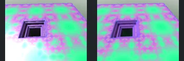
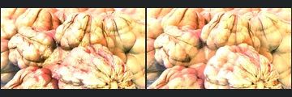
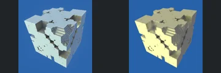
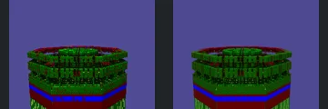
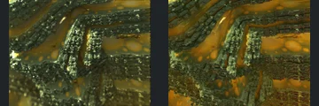
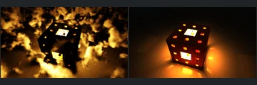
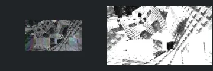
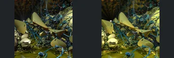

# Reviewed Scenes: Page 1

[Page 1](page-01.md) | [Page 2](page-02.md) | [Page 3](page-03.md) | [Page 4](page-04.md) | [Page 5](page-05.md) | [Page 6](page-06.md) | [Page 7](page-07.md) | [Page 8](page-08.md) | [Page 9](page-09.md) | [Page 10](page-10.md) | [Page 11](page-11.md) | [Page 12](page-12.md) | [Page 13](page-13.md) | [Page 14](page-14.md) | [Page 15](page-15.md) | [Page 16](page-16.md) | [Page 17](page-17.md) | [Page 18](page-18.md) | [Page 19](page-19.md) | [Page 20](page-20.md) | [Page 21](page-21.md) | [Page 22](page-22.md) | [Page 23](page-23.md) | [Page 24](page-24.md) | [Page 25](page-25.md) | [Page 26](page-26.md) | [Page 27](page-27.md) | [Page 28](page-28.md) | [Page 29](page-29.md) | [Page 30](page-30.md) | [Page 31](page-31.md) | [Page 32](page-32.md) | [Page 33](page-33.md) | [Page 34](page-34.md) | [Page 35](page-35.md) | [Page 36](page-36.md) | [Page 37](page-37.md) | [Page 38](page-38.md) | [Page 39](page-39.md) | [Page 40](page-40.md) | [Page 41](page-41.md) | [Page 42](page-42.md) | [Page 43](page-43.md)

Each thumbnail: native left, FPT authored right. Open a scene for full neutral/beauty comparisons, limitations and capture settings.

## [01: menger-FabsAddConditional4D](01.md)

accepted-with-limitations | historical-2026-09-10 | 32 SPP

Prior ranked-gallery visual acceptance retained for these unchanged captures. Native appearance and fine-detail parity are not certified.

## [02: hybrid 03 - christmas ornaments](02.md)

accepted-with-limitations | historical-2026-09-10 | 32 SPP

Prior ranked-gallery visual acceptance retained for these unchanged captures. Native appearance and fine-detail parity are not certified.

## [03: Mix Pinski 4D - DE linear cube](03.md)

accepted-with-limitations | historical-2026-09-10 | 32 SPP

Prior ranked-gallery visual acceptance retained for these unchanged captures. Native appearance and fine-detail parity are not certified.

## [04: DIFS Cylinder complex primitive](04.md)

accepted-with-limitations | historical-2026-09-10 | 32 SPP

Prior ranked-gallery visual acceptance retained for these unchanged captures. Native appearance and fine-detail parity are not certified.

## [05: menger-IterationWeight4D](05.md)

accepted-with-limitations | historical-2026-09-10 | 32 SPP

Prior ranked-gallery visual acceptance retained for these unchanged captures. Native appearance and fine-detail parity are not certified.

## [06: amoxmodkali_001](06.md)

accepted-with-limitations | historical-2026-09-10 | 32 SPP

Prior ranked-gallery visual acceptance retained for these unchanged captures. Native appearance and fine-detail parity are not certified.

## [07: clouds 004](07.md)

accepted-with-limitations | historical-2026-09-10 | 32 SPP

Surface lighting restored; cloud volume remains unsupported.

## [08: pseudo kleinian 002](08.md)

accepted-with-limitations | historical-2026-09-10 | 32 SPP

Generated point lights restored; native light placement is not bit-exact.

## [09: iridescence](09.md)

accepted-with-limitations | historical-2026-09-10 | 32 SPP

Prior ranked-gallery visual acceptance retained for these unchanged captures. Native appearance and fine-detail parity are not certified.

## [10: pseudoKleinianMod5](10.md)

accepted-with-limitations | historical-2026-09-10 | 32 SPP

Prior ranked-gallery visual acceptance retained for these unchanged captures. Native appearance and fine-detail parity are not certified.
