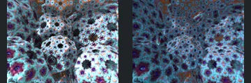
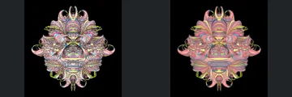
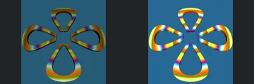
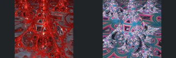
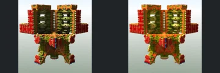
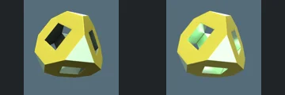
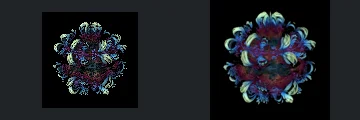
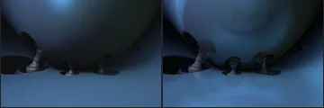
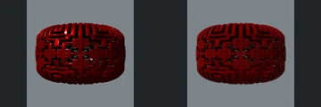
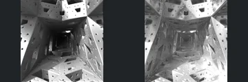

# Reviewed Scenes: Page 2

[Page 1](page-01.md) | [Page 2](page-02.md) | [Page 3](page-03.md) | [Page 4](page-04.md) | [Page 5](page-05.md) | [Page 6](page-06.md) | [Page 7](page-07.md) | [Page 8](page-08.md) | [Page 9](page-09.md) | [Page 10](page-10.md) | [Page 11](page-11.md) | [Page 12](page-12.md) | [Page 13](page-13.md) | [Page 14](page-14.md) | [Page 15](page-15.md) | [Page 16](page-16.md) | [Page 17](page-17.md) | [Page 18](page-18.md) | [Page 19](page-19.md) | [Page 20](page-20.md) | [Page 21](page-21.md) | [Page 22](page-22.md)

Each thumbnail: native left, FPT authored right. Open a scene for full neutral/beauty comparisons, limitations and capture settings.

## [11: hybrid16](11.md)

accepted-with-limitations | historical-2026-09-10 | 32 SPP

Prior ranked-gallery visual acceptance retained for these unchanged captures. Native appearance and fine-detail parity are not certified.

## [12: mandelbulb_pupuku pow-4](12.md)

accepted-with-limitations | historical-2026-09-10 | 32 SPP

Prior ranked-gallery visual acceptance retained for these unchanged captures. Native appearance and fine-detail parity are not certified.

## [13: transf_difs_piriform](13.md)

accepted-with-limitations | historical-2026-09-10 | 32 SPP

Prior ranked-gallery visual acceptance retained for these unchanged captures. Native appearance and fine-detail parity are not certified.

## [14: two pseudo klienian](14.md)

accepted-with-limitations | historical-2026-09-10 | 32 SPP

Prior ranked-gallery visual acceptance retained for these unchanged captures. Native appearance and fine-detail parity are not certified.

## [15: Mix Pinski 4D hybrid](15.md)

accepted-with-limitations | historical-2026-09-10 | 32 SPP

Prior ranked-gallery visual acceptance retained for these unchanged captures. Native appearance and fine-detail parity are not certified.

## [16: T-DifsOctahedron2](16.md)

accepted-with-limitations | historical-2026-09-10 | 32 SPP

Prior ranked-gallery visual acceptance retained for these unchanged captures. Native appearance and fine-detail parity are not certified.

## [17: xenodreambuieV2  pow -7 julia](17.md)

accepted-with-limitations | historical-2026-09-10 | 32 SPP

Prior ranked-gallery visual acceptance retained for these unchanged captures. Native appearance and fine-detail parity are not certified.

## [18: asurfKlein_difsGreek](18.md)

accepted-with-limitations | historical-2026-09-10 | 32 SPP

Prior ranked-gallery visual acceptance retained for these unchanged captures. Native appearance and fine-detail parity are not certified.

## [19: T-DifsTorusMenger](19.md)

accepted-with-limitations | historical-2026-09-10 | 32 SPP

Prior ranked-gallery visual acceptance retained for these unchanged captures. Native appearance and fine-detail parity are not certified.

## [20: transf_sincosHelix](20.md)

accepted-with-limitations | historical-2026-09-10 | 32 SPP

Prior ranked-gallery visual acceptance retained for these unchanged captures. Native appearance and fine-detail parity are not certified.
