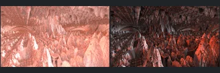
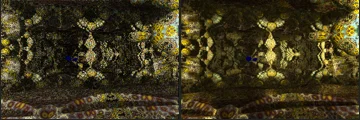
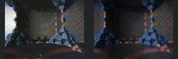
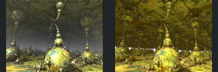
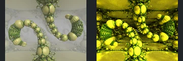
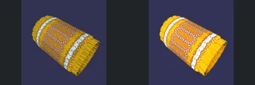
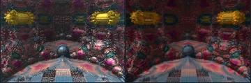
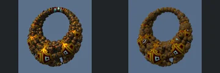
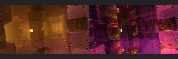
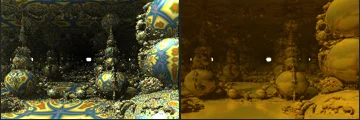

# Reviewed Scenes: Page 3

[Page 1](page-01.md) | [Page 2](page-02.md) | [Page 3](page-03.md) | [Page 4](page-04.md) | [Page 5](page-05.md) | [Page 6](page-06.md) | [Page 7](page-07.md) | [Page 8](page-08.md) | [Page 9](page-09.md) | [Page 10](page-10.md) | [Page 11](page-11.md) | [Page 12](page-12.md) | [Page 13](page-13.md) | [Page 14](page-14.md) | [Page 15](page-15.md) | [Page 16](page-16.md) | [Page 17](page-17.md) | [Page 18](page-18.md) | [Page 19](page-19.md) | [Page 20](page-20.md) | [Page 21](page-21.md) | [Page 22](page-22.md)

Each thumbnail: native left, FPT authored right. Open a scene for full neutral/beauty comparisons, limitations and capture settings.

## [21: mandelbox24](21.md)

accepted-with-limitations | historical-2026-09-10 | 32 SPP

Prior ranked-gallery visual acceptance retained for these unchanged captures. Native appearance and fine-detail parity are not certified.

## [22: asurf_klein](22.md)

accepted-with-limitations | historical-2026-09-10 | 32 SPP

Prior ranked-gallery visual acceptance retained for these unchanged captures. Native appearance and fine-detail parity are not certified.

## [23: boxFoldBulb_v3](23.md)

accepted-with-limitations | historical-2026-09-10 | 32 SPP

Prior ranked-gallery visual acceptance retained for these unchanged captures. Native appearance and fine-detail parity are not certified.

## [24: aboxMod13_002](24.md)

accepted-with-limitations | historical-2026-09-10 | 32 SPP

Prior ranked-gallery visual acceptance retained for these unchanged captures. Native appearance and fine-detail parity are not certified.

## [25: Jos Leys Kleinian v3 SphereGrid](25.md)

accepted-with-limitations | historical-2026-09-10 | 32 SPP

Prior ranked-gallery visual acceptance retained for these unchanged captures. Native appearance and fine-detail parity are not certified.

## [26: asurf_kleinV2](26.md)

accepted-with-limitations | historical-2026-09-10 | 32 SPP

Prior ranked-gallery visual acceptance retained for these unchanged captures. Native appearance and fine-detail parity are not certified.

## [27: transf_juliaBox_bxFld_scale_mgrM1](27.md)

accepted-with-limitations | historical-2026-09-10 | 32 SPP

Prior ranked-gallery visual acceptance retained for these unchanged captures. Native appearance and fine-detail parity are not certified.

## [28: Jos Leys Kleinian sphereInversion](28.md)

accepted-with-limitations | historical-2026-09-10 | 32 SPP

Prior ranked-gallery visual acceptance retained for these unchanged captures. Native appearance and fine-detail parity are not certified.

## [29: menger 4D 001](29.md)

accepted-with-limitations | historical-2026-09-10 | 32 SPP

Prior ranked-gallery visual acceptance retained for these unchanged captures. Native appearance and fine-detail parity are not certified.

## [30: pseudoKleinianMod_4D](30.md)

accepted-with-limitations | historical-2026-09-10 | 32 SPP

Prior ranked-gallery visual acceptance retained for these unchanged captures. Native appearance and fine-detail parity are not certified.
