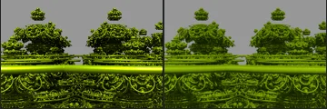
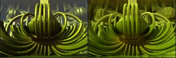
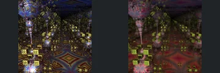
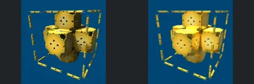
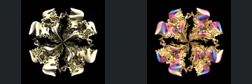
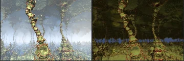
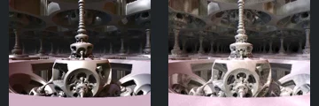
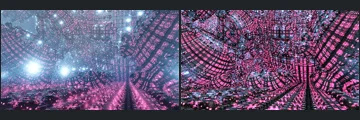
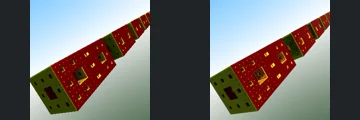
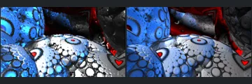

# Reviewed Scenes: Page 4

[Page 1](page-01.md) | [Page 2](page-02.md) | [Page 3](page-03.md) | [Page 4](page-04.md) | [Page 5](page-05.md) | [Page 6](page-06.md) | [Page 7](page-07.md) | [Page 8](page-08.md) | [Page 9](page-09.md) | [Page 10](page-10.md) | [Page 11](page-11.md) | [Page 12](page-12.md) | [Page 13](page-13.md) | [Page 14](page-14.md) | [Page 15](page-15.md) | [Page 16](page-16.md) | [Page 17](page-17.md) | [Page 18](page-18.md) | [Page 19](page-19.md) | [Page 20](page-20.md) | [Page 21](page-21.md) | [Page 22](page-22.md)

Each thumbnail: native left, FPT authored right. Open a scene for full neutral/beauty comparisons, limitations and capture settings.

## [31: T_DIFS AmazIfs torus](31.md)

accepted-with-limitations | historical-2026-09-10 | 32 SPP

Prior ranked-gallery visual acceptance retained for these unchanged captures. Native appearance and fine-detail parity are not certified.

## [33: pk3Abx15](33.md)

accepted-with-limitations | historical-2026-09-10 | 32 SPP

Prior ranked-gallery visual acceptance retained for these unchanged captures. Native appearance and fine-detail parity are not certified.

## [34: pseudo_kleinian_mod6](34.md)

accepted-with-limitations | historical-2026-09-10 | 32 SPP

Prior ranked-gallery visual acceptance retained for these unchanged captures. Native appearance and fine-detail parity are not certified.

## [35: transf_quadratic_fold menger4D](35.md)

accepted-with-limitations | historical-2026-09-10 | 32 SPP

Prior ranked-gallery visual acceptance retained for these unchanged captures. Native appearance and fine-detail parity are not certified.

## [36: mandelbulb_pupuku pow-4a](36.md)

accepted-with-limitations | historical-2026-09-10 | 32 SPP

Prior ranked-gallery visual acceptance retained for these unchanged captures. Native appearance and fine-detail parity are not certified.

## [38: asurf_kleinV2 aa](38.md)

accepted-with-limitations | historical-2026-09-10 | 32 SPP

Prior ranked-gallery visual acceptance retained for these unchanged captures. Native appearance and fine-detail parity are not certified.

## [39: aboxMod14_torus](39.md)

accepted-with-limitations | historical-2026-09-10 | 32 SPP

Prior ranked-gallery visual acceptance retained for these unchanged captures. Native appearance and fine-detail parity are not certified.

## [40: orbitTraps 005](40.md)

accepted-with-limitations | historical-2026-09-10 | 32 SPP

Orbit-trap surface lighting restored; volumetric halos remain unsupported.

## [41: transfSinYm3d_menger3](41.md)

accepted-with-limitations | historical-2026-09-10 | 32 SPP

Prior ranked-gallery visual acceptance retained for these unchanged captures. Native appearance and fine-detail parity are not certified.

## [42: riemann bulb msltoe mod2 001](42.md)

accepted-with-limitations | historical-2026-09-10 | 32 SPP

Known normal/lighting residual; rejected analytic derivative is NOT included.
