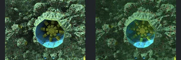
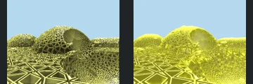
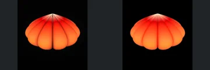
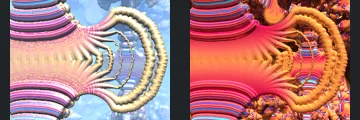
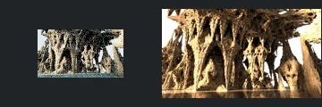
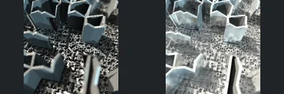
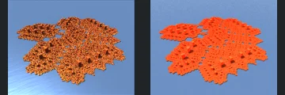
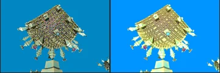
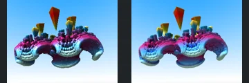
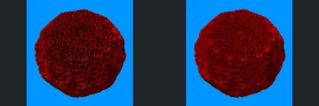

# Reviewed Scenes: Page 5

[Page 1](page-01.md) | [Page 2](page-02.md) | [Page 3](page-03.md) | [Page 4](page-04.md) | [Page 5](page-05.md) | [Page 6](page-06.md) | [Page 7](page-07.md) | [Page 8](page-08.md) | [Page 9](page-09.md) | [Page 10](page-10.md) | [Page 11](page-11.md) | [Page 12](page-12.md) | [Page 13](page-13.md) | [Page 14](page-14.md) | [Page 15](page-15.md) | [Page 16](page-16.md) | [Page 17](page-17.md) | [Page 18](page-18.md) | [Page 19](page-19.md) | [Page 20](page-20.md)

Each thumbnail: native left, FPT authored right. Open a scene for full neutral/beauty comparisons, limitations and capture settings.

## [43: Koch_Ifs aaa2](43.md)

accepted-with-limitations | historical-2026-09-10 | 32 SPP

Prior ranked-gallery visual acceptance retained for these unchanged captures. Native appearance and fine-detail parity are not certified.

## [44: T_DIFS Tri_Grid asurf](44.md)

accepted-with-limitations | historical-2026-09-10 | 32 SPP

Prior ranked-gallery visual acceptance retained for these unchanged captures. Native appearance and fine-detail parity are not certified.

## [45: T_difsSupershapeV2](45.md)

accepted-with-limitations | historical-2026-09-10 | 32 SPP

Prior ranked-gallery visual acceptance retained for these unchanged captures. Native appearance and fine-detail parity are not certified.

## [47: pseudo kleinian std de 001](47.md)

accepted-with-limitations | historical-2026-09-10 | 32 SPP

Prior ranked-gallery visual acceptance retained for these unchanged captures. Native appearance and fine-detail parity are not certified.

## [49: monte carlo global illumination](49.md)

accepted-with-limitations | historical-2026-09-10 | 32 SPP

Prior ranked-gallery visual acceptance retained for these unchanged captures. Native appearance and fine-detail parity are not certified.

## [50: hex prism and chromatic](50.md)

accepted-with-limitations | historical-2026-09-10 | 32 SPP

Known authored-lighting/indirect-transport mismatch.

## [052: DIFS Box DiagV1 complex primitive](052.md)

accepted-with-limitations | refreshed-2026-09-11 | 32 SPP

Authored silhouette and framing align after water support. Neutral water dominates the white control; authored orange material is flatter and the reflected sky differs. Accept broad structure, not water transport parity.

## [054: DIFS Box DiagV3 asurf](054.md)

accepted-with-limitations | historical-2026-09-10 | 32 SPP

Tree silhouette and framing align. FPT is brighter/yellower and uses a different blue sky; colour differences do not obscure the structure.

## [055: DIFS Box DiagV3 complex primitive](055.md)

accepted | refreshed-2026-09-11 | 32 SPP

Refreshed crystal arrangement, curved ridges, orientation and broad colours closely match the reference. Minor highlights differ.

## [056: DIFS Box Frame asa1](056.md)

accepted-with-limitations | historical-2026-09-10 | 32 SPP

Red spherical silhouette and surface pattern align. Both views are dark red; FPT contrast is softer, but the shape remains readable.
