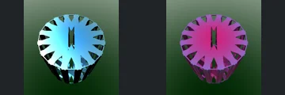
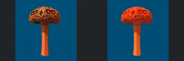
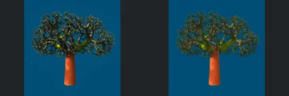
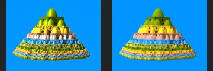
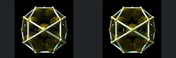
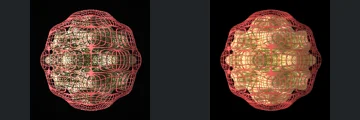

# Reviewed Scenes: Page 6

[Page 1](page-01.md) | [Page 2](page-02.md) | [Page 3](page-03.md) | [Page 4](page-04.md) | [Page 5](page-05.md) | [Page 6](page-06.md) | [Page 7](page-07.md) | [Page 8](page-08.md) | [Page 9](page-09.md) | [Page 10](page-10.md) | [Page 11](page-11.md) | [Page 12](page-12.md) | [Page 13](page-13.md) | [Page 14](page-14.md) | [Page 15](page-15.md) | [Page 16](page-16.md) | [Page 17](page-17.md) | [Page 18](page-18.md) | [Page 19](page-19.md) | [Page 20](page-20.md) | [Page 21](page-21.md) | [Page 22](page-22.md) | [Page 23](page-23.md) | [Page 24](page-24.md)

Each thumbnail: native left, FPT authored right. Open a scene for full neutral/beauty comparisons, limitations and capture settings.

## [057: DIFS Box Frame asa2](057.md)

accepted-with-limitations | historical-2026-09-10 | 32 SPP

Cutouts, silhouette and orientation align clearly. Native cyan becomes magenta; accepted as a palette difference, not material parity.

## [058: DIFS BoxV1 asurf](058.md)

accepted-with-limitations | historical-2026-09-10 | 32 SPP

Nested rings, close-up framing and visible openings align. FPT reflections and brightness differ without hiding the main structure.

## [059: DIFS BoxV1 flower](059.md)

accepted-with-limitations | historical-2026-09-10 | 32 SPP

Cap/stem silhouette and framing align. FPT replaces glossy orange highlights with a flatter red/orange material.

## [060: DIFS Cylinder rocket](060.md)

accepted | refreshed-2026-09-11 | 32 SPP

Refreshed rocket components, orientation, framing and broad colours align. Remaining differences are small shading changes.

## [061: DIFS Cylinder tree](061.md)

accepted-with-limitations | refreshed-2026-09-11 | 32 SPP

Tree silhouette, trunk and branching align. Leaf shading and trunk saturation differ, but both remain readable.

## [062: DIFS GridV2 boxBulb](062.md)

accepted-with-limitations | refreshed-2026-09-11 | 32 SPP

Main divided cylindrical composition, opening and repeated spherical detail align. Palette and fine patterned shading differ considerably but the structure remains readable.

## [063: DIFS Hextgrid2 sphInv](063.md)

accepted-with-limitations | refreshed-2026-09-11 | 32 SPP

Symmetric nested toroidal structure and central fine motif align. Pink authored metal becomes yellow in FPT; colour accuracy is explicitly outside this acceptance.

## [064: DIFS Menger Ellipsoid](064.md)

accepted-with-limitations | refreshed-2026-09-11 | 32 SPP

Tiered ellipsoid silhouette, levels and horizontal colour bands align closely. Fine highlights and shadows differ.

## [065: DIFS Polyhedra_hexgrid](065.md)

accepted-with-limitations | refreshed-2026-09-11 | 32 SPP

Polyhedral frame, spherical vertices and internal round structures align. FPT has darker, less glittering gold interiors but preserves their visible shape.

## [066: DIFS Sphere MBulb a2](066.md)

accepted-with-limitations | refreshed-2026-09-11 | 32 SPP

Rounded cage silhouette, repeated red lattice and gold interior align. FPT shows a brighter, more continuous interior and different reflective highlights.
