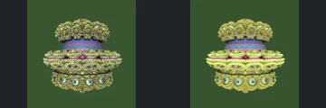
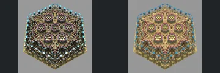
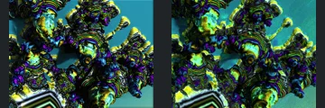
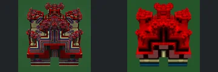
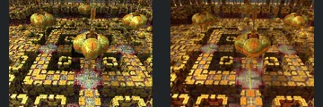
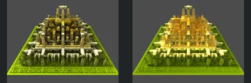

# Reviewed Scenes: Page 7

[Page 1](page-01.md) | [Page 2](page-02.md) | [Page 3](page-03.md) | [Page 4](page-04.md) | [Page 5](page-05.md) | [Page 6](page-06.md) | [Page 7](page-07.md) | [Page 8](page-08.md) | [Page 9](page-09.md) | [Page 10](page-10.md) | [Page 11](page-11.md) | [Page 12](page-12.md) | [Page 13](page-13.md) | [Page 14](page-14.md) | [Page 15](page-15.md) | [Page 16](page-16.md) | [Page 17](page-17.md) | [Page 18](page-18.md) | [Page 19](page-19.md) | [Page 20](page-20.md) | [Page 21](page-21.md) | [Page 22](page-22.md) | [Page 23](page-23.md) | [Page 24](page-24.md) | [Page 25](page-25.md) | [Page 26](page-26.md) | [Page 27](page-27.md) | [Page 28](page-28.md) | [Page 29](page-29.md) | [Page 30](page-30.md) | [Page 31](page-31.md)

Each thumbnail: native left, FPT authored right. Open a scene for full neutral/beauty comparisons, limitations and capture settings.

## [067: DIFS Sphere MBulb](067.md)

accepted-with-limitations | refreshed-2026-09-11 | 32 SPP

Tiered rounded structure, central dome and repeated top/bottom ornaments align. FPT is more yellow and evenly lit with different tiny highlights.

## [068: DIFS Torus asurf](068.md)

accepted-with-limitations | refreshed-2026-09-11 | 32 SPP

Central arch, patterned ground and horizon mounds align. Both authored images are deliberately dark orange; FPT reduces fine bright highlights but the principal layout remains visible.

## [070: DIFS Torus twist asa1](070.md)

accepted-with-limitations | refreshed-2026-09-11 | 32 SPP

Twisted three-lobed surface and central opening align closely. Small bright/noisy reflection patches remain near the inner join; no large structural discrepancy is visible.

## [072: DIFS_AmazIfs_Hex](072.md)

accepted-with-limitations | refreshed-2026-09-11 | 32 SPP

Hexagonal outline, repeated central rosettes and outer facet bands align. FPT has softer gold shading and less point-like sparkle, without a large visible geometry omission.

## [073: Jos Leys Kleinian Hybrid esc7](073.md)

accepted-with-limitations | refreshed-2026-09-11 | 32 SPP

Oblique lobed repeating structure and major voids align. FPT has broader yellow/cyan reflections and noise around bright patches; exact reflective appearance is not certified.

## [074: Jos Leys Kleinian Hybrid inv cos](074.md)

accepted-with-limitations | refreshed-2026-09-11 | 32 SPP

Symmetric curled lobes, central bright motif and crossed lower stems align closely. Reflective colours and fine highlights differ, without obvious large structural loss.

## [075: Jos Leys Kleinian v3](075.md)

accepted-with-limitations | refreshed-2026-09-11 | 32 SPP

Elongated central body, paired curled lobes and bead-like surface pattern align. Red/gold highlights and dark background tone differ slightly; fine reflective parity is not certified.

## [077: KochV4](077.md)

accepted-with-limitations | refreshed-2026-09-11 | 32 SPP

Stepped tower silhouette, central arch and repeated upper features align. FPT replaces multicoloured contour bands with mostly red material and shaded surfaces; colour/texture interpretation remains approximate.

## [078: KochV5 01](078.md)

accepted-with-limitations | refreshed-2026-09-11 | 32 SPP

Central floating rounded forms, surrounding platforms and square openings align. Gold reflection/transparency and noise differ, but the principal structure remains readable.

## [079: KochV5](079.md)

accepted-with-limitations | refreshed-2026-09-11 | 32 SPP

Symmetric tiered structure, upper arch and rectangular base align. FPT's stronger gold illumination and softer internal contrast change the material appearance, not the broad layout.
