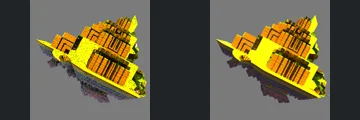
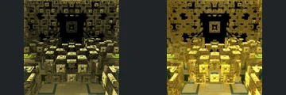
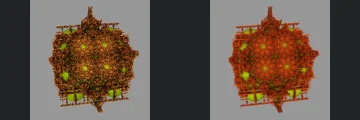
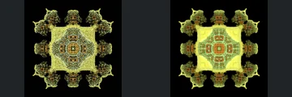
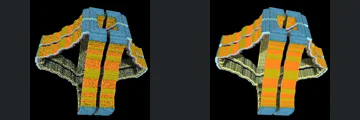
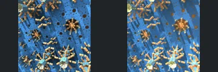
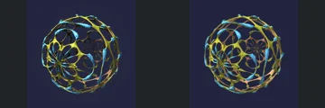
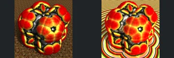

# Reviewed Scenes: Page 8

[Page 1](page-01.md) | [Page 2](page-02.md) | [Page 3](page-03.md) | [Page 4](page-04.md) | [Page 5](page-05.md) | [Page 6](page-06.md) | [Page 7](page-07.md) | [Page 8](page-08.md) | [Page 9](page-09.md) | [Page 10](page-10.md) | [Page 11](page-11.md) | [Page 12](page-12.md) | [Page 13](page-13.md) | [Page 14](page-14.md) | [Page 15](page-15.md) | [Page 16](page-16.md) | [Page 17](page-17.md) | [Page 18](page-18.md) | [Page 19](page-19.md) | [Page 20](page-20.md) | [Page 21](page-21.md) | [Page 22](page-22.md) | [Page 23](page-23.md) | [Page 24](page-24.md) | [Page 25](page-25.md) | [Page 26](page-26.md) | [Page 27](page-27.md) | [Page 28](page-28.md) | [Page 29](page-29.md) | [Page 30](page-30.md) | [Page 31](page-31.md) | [Page 32](page-32.md) | [Page 33](page-33.md) | [Page 34](page-34.md) | [Page 35](page-35.md) | [Page 36](page-36.md) | [Page 37](page-37.md) | [Page 38](page-38.md) | [Page 39](page-39.md) | [Page 40](page-40.md) | [Page 41](page-41.md) | [Page 42](page-42.md) | [Page 43](page-43.md) | [Page 44](page-44.md)

Each thumbnail: native left, FPT authored right. Open a scene for full neutral/beauty comparisons, limitations and capture settings.

## [080: KochV5_001](080.md)

accepted-with-limitations | refreshed-2026-09-11 | 32 SPP

Oblique tiered structure, slabs, small openings and underside silhouette align. Yellow/orange highlights and fine underside shading differ slightly.

## [081: KochV5_KochV5](081.md)

accepted-with-limitations | refreshed-2026-09-11 | 32 SPP

Frontal nested square opening, foreground platform and side structures align. FPT gold reflections/transparency brighten the scene substantially, but the repeated openings and principal layout remain readable.

## [082: KochV5_absAddConst](082.md)

accepted-with-limitations | refreshed-2026-09-11 | 32 SPP

Large foreground blocks, architectural grid and repeated fine cavities align closely. FPT has softer greyscale shading and some additional sampling noise; broad visibility remains consistent.

## [083: KochV5_polyFld_sphereFld](083.md)

accepted-with-limitations | refreshed-2026-09-11 | 32 SPP

Rounded lattice silhouette, top/bottom projections and embedded green forms align. FPT is redder and less sparkling than the gold native capture; fine detail is not certified at this resolution.

## [084: Koch_Ifs aaa1](084.md)

accepted-with-limitations | refreshed-2026-09-11 | 32 SPP

Symmetric outer ornaments, central rounded motif and rectangular support align. FPT is more green/gold with broader highlights and less sparkle; fine internal transparency is not certified.

## [085: Koch_Ifs aaa3](085.md)

accepted-with-limitations | refreshed-2026-09-11 | 32 SPP

Folded ribbon structure, central slit and open side gaps align closely. Blue/orange bands match broadly; reflective noise and fine edge brightness differ.

## [086: Koch_Ifs aaa4](086.md)

accepted-with-limitations | refreshed-2026-09-11 | 32 SPP

Scattered radial block clusters, surrounding round forms and camera framing align. Blue/gold colours are broadly similar; FPT has softer contrast and altered reflection/transparency.

## [087: MbulbAbsPow2_001](087.md)

accepted-with-limitations | refreshed-2026-09-11 | 32 SPP

Open spherical lattice, floral loops and central gaps align closely. Blue/gold reflections and fine edge highlights differ slightly.

## [089: Menger 4D Mod1](089.md)

accepted-with-limitations | refreshed-2026-09-11 | 32 SPP

Curved blue columns, pink foreground arch and circular cavity align closely. FPT changes reflective brightness and transparency, but the colourful surfaces and large openings remain readable.

## [090: MengerMid_RotVary_SphOffsetVCL](090.md)

accepted-with-limitations | refreshed-2026-09-11 | 32 SPP

Rounded red/gold lobes, center opening and foreground silhouette align. The ground material differs substantially, becoming concentric bands rather than a mottled texture; acceptance is limited to readable object geometry, not background material parity.
