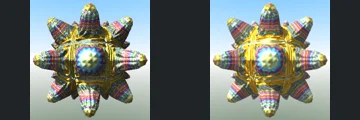
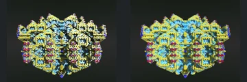

# Reviewed Scenes: Page 9

[Page 1](page-01.md) | [Page 2](page-02.md) | [Page 3](page-03.md) | [Page 4](page-04.md) | [Page 5](page-05.md) | [Page 6](page-06.md) | [Page 7](page-07.md) | [Page 8](page-08.md) | [Page 9](page-09.md) | [Page 10](page-10.md) | [Page 11](page-11.md) | [Page 12](page-12.md) | [Page 13](page-13.md) | [Page 14](page-14.md) | [Page 15](page-15.md) | [Page 16](page-16.md) | [Page 17](page-17.md) | [Page 18](page-18.md) | [Page 19](page-19.md) | [Page 20](page-20.md) | [Page 21](page-21.md) | [Page 22](page-22.md) | [Page 23](page-23.md) | [Page 24](page-24.md) | [Page 25](page-25.md) | [Page 26](page-26.md) | [Page 27](page-27.md) | [Page 28](page-28.md) | [Page 29](page-29.md) | [Page 30](page-30.md) | [Page 31](page-31.md) | [Page 32](page-32.md) | [Page 33](page-33.md) | [Page 34](page-34.md) | [Page 35](page-35.md) | [Page 36](page-36.md) | [Page 37](page-37.md) | [Page 38](page-38.md)

Each thumbnail: native left, FPT authored right. Open a scene for full neutral/beauty comparisons, limitations and capture settings.

## [091: MengerV4](091.md)

accepted-with-limitations | refreshed-2026-09-11 | 32 SPP

Spiral thin-sheet silhouette, large gaps and internal filaments align. FPT is brighter yellow with broader highlights, but no large structural omission is apparent.

## [092: MengerV5](092.md)

accepted-with-limitations | refreshed-2026-09-11 | 32 SPP

The square slab, central through-opening and repeated cavity grid align. FPT loses bright metallic highlights and is darker/more matte, but the main openings and surface pattern remain readable.

## [094: RiemannSphereMsltoeV2](094.md)

accepted-with-limitations | refreshed-2026-09-11 | 32 SPP

The radial lobes, central faceted recess and silhouette match. FPT retains the rainbow/gold material and blue sky, with smoother highlights, less native noise and altered small reflection detail.

## [096: Sierpinski 4D](096.md)

accepted-with-limitations | refreshed-2026-09-11 | 32 SPP

The symmetric stepped silhouette, central diamond and repeated square details align. FPT retains the blue/gold palette with flatter and broader colour patches instead of the native high-contrast reflective sparkle.

## [098: T-DifsBxFrame_T-DifsCayley2](098.md)

accepted-with-limitations | refreshed-2026-09-11 | 32 SPP

The thin rectangular frame, top loops and central rounded solid align. FPT is substantially brighter yellow/red and changes face shading, but the component layout and empty frame gaps remain clear.

## [099: T-DifsCayley2](099.md)

accepted-with-limitations | refreshed-2026-09-11 | 32 SPP

The large pointed arch, repeated central rounded pairs and flanking curved surfaces align. FPT is more matte and subdued green instead of bright glossy yellow-green, while the openings and forms remain readable.

## [101: T-DifsChessboard_T-DifsSphereGrid](101.md)

accepted-with-limitations | refreshed-2026-09-11 | 32 SPP

The circular relief, radial grooves, central star pattern and black/white surface bands align closely. FPT shifts some bands toward pale yellow and changes highlight strength, without an obvious large geometry difference.

## [103: T-DifsHelixMenger](103.md)

accepted-with-limitations | refreshed-2026-09-11 | 32 SPP

The stacked perforated cylindrical sections, central openings and red top-face pattern align closely. FPT changes some highlight and inner-hole colours without altering the broad construction.

## [104: T-DifsHelixMenger_001](104.md)

accepted-with-limitations | refreshed-2026-09-11 | 32 SPP

The radial panel layout, outer silhouette and central aperture align broadly. FPT changes the copper material to a rainbow reflective appearance, including different inner-rim reflections; this acceptance is for readable structure, not material parity.

## [105: T-DifsHelixMenger_002](105.md)

accepted-with-limitations | refreshed-2026-09-11 | 32 SPP

The repeating twisted ribbed form and narrow central connections align. Both images have very bright white faces; FPT changes fine highlight and crease contrast without an obvious broad shape difference.
