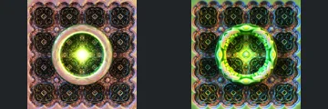

# Reviewed Scenes: Page 10

[Page 1](page-01.md) | [Page 2](page-02.md) | [Page 3](page-03.md) | [Page 4](page-04.md) | [Page 5](page-05.md) | [Page 6](page-06.md) | [Page 7](page-07.md) | [Page 8](page-08.md) | [Page 9](page-09.md) | [Page 10](page-10.md) | [Page 11](page-11.md) | [Page 12](page-12.md) | [Page 13](page-13.md) | [Page 14](page-14.md)

Each thumbnail: native left, FPT authored right. Open a scene for full neutral/beauty comparisons, limitations and capture settings.

## [393: IFS 31](393.md)

accepted-with-limitations | refreshed-2026-09-11 | 32 SPP

Dense lattice corridor, central support and converging floor align. FPT has stronger bright speckling at 32 SPP and a coloured rather than grey atmosphere; fine detail/noise parity is not certified.

## [398: aboxmod15](398.md)

accepted-with-limitations | refreshed-2026-09-11 | 32 SPP

Dense central ridges, left foreground rise and right cliff outline align. FPT is sharper with stronger dark creases; native haze and fine-detail noise are not matched.

## [400: aexion01](400.md)

accepted-with-limitations | refreshed-2026-09-11 | 32 SPP

Tall central spire and sweeping stepped flanks align. FPT retains readable green surfaces but omits the native atmospheric sky; atmosphere is explicitly outside this acceptance.

## [406: benesi03](406.md)

accepted-with-limitations | refreshed-2026-09-11 | 32 SPP

Sweeping foreground folds, large upper curl and right-hand branching cavity align closely. Yellow/orange lighting is somewhat stronger in FPT but preserves the same major surface relief.

## [410: bristorbrot01](410.md)

accepted-with-limitations | refreshed-2026-09-11 | 32 SPP

Large receding rings and central spiral align. FPT is sharply defined and strongly gold/magenta rather than hazy grey/gold; depth of field, sky and reflective appearance are not certified.

## [412: cayley2](412.md)

accepted-with-limitations | refreshed-2026-09-11 | 32 SPP

Central ring, inner motif and surrounding repeated tiles align. Green reflective patterns and glow differ considerably while keeping the main geometry readable.

## [563: Makin3D-Julia_001](563.md)

accepted-with-limitations | historical-2026-09-10 | 32 SPP

Curved foreground forms remain clear and similarly placed. Pink/yellow native environment becomes dark blue with chrome surfaces; accepted with strong material/environment caveats.

## [564: Abox4D8K](564.md)

accepted-with-limitations | historical-2026-09-10 | 32 SPP

Rounded corridor features and camera framing align. FPT replaces olive highlights with reddish lower-contrast shading.

## [565: Caves-PseudoKleinianMod2](565.md)

accepted-with-limitations | historical-2026-09-10 | 32 SPP

Cave pillars, water/floor extent and framing broadly align. Native reflective highlights and floor response differ.

## [566: Caves2-PseudoKleinianMod2](566.md)

accepted-with-limitations | historical-2026-09-10 | 32 SPP

Cave walls and pillar positions align, with the structure clearly readable. Patterned green FPT materials differ from native highlights.
