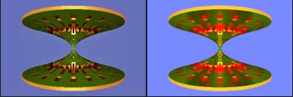
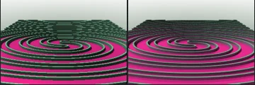

# Reviewed Scenes: Page 10

[Page 1](page-01.md) | [Page 2](page-02.md) | [Page 3](page-03.md) | [Page 4](page-04.md) | [Page 5](page-05.md) | [Page 6](page-06.md) | [Page 7](page-07.md) | [Page 8](page-08.md) | [Page 9](page-09.md) | [Page 10](page-10.md) | [Page 11](page-11.md) | [Page 12](page-12.md) | [Page 13](page-13.md) | [Page 14](page-14.md) | [Page 15](page-15.md) | [Page 16](page-16.md) | [Page 17](page-17.md) | [Page 18](page-18.md) | [Page 19](page-19.md) | [Page 20](page-20.md) | [Page 21](page-21.md) | [Page 22](page-22.md)

Each thumbnail: native left, FPT authored right. Open a scene for full neutral/beauty comparisons, limitations and capture settings.

## [106: T-DifsHelixV2](106.md)

accepted-with-limitations | refreshed-2026-09-11 | 32 SPP

The tapered spiral ribbon, open gaps and pointed top align closely. FPT is more uniformly orange with reduced golden specular highlights, while the full silhouette remains clear.

## [107: T-DifsHelixV2_001](107.md)

accepted-with-limitations | refreshed-2026-09-11 | 32 SPP

The interleaved spiral ribbons, crossing positions and open gaps align closely. FPT is more evenly orange with weaker glossy highlights than native.

## [108: T-DifsOctahedron2a](108.md)

accepted-with-limitations | refreshed-2026-09-11 | 32 SPP

The tilted faceted solid, circular face regions and cyan/pink/yellow pattern align closely. Small shading and antialiasing differences remain.

## [109: T-DifsOctahedron2b](109.md)

accepted-with-limitations | refreshed-2026-09-11 | 32 SPP

The orange faceted lobes, green circular corner regions and overall framing align. FPT introduces stronger red shading along the central crease and some grain; the broad shape and material regions remain clear.

## [110: T-DifsTorusMenger_T-DifsClipCustom](110.md)

accepted-with-limitations | refreshed-2026-09-11 | 32 SPP

The rounded perforated shell, large front opening, upper rim and repeated small windows align in native and both FPT controls. Authored FPT is brighter yellow with a brighter violet background; broad structure remains readable, without claiming exact shading or palette parity.

## [111: T-DifsTorusMenger_T-DifsClipCustom_001](111.md)

accepted-with-limitations | refreshed-2026-09-11 | 32 SPP

The opposing perforated disks, narrow central connection and outer rims align. FPT has brighter red/yellow accents and a brighter blue background; the major openings and silhouette remain readable.

## [112: T-DifsTorusMenger_T-DifsPiriform](112.md)

accepted-with-limitations | refreshed-2026-09-11 | 32 SPP

The interleaved spiral ribbons, open gaps and circular silhouette align closely. FPT is brighter orange/yellow and less glossy than native; major material regions and structure remain clear.

## [115: T_DIFS Chessboard](115.md)

accepted-with-limitations | refreshed-2026-09-11 | 32 SPP

The flat slab, black/white checker layout and camera framing match closely. Fine edge sampling and slight white/yellow shading differ.

## [116: T_DIFS GridV3 001](116.md)

accepted-with-limitations | refreshed-2026-09-11 | 32 SPP

The flat spiral bands, narrow gaps and upper stepped boundary align closely. Pink/green regions are retained with small contrast, background and sampling differences.

## [117: T_DIFS GridV3 002](117.md)

accepted-with-limitations | refreshed-2026-09-11 | 32 SPP

The stepped square spiral, side fins and central raised regions align. FPT has a brighter cyan background and slightly brighter gold faces, with no obvious broad framing or coverage change.
