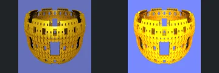

# Reviewed Scenes: Page 10

[Page 1](page-01.md) | [Page 2](page-02.md) | [Page 3](page-03.md) | [Page 4](page-04.md) | [Page 5](page-05.md) | [Page 6](page-06.md) | [Page 7](page-07.md) | [Page 8](page-08.md) | [Page 9](page-09.md) | [Page 10](page-10.md) | [Page 11](page-11.md) | [Page 12](page-12.md) | [Page 13](page-13.md) | [Page 14](page-14.md) | [Page 15](page-15.md) | [Page 16](page-16.md) | [Page 17](page-17.md)

Each thumbnail: native left, FPT authored right. Open a scene for full neutral/beauty comparisons, limitations and capture settings.

## [106: T-DifsHelixV2](106.md)

accepted-with-limitations | refreshed-2026-09-11 | 32 SPP

The tapered spiral ribbon, open gaps and pointed top align closely. FPT is more uniformly orange with reduced golden specular highlights, while the full silhouette remains clear.

## [107: T-DifsHelixV2_001](107.md)

accepted-with-limitations | refreshed-2026-09-11 | 32 SPP

The interleaved spiral ribbons, crossing positions and open gaps align closely. FPT is more evenly orange with weaker glossy highlights than native.

## [108: T-DifsOctahedron2a](108.md)

accepted-with-limitations | refreshed-2026-09-11 | 32 SPP

The tilted faceted solid, circular face regions and cyan/pink/yellow pattern align closely. Small shading and antialiasing differences remain.

## [109: T-DifsOctahedron2b](109.md)

accepted-with-limitations | refreshed-2026-09-11 | 32 SPP

The orange faceted lobes, green circular corner regions and overall framing align. FPT introduces stronger red shading along the central crease and some grain; the broad shape and material regions remain clear.

## [110: T-DifsTorusMenger_T-DifsClipCustom](110.md)

accepted-with-limitations | refreshed-2026-09-11 | 32 SPP

The rounded perforated shell, large front opening, upper rim and repeated small windows align in native and both FPT controls. Authored FPT is brighter yellow with a brighter violet background; broad structure remains readable, without claiming exact shading or palette parity.

## [375: Construct by Ectoplaz 2](375.md)

accepted-with-limitations | historical-2026-09-10 | 32 SPP

Main green structure and framing align and remain readable. Native blue atmospheric fill is absent; background contrast and materials differ.

## [378: GeneralizedFoldBox01](378.md)

accepted-with-limitations | historical-2026-09-10 | 32 SPP

Large central surfaces and framing align. FPT is sharper/orange and native blur differs; fine depth and material parity are not certified.

## [379: GeneralizedFoldBox02](379.md)

accepted-with-limitations | refreshed-2026-09-11 | 32 SPP

Refreshed water surface and red sphere are restored; broad cavern framing matches. Reflections, saturation and sphere roughness still differ.

## [380: GeneralizedFoldBox03_2](380.md)

accepted-with-limitations | refreshed-2026-09-11 | 32 SPP

Refreshed box/displacement path restores the cavern instead of the earlier incorrect close surfaces. Broad opening and rock placement now align; blue contrast, highlights and fine cave detail remain imperfect.

## [381: Hybrid 1](381.md)

accepted-with-limitations | historical-2026-09-10 | 32 SPP

Central ornament placement and surrounding forms broadly align. Native soft focus becomes sharper and more contrasty in FPT.
