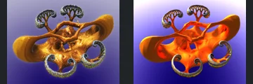
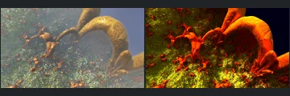
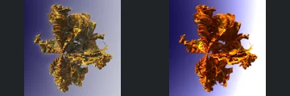
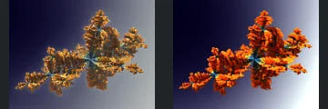
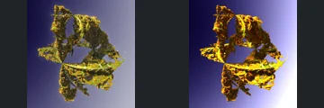
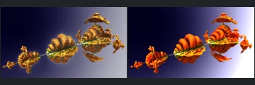

# Reviewed Scenes: Page 11

[Page 1](page-01.md) | [Page 2](page-02.md) | [Page 3](page-03.md) | [Page 4](page-04.md) | [Page 5](page-05.md) | [Page 6](page-06.md) | [Page 7](page-07.md) | [Page 8](page-08.md) | [Page 9](page-09.md) | [Page 10](page-10.md) | [Page 11](page-11.md) | [Page 12](page-12.md)

Each thumbnail: native left, FPT authored right. Open a scene for full neutral/beauty comparisons, limitations and capture settings.

## [606: amazing_surf 002](606.md)

accepted-with-limitations | refreshed-2026-09-11 | 32 SPP

Foreground arches, central bowl, curling supports and distant repetition align. FPT is strongly orange and sharp rather than hazy with authored depth of field; atmosphere and optical effects are not certified.

## [611: benesi pwr2 mandelbulbs 001](611.md)

accepted-with-limitations | refreshed-2026-09-11 | 32 SPP

Radial cavity, surrounding ring and right-hand surface boundary align. FPT is sharper with red/blue rather than gold/purple optical shading; depth-of-field and reflective appearance are not certified.

## [612: benesi_mag_transforms_001](612.md)

accepted-with-limitations | refreshed-2026-09-11 | 32 SPP

Radial petal composition and center align in the geometry control. FPT reflective appearance is sharper and strongly magenta rather than brown/pink; exact material transport is not certified.

## [617: box_fold_bulb_pow2_001](617.md)

accepted-with-limitations | refreshed-2026-09-11 | 32 SPP

Central tiered spire, surrounding repeated spires and camera align. FPT is sharper with strongly patterned gold ground; native clouds and depth-of-field blur are not reproduced.

## [630: newtonPow3-PolyFoldSym-delta-gnj-016d](630.md)

accepted-with-limitations | historical-2026-09-10 | 32 SPP

Newton silhouette, openings and loops align clearly. Native reflective gold becomes saturated orange/red with a different environment gradient.

## [631: newtonPow3-PolyFoldSym-delta-gnj-017b](631.md)

accepted-with-limitations | historical-2026-09-10 | 32 SPP

Large Newton arcs and framing align. Native soft golden shading/haze becomes sharper saturated red/yellow detail; fine background fidelity is not certified.

## [632: newtonPow3-ScaleRot-delta-gnj-007d](632.md)

accepted-with-limitations | historical-2026-09-10 | 32 SPP

Branching Newton silhouette and major gaps align. FPT colours and environment gradient differ substantially but do not hide the structure.

## [633: newtonPow3-delta-gnj-001b](633.md)

accepted-with-limitations | historical-2026-09-10 | 32 SPP

Newton silhouette, framing and branching placement align. FPT is more saturated orange with different highlights and background lighting.

## [634: newtonPow3-delta-gnj-002h](634.md)

accepted-with-limitations | historical-2026-09-10 | 32 SPP

Broad Newton silhouette and openings align. Brighter yellow highlights and a different environment gradient remain.

## [635: newtonPow3-rotfold-delta-gnj-003d](635.md)

accepted-with-limitations | historical-2026-09-10 | 32 SPP

Newton coil placement and framing align clearly. Native gold becomes saturated orange/red; reflection and environment differences remain.
