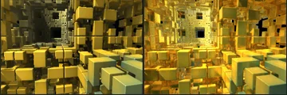
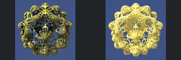
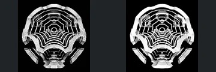
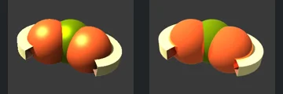

# Reviewed Scenes: Page 11

[Page 1](page-01.md) | [Page 2](page-02.md) | [Page 3](page-03.md) | [Page 4](page-04.md) | [Page 5](page-05.md) | [Page 6](page-06.md) | [Page 7](page-07.md) | [Page 8](page-08.md) | [Page 9](page-09.md) | [Page 10](page-10.md) | [Page 11](page-11.md) | [Page 12](page-12.md) | [Page 13](page-13.md) | [Page 14](page-14.md) | [Page 15](page-15.md) | [Page 16](page-16.md) | [Page 17](page-17.md) | [Page 18](page-18.md) | [Page 19](page-19.md) | [Page 20](page-20.md)

Each thumbnail: native left, FPT authored right. Open a scene for full neutral/beauty comparisons, limitations and capture settings.

## [118: T_DIFS Helix 001](118.md)

accepted-with-limitations | refreshed-2026-09-11 | 32 SPP

The tapered yellow helix, spacing between turns and silhouette align closely. FPT uses a brighter blue-white sky and flatter bright yellow faces; no obvious broad geometry loss.

## [119: T_DIFS Helix 002](119.md)

accepted-with-limitations | refreshed-2026-09-11 | 32 SPP

The tapered curled tube, two upper openings and repeated turns align in all three views. FPT replaces the plain orange native material with rainbow bands, but silhouette and openings remain clear. This accepts geometry/readability, not exact procedural colour.

## [120: T_DIFS Helix 003](120.md)

accepted-with-limitations | refreshed-2026-09-11 | 32 SPP

The vertical green cylinder, orange helical fins and turn spacing align. FPT is brighter red/orange with a lighter background; the cropped framing is authored and shared by both captures.

## [121: T_DIFS Helix Menger 001](121.md)

accepted-with-limitations | refreshed-2026-09-11 | 32 SPP

The block corridor, central square opening and major foreground cubes align closely. FPT has brighter gold reflections and visible sampling grain while keeping the block layout and gaps readable.

## [122: T_DIFS SphereGrid IQ](122.md)

accepted-with-limitations | refreshed-2026-09-11 | 32 SPP

The spherical open wire lattice, outer lobes and central repeated loops align closely. FPT is brighter pale gold with weaker dark reflective contrast, but the thin connections and open gaps remain legible.

## [123: T_DIFS Spring MixPinski](123.md)

accepted-with-limitations | refreshed-2026-09-11 | 32 SPP

The thin spring/wire corridor, twin rounded door outlines and long crossing horizontal lines align. Both renders intentionally have a black field with yellow-green lines; FPT changes fine line intensity and reflective repetition, without an obvious loss of the main wire structure.

## [124: T_DIFS Spring PolyFld](124.md)

accepted-with-limitations | refreshed-2026-09-11 | 32 SPP

The spherical polygonal wire bands, central opening and three large lower arches align. FPT brightens and visually thickens some white highlights; the overall open lattice remains intact, without certifying subpixel line thickness.

## [125: T_DIFS Torus4](125.md)

accepted-with-limitations | refreshed-2026-09-11 | 32 SPP

The repeated rounded three-lobed pattern and open blue gaps align closely. Small edge shading and background saturation changes remain.

## [126: T_DIFS Torus4_sphere](126.md)

accepted-with-limitations | refreshed-2026-09-11 | 32 SPP

The three rounded lobes and surrounding cut ring align closely. Orange/green/cream regions match, while FPT removes the strong native glossy highlight and looks more matte.

## [127: T_DIFS Tube _ Tube](127.md)

accepted-with-limitations | refreshed-2026-09-11 | 32 SPP

The two split cylindrical shells, central connector and thin internal dividers align. Material regions and background correspond, with brighter yellow/green reflections and more sampling grain in FPT.
