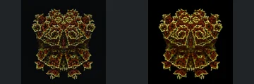
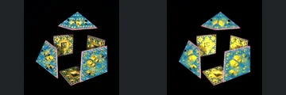
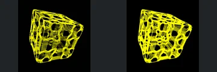
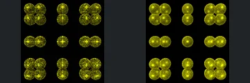
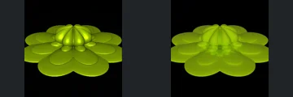

# Reviewed Scenes: Page 12

[Page 1](page-01.md) | [Page 2](page-02.md) | [Page 3](page-03.md) | [Page 4](page-04.md) | [Page 5](page-05.md) | [Page 6](page-06.md) | [Page 7](page-07.md) | [Page 8](page-08.md) | [Page 9](page-09.md) | [Page 10](page-10.md) | [Page 11](page-11.md) | [Page 12](page-12.md) | [Page 13](page-13.md) | [Page 14](page-14.md) | [Page 15](page-15.md) | [Page 16](page-16.md) | [Page 17](page-17.md) | [Page 18](page-18.md) | [Page 19](page-19.md) | [Page 20](page-20.md) | [Page 21](page-21.md) | [Page 22](page-22.md) | [Page 23](page-23.md) | [Page 24](page-24.md)

Each thumbnail: native left, FPT authored right. Open a scene for full neutral/beauty comparisons, limitations and capture settings.

## [128: T_PolyfoldAtan2Iter_sierp](128.md)

accepted-with-limitations | refreshed-2026-09-11 | 32 SPP

The symmetrical clustered form, upper/lower lobes and silhouette align closely. FPT softens the tiny sparkling edge pattern and changes red/gold contrast; broad structure remains readable, without certifying microscopic detail.

## [130: T_absSym3_koch](130.md)

accepted-with-limitations | refreshed-2026-09-11 | 32 SPP

The separated triangular top, open box panels and large central gap align. FPT changes fine triangular reflections and blue/gold surface patterns, but the main panel geometry and framing remain clear.

## [131: T_absSym3_octahedron](131.md)

accepted-with-limitations | refreshed-2026-09-11 | 32 SPP

The faceted orange polyhedron, centre junction and silhouette align closely. FPT removes the strongest pale specular highlight and changes individual face brightness slightly.

## [132: T_absSym3_rotCheby_hextGriw2](132.md)

accepted-with-limitations | refreshed-2026-09-11 | 32 SPP

The tilted open lattice, hexagonal gaps and outer silhouette align. FPT brightens and visually thickens some yellow lines, while preserving the broad openings and connectivity. Subpixel line thickness is not certified.

## [133: T_absSym3_tube](133.md)

accepted-with-limitations | refreshed-2026-09-11 | 32 SPP

The four repeated orange tube frames, central gaps and green end openings align closely. FPT changes face brightness and introduces mild sampling grain without a broad coverage difference.

## [135: T_bxFoldInfy_sphGrid3](135.md)

accepted-with-limitations | refreshed-2026-09-11 | 32 SPP

The grid of paired and clustered wire spheres, gaps and positions align. FPT makes the yellow lattice brighter and more continuous than native fine points; broad connectivity is retained, while subpixel wire appearance is not certified.

## [136: T_difsSupershape](136.md)

accepted-with-limitations | refreshed-2026-09-11 | 32 SPP

The green rounded petal layers, raised centre and silhouette align. FPT is matte and grainier with reduced glossy highlights; the broad surfaces remain readable.

## [137: T_difsSupershapeV2 a1](137.md)

accepted-with-limitations | refreshed-2026-09-11 | 32 SPP

The star-edged open cup, central crease and outer red shell align closely. FPT has much brighter yellow interior reflections and more grain, but the cavity edges and broad form remain readable.

## [138: T_difsSupershape_sphGrid3](138.md)

accepted-with-limitations | refreshed-2026-09-11 | 32 SPP

The radial folded pale-yellow form, repeated outer ribs and narrow gaps align. FPT is brighter and flatter, but the outer silhouette and primary folds remain legible; fine highlight contrast differs.

## [140: T_sphInvV4_abxKali_hexGrid2](140.md)

accepted-with-limitations | refreshed-2026-09-11 | 32 SPP

The rounded blue hexagonal cage, smaller lower cage and receding internal openings align. FPT brightens/thickens some wire highlights, but the broad openings and silhouette remain intact; fine line intensity is not certified.
