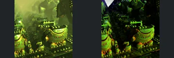
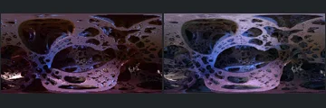
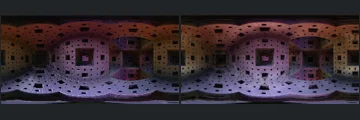
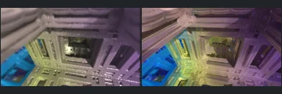
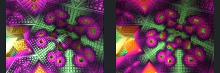
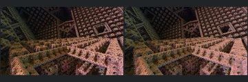
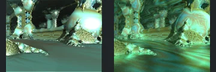

# Reviewed Scenes: Page 12

[Page 1](page-01.md) | [Page 2](page-02.md) | [Page 3](page-03.md) | [Page 4](page-04.md) | [Page 5](page-05.md) | [Page 6](page-06.md) | [Page 7](page-07.md) | [Page 8](page-08.md) | [Page 9](page-09.md) | [Page 10](page-10.md) | [Page 11](page-11.md) | [Page 12](page-12.md) | [Page 13](page-13.md) | [Page 14](page-14.md) | [Page 15](page-15.md) | [Page 16](page-16.md) | [Page 17](page-17.md)

Each thumbnail: native left, FPT authored right. Open a scene for full neutral/beauty comparisons, limitations and capture settings.

## [418: constant factor 2.0  - mandelbox scale 2.0](418.md)

accepted-with-limitations | refreshed-2026-09-11 | 32 SPP

The large foreground rounded machinery, repeated beads, stepped connections and base framing align. FPT preserves readable green/gold foreground detail but removes much of the native yellow haze and darkens the background strongly; acceptance does not certify background atmosphere or full lighting parity.

## [420: dune](420.md)

accepted-with-limitations | refreshed-2026-09-11 | 32 SPP

The domed overhang, layered front slit, short base and tilted ground align. FPT is darker and more reflective and removes the native atmospheric veil/clouded sky, but the main object remains readable; atmosphere and exact material appearance are not certified.

## [421: equirectangular mandelbox](421.md)

accepted-with-limitations | refreshed-2026-09-11 | 32 SPP

The wide equirectangular framing, central perforated form and large top/side openings align. FPT changes brown/purple reflections to cooler blue/purple and adds grain, without an obvious large structural omission.

## [422: equirectangular menger sponge](422.md)

accepted-with-limitations | refreshed-2026-09-11 | 32 SPP

The equirectangular chamber, central square recess and repeated wall/floor openings align closely. Brown/purple illumination and floor reflections differ slightly while retaining readable structure.

## [424: folded mender sponge](424.md)

accepted-with-limitations | refreshed-2026-09-11 | 32 SPP

The tilted nested square frames, perforated beams and central recess align. FPT is sharper, more yellow/blue and less blurred than native, while keeping the main connections and gaps readable.

## [430: hybrid17](430.md)

accepted-with-limitations | refreshed-2026-09-11 | 32 SPP

The nested tilted wall grids and major square recesses align. FPT retains the pink/green/yellow illumination but spreads it more softly and changes reflective contrast; fine edge and lighting parity are not certified.

## [431: hybrid18_2](431.md)

accepted-with-limitations | refreshed-2026-09-11 | 32 SPP

The tilted latticed walls, repeated foreground steps and larger square recesses align closely. Brown/pink illumination and fine sampling noise differ slightly.

## [563: Makin3D-Julia_001](563.md)

accepted-with-limitations | historical-2026-09-10 | 32 SPP

Curved foreground forms remain clear and similarly placed. Pink/yellow native environment becomes dark blue with chrome surfaces; accepted with strong material/environment caveats.

## [564: Abox4D8K](564.md)

accepted-with-limitations | historical-2026-09-10 | 32 SPP

Rounded corridor features and camera framing align. FPT replaces olive highlights with reddish lower-contrast shading.

## [565: Caves-PseudoKleinianMod2](565.md)

accepted-with-limitations | historical-2026-09-10 | 32 SPP

Cave pillars, water/floor extent and framing broadly align. Native reflective highlights and floor response differ.
