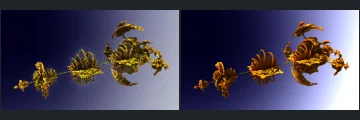

# Reviewed Scenes: Page 12

[Page 1](page-01.md) | [Page 2](page-02.md) | [Page 3](page-03.md) | [Page 4](page-04.md) | [Page 5](page-05.md) | [Page 6](page-06.md) | [Page 7](page-07.md) | [Page 8](page-08.md) | [Page 9](page-09.md) | [Page 10](page-10.md) | [Page 11](page-11.md) | [Page 12](page-12.md)

Each thumbnail: native left, FPT authored right. Open a scene for full neutral/beauty comparisons, limitations and capture settings.

## [636: newtonPow3-rotfold-delta-gnj-010g](636.md)

accepted-with-limitations | historical-2026-09-10 | 32 SPP

Newton coils and framing align. FPT interiors are smoother/darker orange and the environment gradient differs.
