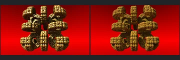
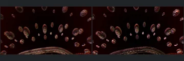

# Reviewed Scenes: Page 13

[Page 1](page-01.md) | [Page 2](page-02.md) | [Page 3](page-03.md) | [Page 4](page-04.md) | [Page 5](page-05.md) | [Page 6](page-06.md) | [Page 7](page-07.md) | [Page 8](page-08.md) | [Page 9](page-09.md) | [Page 10](page-10.md) | [Page 11](page-11.md) | [Page 12](page-12.md) | [Page 13](page-13.md) | [Page 14](page-14.md) | [Page 15](page-15.md) | [Page 16](page-16.md) | [Page 17](page-17.md)

Each thumbnail: native left, FPT authored right. Open a scene for full neutral/beauty comparisons, limitations and capture settings.

## [566: Caves2-PseudoKleinianMod2](566.md)

accepted-with-limitations | historical-2026-09-10 | 32 SPP

Cave walls and pillar positions align, with the structure clearly readable. Patterned green FPT materials differ from native highlights.

## [569: coastalbrot_bear](569.md)

accepted-with-limitations | historical-2026-09-10 | 32 SPP

Broad silhouette, placement and main surface forms align. FPT green is darker and more saturated than the native chrome response.

## [570: coastalbrot_smilin](570.md)

accepted-with-limitations | historical-2026-09-10 | 32 SPP

Bowl-like structure, large openings and framing align. Reflections, brightness and fine edge detail differ.

## [571: continuum](571.md)

accepted-with-limitations | historical-2026-09-10 | 32 SPP

Broad geometry and framing closely align. Gold is darker and less glossy in FPT, without hiding the repeated forms.

## [572: hybrid77-stereo](572.md)

accepted-with-limitations | refreshed-2026-09-11 | 32 SPP

Refreshed monoscopic image closely aligns the central disks and surrounding objects. Fine ring lighting differs. Native stereo is explicitly disabled for this reference; stereo support is not certified.

## [574: icoastahedron](574.md)

accepted-with-limitations | refreshed-2026-09-11 | 32 SPP

Arched silhouette and triangular cavities align. Strong green/yellow material and reflection differences remain; exact glass transport is not certified.

## [575: mandelbox22_anim](575.md)

accepted-with-limitations | refreshed-2026-09-11 | 32 SPP

Tilted cube silhouette, framing and large cutouts align. FPT sky is lighter and cube highlights/material tones differ.

## [577: menger-BoxFold4D](577.md)

accepted-with-limitations | refreshed-2026-09-11 | 32 SPP

Central raised cube and nested square cavity align. FPT adds softer indirect shading and changes fine edge contrast, without an obvious large structural omission.

## [579: menger-Rotation4D](579.md)

accepted-with-limitations | refreshed-2026-09-11 | 32 SPP

Open rotated fractal lattice, silhouette and internal gaps align. Gold highlight intensity and background gradient differ.

## [580: menger-Scale4D](580.md)

accepted-with-limitations | refreshed-2026-09-11 | 32 SPP

Nine-panel perforated slab, central opening and repeated smaller holes align. FPT changes interior reflection tones and softens edge highlights.
