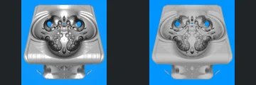
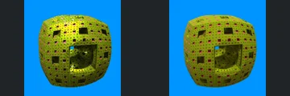
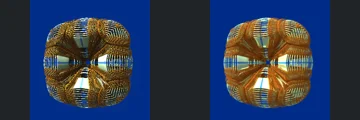
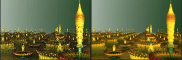
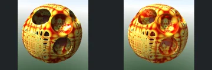
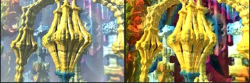
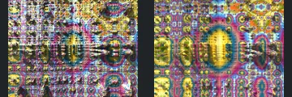
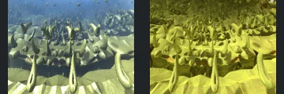

# Reviewed Scenes: Page 13

[Page 1](page-01.md) | [Page 2](page-02.md) | [Page 3](page-03.md) | [Page 4](page-04.md) | [Page 5](page-05.md) | [Page 6](page-06.md) | [Page 7](page-07.md) | [Page 8](page-08.md) | [Page 9](page-09.md) | [Page 10](page-10.md) | [Page 11](page-11.md) | [Page 12](page-12.md) | [Page 13](page-13.md) | [Page 14](page-14.md) | [Page 15](page-15.md) | [Page 16](page-16.md) | [Page 17](page-17.md) | [Page 18](page-18.md) | [Page 19](page-19.md) | [Page 20](page-20.md) | [Page 21](page-21.md) | [Page 22](page-22.md) | [Page 23](page-23.md) | [Page 24](page-24.md) | [Page 25](page-25.md) | [Page 26](page-26.md) | [Page 27](page-27.md) | [Page 28](page-28.md) | [Page 29](page-29.md) | [Page 30](page-30.md) | [Page 31](page-31.md)

Each thumbnail: native left, FPT authored right. Open a scene for full neutral/beauty comparisons, limitations and capture settings.

## [141: T_sphInvV4_abxKali_sphGrid](141.md)

accepted-with-limitations | refreshed-2026-09-11 | 32 SPP

The silver framed form, paired blue openings and repeated central rounded features align. FPT is more matte and grainy with reduced metallic highlights; broad geometry and camera framing are retained.

## [142: T_sphInvV4_menger3](142.md)

accepted-with-limitations | refreshed-2026-09-11 | 32 SPP

The rounded perforated cube, large front cavity and small blue opening align closely. FPT has a more matte olive/red surface with fewer bright yellow sparkles than native, without an obvious broad geometry loss.

## [143: T_sphInvV4_menger_sphGridV3](143.md)

accepted-with-limitations | refreshed-2026-09-11 | 32 SPP

The rounded gold wire-grid form, four major openings and repeated outer bands align. FPT changes line intensity, fine reflections and the apparent density of subpixel wires, while retaining broad connectivity and framing.

## [144: TransfDIFSEllipsoid asurf](144.md)

accepted-with-limitations | refreshed-2026-09-11 | 32 SPP

The repeated upright striped forms, their spacing, stems and horizon align. FPT has a darker orange/green ground and fewer sparkling reflections, while the main objects and broad layout remain readable.

## [145: TransfSphereCoordInv_bulbs](145.md)

accepted-with-limitations | refreshed-2026-09-11 | 32 SPP

The tall right-hand gold spindle, smaller repeated towers, layered ground forms and horizon align. FPT reduces sparkling highlights and changes fine gold/green shading while retaining the scene layout.

## [146: aBox 4D](146.md)

accepted-with-limitations | captured-2026-09-12 | 32 SPP

The low sweeping landscape, large purple region, foreground oval features and sky boundary align. FPT changes fine reflective streaks and colour intensity while retaining the main geometry and framing.

## [147: aBox4D_addCpixel4D](147.md)

accepted-with-limitations | captured-2026-09-12 | 32 SPP

The rounded decorated body, three major circular features and repeated small surface openings align. FPT changes interior reflections and the red/gold pattern, but the broad form remains clear. Exact material transport is not certified.

## [148: abox11_aboxSurfBox](148.md)

accepted-with-limitations | captured-2026-09-12 | 32 SPP

The central gold ribbed spindle, left branching arch and repeated vertical structure align. FPT removes the native pale veil and changes background reflection colours, but the large foreground forms remain readable. Atmospheric and fine reflective parity are not certified.

## [149: aboxMod1 V2.11](149.md)

accepted-with-limitations | captured-2026-09-12 | 32 SPP

The repeated grid, large central oval regions and crossing horizontal structure align broadly. FPT reduces the native bright high-frequency sparkle and changes rainbow surface patterns. Fine repeated detail is difficult to resolve in both views and is not certified; broad layout remains readable.

## [150: aboxMod11_001](150.md)

accepted-with-limitations | captured-2026-09-12 | 32 SPP

The repeated rising curved forms, foreground ledge and central valley align. FPT changes the blue distant veil to yellow/green and strengthens surface contrast; broad foreground geometry remains readable. Atmosphere and distant fine-detail parity are not certified.
