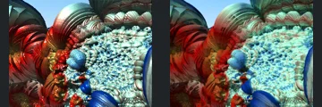
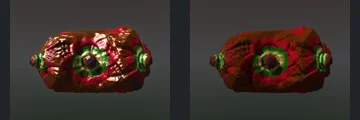
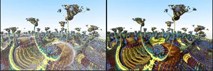
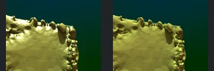
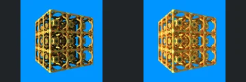
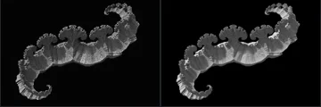
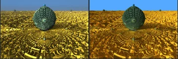
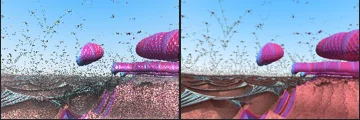

# Reviewed Scenes: Page 14

[Page 1](page-01.md) | [Page 2](page-02.md) | [Page 3](page-03.md) | [Page 4](page-04.md) | [Page 5](page-05.md) | [Page 6](page-06.md) | [Page 7](page-07.md) | [Page 8](page-08.md) | [Page 9](page-09.md) | [Page 10](page-10.md) | [Page 11](page-11.md) | [Page 12](page-12.md) | [Page 13](page-13.md) | [Page 14](page-14.md) | [Page 15](page-15.md) | [Page 16](page-16.md) | [Page 17](page-17.md) | [Page 18](page-18.md) | [Page 19](page-19.md) | [Page 20](page-20.md) | [Page 21](page-21.md) | [Page 22](page-22.md) | [Page 23](page-23.md) | [Page 24](page-24.md) | [Page 25](page-25.md) | [Page 26](page-26.md) | [Page 27](page-27.md) | [Page 28](page-28.md) | [Page 29](page-29.md) | [Page 30](page-30.md) | [Page 31](page-31.md) | [Page 32](page-32.md) | [Page 33](page-33.md) | [Page 34](page-34.md) | [Page 35](page-35.md) | [Page 36](page-36.md) | [Page 37](page-37.md) | [Page 38](page-38.md)

Each thumbnail: native left, FPT authored right. Open a scene for full neutral/beauty comparisons, limitations and capture settings.

## [151: aboxMod11_002](151.md)

accepted-with-limitations | captured-2026-09-12 | 32 SPP

The paired curved shells, repeated oval openings and large red interior regions align. FPT reduces metallic highlights and changes fine interior patterns while retaining silhouette, openings and authored crop.

## [152: aboxMod11_003](152.md)

accepted-with-limitations | captured-2026-09-12 | 32 SPP

The large crossing arches, upper diagonal ribbed form and lower repeated curves align. FPT replaces the pale native veil with stronger green/gold contrast, but the foreground layout stays readable. Atmosphere and distant optical detail are not certified.

## [153: aboxMod11_addCpixelRotate](153.md)

accepted-with-limitations | captured-2026-09-12 | 32 SPP

The large upper curved lobes, left red folds and dense blue/cyan rounded cluster align closely. FPT alters metallic highlights and tiny surface reflections while retaining broad structure and framing.

## [155: aboxMod11_hybrid](155.md)

accepted-with-limitations | captured-2026-09-12 | 32 SPP

The decorated rounded rectangular body, central green circular feature and paired side knobs align. FPT is darker and less metallic, but the silhouette and principal surface features remain legible. Exact reflective material response is not certified.

## [156: aboxMod13Surf](156.md)

accepted-with-limitations | captured-2026-09-12 | 32 SPP

The branching mushroom-like forms, large sweeping foreground bowl and horizon line align. FPT strengthens saturated bands and removes much of the native sparkle/veil, but the silhouettes and broad surface structure remain clear.

## [157: aboxMod13_001](157.md)

accepted-with-limitations | captured-2026-09-12 | 32 SPP

The curved foreground platform, scalloped upper edge and chain of right-hand protrusions align closely. FPT reduces the native bright specular patches while retaining broad shape and fine repeated surface relief.

## [158: aboxMod14_001](158.md)

accepted-with-limitations | captured-2026-09-12 | 32 SPP

The open cubic cage, repeated round apertures, internal decorated forms and silhouette align closely. FPT brightens the gold/orange reflections without filling the openings or obscuring the structure.

## [159: aboxMod15_001](159.md)

accepted-with-limitations | captured-2026-09-12 | 32 SPP

The long curled ribbon, scalloped upper edge and both curled ends align. FPT makes some repeated ridges more solid/brighter than the faint native appearance, but preserves the overall thin structure and framing. Subpixel edge intensity is not certified.

## [160: aboxMod15_meng3](160.md)

accepted-with-limitations | captured-2026-09-12 | 32 SPP

The central green rounded form, small upper/lower spheres and concentric foreground terrain align. FPT reduces native gold sparkle and changes sky colour and surface contrast while retaining the main shapes and authored camera.

## [161: aboxMod15cpixelInvert](161.md)

accepted-with-limitations | captured-2026-09-12 | 32 SPP

The floating pink forms, long right-hand band, foreground troughs and horizon align. FPT reduces the native high-frequency sparkle and renders the sparse overhead filaments more continuously. Broad layout remains clear; subpixel filament visibility and exact reflective response are not certified.
