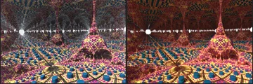
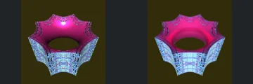
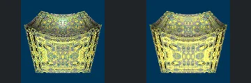
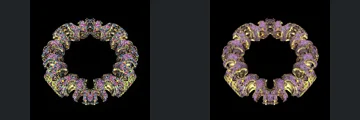
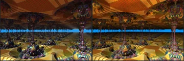
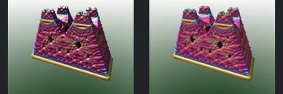

# Reviewed Scenes: Page 15

[Page 1](page-01.md) | [Page 2](page-02.md) | [Page 3](page-03.md) | [Page 4](page-04.md) | [Page 5](page-05.md) | [Page 6](page-06.md) | [Page 7](page-07.md) | [Page 8](page-08.md) | [Page 9](page-09.md) | [Page 10](page-10.md) | [Page 11](page-11.md) | [Page 12](page-12.md) | [Page 13](page-13.md) | [Page 14](page-14.md) | [Page 15](page-15.md) | [Page 16](page-16.md) | [Page 17](page-17.md) | [Page 18](page-18.md) | [Page 19](page-19.md) | [Page 20](page-20.md) | [Page 21](page-21.md) | [Page 22](page-22.md) | [Page 23](page-23.md) | [Page 24](page-24.md) | [Page 25](page-25.md) | [Page 26](page-26.md) | [Page 27](page-27.md) | [Page 28](page-28.md) | [Page 29](page-29.md) | [Page 30](page-30.md) | [Page 31](page-31.md) | [Page 32](page-32.md) | [Page 33](page-33.md) | [Page 34](page-34.md) | [Page 35](page-35.md) | [Page 36](page-36.md) | [Page 37](page-37.md) | [Page 38](page-38.md) | [Page 39](page-39.md) | [Page 40](page-40.md) | [Page 41](page-41.md) | [Page 42](page-42.md) | [Page 43](page-43.md) | [Page 44](page-44.md)

Each thumbnail: native left, FPT authored right. Open a scene for full neutral/beauty comparisons, limitations and capture settings.

## [162: abox_cylinder](162.md)

accepted-with-limitations | captured-2026-09-12 | 32 SPP

The foreground circular grid, large right-hand spire, repeated smaller spires and left bright horizon feature align. FPT reduces the native upper/background sphere highlights and sparkle, while the defining foreground geometry remains readable. Distant reflective/optical detail is not certified.

## [163: abox_donut4dV2 naa1](163.md)

accepted-with-limitations | captured-2026-09-12 | 32 SPP

The scalloped ring, central opening and repeated outer points align. FPT softens the bright inner highlight and changes fine reflective sparkle while preserving the silhouette and readable pink/cyan surface structure.

## [164: abox_donut4dV2 naa2](164.md)

accepted-with-limitations | captured-2026-09-12 | 32 SPP

The concave upper rim, broad decorated front and side silhouette align. FPT changes the dense yellow reflective sparkle into more continuous surface patterns, but the main form and repeated decorations remain readable. Fine reflection intensity is not certified.

## [165: abox_donut4d_aa1](165.md)

accepted-with-limitations | captured-2026-09-12 | 32 SPP

The decorated ring, large central opening and repeated outward curled lobes align. FPT turns the native multicolour sparkle into quieter gold/purple surfaces without losing the defining silhouette or openings.

## [166: abox_donut4d_aa2](166.md)

accepted-with-limitations | captured-2026-09-12 | 32 SPP

The toroidal silhouette, central opening and repeated surface decorations align. FPT reduces the native silver highlights and sparkle into a greyer material response, but the broad geometry and relief remain legible.

## [167: abox_donut4d_abs](167.md)

accepted-with-limitations | captured-2026-09-12 | 32 SPP

The eight repeated curved segments, central opening and connecting narrow surfaces align. FPT changes the bright patterned faces and reflective intensity, while the silhouette and repeated openings remain clear.

## [168: abox_klein](168.md)

accepted-with-limitations | captured-2026-09-12 | 32 SPP

The repeated columns, overhead forms, large right column and narrow blue horizon band align. FPT reduces native sparkle and changes the patterned foreground reflections while preserving the main layout and openings.

## [171: abox_mod11_rotVaryV1](171.md)

accepted-with-limitations | captured-2026-09-12 | 32 SPP

The row of narrow curved stems, flared upper forms and dense left cluster align. FPT brightens gold surfaces and changes the blue sky gradient, but all defining gaps, contours and foreground structures remain legible. Exact specular intensity is not certified.

## [173: abox_mod_kali_v2 aa1](173.md)

accepted-with-limitations | captured-2026-09-12 | 32 SPP

The tall central angular ridge, large curved crossing band and left rounded form align closely. FPT strengthens blue/cyan contrast and reflective colour but retains the major openings, contours and framing.

## [174: abox_mod_kali_v2 asurf mode](174.md)

accepted-with-limitations | captured-2026-09-12 | 32 SPP

The four peaked decorated towers, central recesses and rectangular base align closely. FPT softens several bright metallic highlights but preserves the silhouette, layered forms and broad pink/rainbow appearance.
