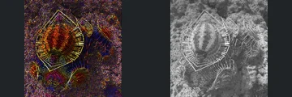
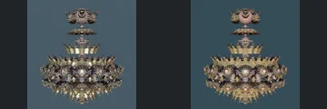
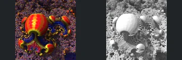
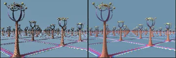
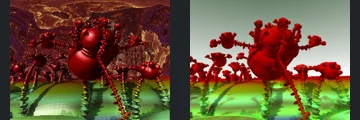

# Reviewed Scenes: Page 16

[Page 1](page-01.md) | [Page 2](page-02.md) | [Page 3](page-03.md) | [Page 4](page-04.md) | [Page 5](page-05.md) | [Page 6](page-06.md) | [Page 7](page-07.md) | [Page 8](page-08.md) | [Page 9](page-09.md) | [Page 10](page-10.md) | [Page 11](page-11.md) | [Page 12](page-12.md) | [Page 13](page-13.md) | [Page 14](page-14.md) | [Page 15](page-15.md) | [Page 16](page-16.md) | [Page 17](page-17.md) | [Page 18](page-18.md) | [Page 19](page-19.md) | [Page 20](page-20.md) | [Page 21](page-21.md) | [Page 22](page-22.md) | [Page 23](page-23.md) | [Page 24](page-24.md) | [Page 25](page-25.md) | [Page 26](page-26.md) | [Page 27](page-27.md) | [Page 28](page-28.md) | [Page 29](page-29.md) | [Page 30](page-30.md) | [Page 31](page-31.md) | [Page 32](page-32.md) | [Page 33](page-33.md) | [Page 34](page-34.md) | [Page 35](page-35.md) | [Page 36](page-36.md) | [Page 37](page-37.md) | [Page 38](page-38.md)

Each thumbnail: native left, FPT authored right. Open a scene for full neutral/beauty comparisons, limitations and capture settings.

## [175: abox_mod_kali_v2 polfFoldSym](175.md)

accepted-with-limitations | captured-2026-09-12 | 32 SPP

The faceted rounded body, repeated polygonal relief and prominent front panel align. FPT reduces the native silver highlights into a more matte grey response while preserving the major relief, silhouette and camera framing.

## [176: abox_mod_kali_v3 hexgridDIFS](176.md)

accepted-with-limitations | captured-2026-09-12 | 32 SPP

The repeated rounded polygonal forms, six prominent lobes and broad silhouette align closely. FPT changes gold highlights and small reflective patterns without obscuring the main structure or surface divisions.

## [177: abox_octahedron](177.md)

accepted-with-limitations | captured-2026-09-12 | 32 SPP

The foreground terrain, large right spire, repeated smaller spires and bright horizon features align. Both authored views are red/purple and dark; FPT reduces upper/background reflective detail but keeps the defining foreground readable. Distant optical detail is not certified.

## [178: abox_sphere4D](178.md)

accepted-with-limitations | captured-2026-09-12 | 32 SPP

The curved layered boundary, right-hand fringe and blue background extent align broadly. FPT changes native bright speckle into fainter more continuous lines. Large-scale framing is retained, but individual subpixel points, filaments and their intensity cannot be certified at this resolution.

## [179: abox_tetra](179.md)

accepted-with-limitations | captured-2026-09-12 | 32 SPP

The decorated rounded cube, repeated curled openings and broad red central region align. FPT changes the intensity of native gold/magenta highlights without obscuring the main shape, repeated relief or silhouette.

## [180: amazingIFS boxFrame](180.md)

accepted-with-limitations | captured-2026-09-12 | 32 SPP

The central oval, angular surrounding frame and repeated right-hand frames remain recognisable at matching framing. Native coloured sparkling appearance becomes grey mottled shading; acceptance covers broad visible structure, not subpixel lights or material parity.

## [183: amazingIFS hexprsm2](183.md)

accepted-with-limitations | captured-2026-09-12 | 32 SPP

The stacked isolated ornaments, broad lower ring and central openings align well. FPT is smoother and differs in fine reflective detailing, but the full silhouette and major internal arrangement remain readable.

## [185: amazingIFS shroom](185.md)

accepted-with-limitations | captured-2026-09-12 | 32 SPP

Large notched rounded forms, small satellites and their placement correspond. Native saturated red/yellow sparkle becomes bright grey relief; acceptance is for the recognisable forms, not palette, fine glints or matching highlight response.

## [187: amazing_surf_mod2_PlatonicSolid](187.md)

accepted-with-limitations | captured-2026-09-12 | 32 SPP

Tall open-ring posts, repeated distant posts and ground grid line up clearly. Surface sparkle is reduced and colours differ slightly, but the important silhouettes, open centres and layout are preserved.

## [188: amazing_surf_mod2_aaa1](188.md)

accepted-with-limitations | captured-2026-09-12 | 32 SPP

Main two-lobed figures, extended arms, thin legs and repeated side figures preserve their framing. Native reflective/background appearance becomes a plain environment and flatter red material; acceptance is limited to the readable foreground geometry, not the authored environment or specular response.
