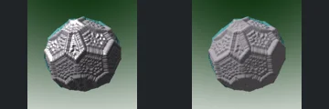
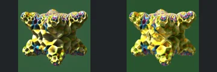
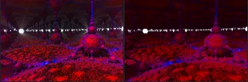
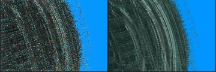
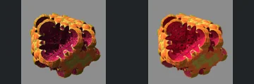
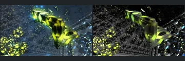
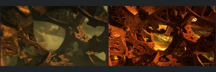
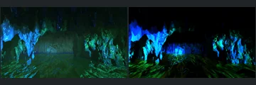
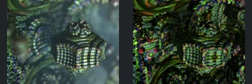

# Reviewed Scenes: Page 16

[Page 1](page-01.md) | [Page 2](page-02.md) | [Page 3](page-03.md) | [Page 4](page-04.md) | [Page 5](page-05.md) | [Page 6](page-06.md) | [Page 7](page-07.md) | [Page 8](page-08.md) | [Page 9](page-09.md) | [Page 10](page-10.md) | [Page 11](page-11.md) | [Page 12](page-12.md) | [Page 13](page-13.md) | [Page 14](page-14.md) | [Page 15](page-15.md) | [Page 16](page-16.md) | [Page 17](page-17.md) | [Page 18](page-18.md) | [Page 19](page-19.md) | [Page 20](page-20.md) | [Page 21](page-21.md) | [Page 22](page-22.md) | [Page 23](page-23.md) | [Page 24](page-24.md) | [Page 25](page-25.md) | [Page 26](page-26.md) | [Page 27](page-27.md)

Each thumbnail: native left, FPT authored right. Open a scene for full neutral/beauty comparisons, limitations and capture settings.

## [175: abox_mod_kali_v2 polfFoldSym](175.md)

accepted-with-limitations | captured-2026-09-12 | 32 SPP

The faceted rounded body, repeated polygonal relief and prominent front panel align. FPT reduces the native silver highlights into a more matte grey response while preserving the major relief, silhouette and camera framing.

## [176: abox_mod_kali_v3 hexgridDIFS](176.md)

accepted-with-limitations | captured-2026-09-12 | 32 SPP

The repeated rounded polygonal forms, six prominent lobes and broad silhouette align closely. FPT changes gold highlights and small reflective patterns without obscuring the main structure or surface divisions.

## [177: abox_octahedron](177.md)

accepted-with-limitations | captured-2026-09-12 | 32 SPP

The foreground terrain, large right spire, repeated smaller spires and bright horizon features align. Both authored views are red/purple and dark; FPT reduces upper/background reflective detail but keeps the defining foreground readable. Distant optical detail is not certified.

## [178: abox_sphere4D](178.md)

accepted-with-limitations | captured-2026-09-12 | 32 SPP

The curved layered boundary, right-hand fringe and blue background extent align broadly. FPT changes native bright speckle into fainter more continuous lines. Large-scale framing is retained, but individual subpixel points, filaments and their intensity cannot be certified at this resolution.

## [179: abox_tetra](179.md)

accepted-with-limitations | captured-2026-09-12 | 32 SPP

The decorated rounded cube, repeated curled openings and broad red central region align. FPT changes the intensity of native gold/magenta highlights without obscuring the main shape, repeated relief or silhouette.

## [375: Construct by Ectoplaz 2](375.md)

accepted-with-limitations | historical-2026-09-10 | 32 SPP

Main green structure and framing align and remain readable. Native blue atmospheric fill is absent; background contrast and materials differ.

## [378: GeneralizedFoldBox01](378.md)

accepted-with-limitations | historical-2026-09-10 | 32 SPP

Large central surfaces and framing align. FPT is sharper/orange and native blur differs; fine depth and material parity are not certified.

## [379: GeneralizedFoldBox02](379.md)

accepted-with-limitations | refreshed-2026-09-11 | 32 SPP

Refreshed water surface and red sphere are restored; broad cavern framing matches. Reflections, saturation and sphere roughness still differ.

## [380: GeneralizedFoldBox03_2](380.md)

accepted-with-limitations | refreshed-2026-09-11 | 32 SPP

Refreshed box/displacement path restores the cavern instead of the earlier incorrect close surfaces. Broad opening and rock placement now align; blue contrast, highlights and fine cave detail remain imperfect.

## [381: Hybrid 1](381.md)

accepted-with-limitations | historical-2026-09-10 | 32 SPP

Central ornament placement and surrounding forms broadly align. Native soft focus becomes sharper and more contrasty in FPT.
