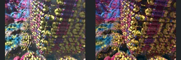
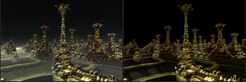
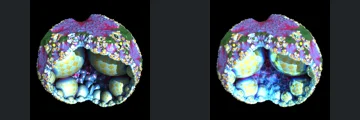
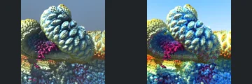
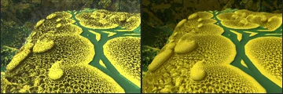
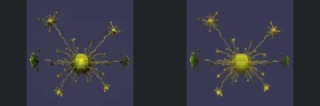
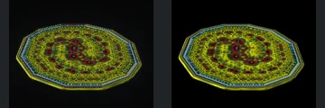
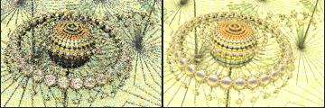
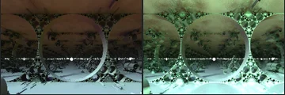

# Reviewed Scenes: Page 17

[Page 1](page-01.md) | [Page 2](page-02.md) | [Page 3](page-03.md) | [Page 4](page-04.md) | [Page 5](page-05.md) | [Page 6](page-06.md) | [Page 7](page-07.md) | [Page 8](page-08.md) | [Page 9](page-09.md) | [Page 10](page-10.md) | [Page 11](page-11.md) | [Page 12](page-12.md) | [Page 13](page-13.md) | [Page 14](page-14.md) | [Page 15](page-15.md) | [Page 16](page-16.md) | [Page 17](page-17.md) | [Page 18](page-18.md) | [Page 19](page-19.md) | [Page 20](page-20.md) | [Page 21](page-21.md) | [Page 22](page-22.md) | [Page 23](page-23.md) | [Page 24](page-24.md) | [Page 25](page-25.md) | [Page 26](page-26.md) | [Page 27](page-27.md) | [Page 28](page-28.md) | [Page 29](page-29.md) | [Page 30](page-30.md) | [Page 31](page-31.md) | [Page 32](page-32.md) | [Page 33](page-33.md) | [Page 34](page-34.md) | [Page 35](page-35.md) | [Page 36](page-36.md) | [Page 37](page-37.md) | [Page 38](page-38.md) | [Page 39](page-39.md) | [Page 40](page-40.md) | [Page 41](page-41.md) | [Page 42](page-42.md) | [Page 43](page-43.md)

Each thumbnail: native left, FPT authored right. Open a scene for full neutral/beauty comparisons, limitations and capture settings.

## [190: asurf julia varylimits](190.md)

accepted-with-limitations | captured-2026-09-12 | 32 SPP

Close-up bead rows, central curved transition and left branching surfaces align closely. FPT changes shadow intensity and colour balance but keeps detailed surfaces readable across the frame.

## [191: asurf3_mandalay](191.md)

accepted-with-limitations | captured-2026-09-12 | 32 SPP

Tall tapering posts, repeated smaller posts and foreground curving bands retain their positions and silhouettes. FPT has less distant haze and slightly darker surfaces, but gold edges keep the layout readable.

## [192: asurf4_sphere_invert](192.md)

accepted-with-limitations | captured-2026-09-12 | 32 SPP

The rounded outer shell, two large internal spheres and smaller lower spheres closely match. Reflections and highlights are stronger in FPT, but the cutaway structure and detailed silhouette are preserved.

## [193: asurf4_worms](193.md)

accepted-with-limitations | captured-2026-09-12 | 32 SPP

The diagonal segmented form, open left tube and rough foreground retain detailed structure and framing. FPT has stronger blue/red saturation and brighter highlights, with the major surfaces still readable.

## [195: asurf_foldingTetra](195.md)

accepted-with-limitations | captured-2026-09-12 | 32 SPP

Large rounded plates, raised small bumps and green connecting gaps closely align. FPT replaces some sparkling highlights with smoother gold shading; the layered structure and gaps remain readable.

## [196: asurf_invert_spherical](196.md)

accepted-with-limitations | captured-2026-09-12 | 32 SPP

Central sphere and delicate radiating branches preserve their positions and silhouette. FPT has smoother, less sparkling line shading; individual subpixel twigs are not certified at this resolution.

## [197: asurf_julia](197.md)

accepted-with-limitations | captured-2026-09-12 | 32 SPP

The tilted polygonal disk, concentric decoration and central openings align very closely. Fine shading differs, but framing and the visible patterned structure are retained.

## [199: asurf_polyfolds](199.md)

accepted-with-limitations | captured-2026-09-12 | 32 SPP

Central banded sphere, surrounding bead ring and radiating wire structures match at broad scale. Both captures are very bright and the native reference is noisy; acceptance does not certify fine lines, highlights or per-pixel detail.

## [200: asurf_spheroids_on_sticks](200.md)

accepted-with-limitations | captured-2026-09-12 | 32 SPP

Repeated spherical heads on posts, small upper satellites and ground plane align well. Sky saturation, reflections and surface noise differ, while silhouettes and arrangement remain clear.

## [201: blockifyV2_PseudoKlien](201.md)

accepted-with-limitations | captured-2026-09-12 | 32 SPP

Large circular openings, surrounding small spheres and receding central arrangement match. FPT has brighter green floor illumination and altered reflections, but the circular structure and interior remain readable.
