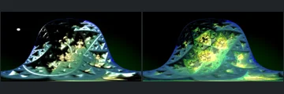
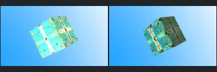
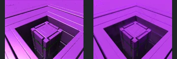
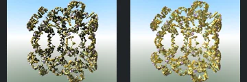
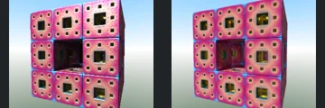
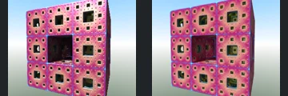
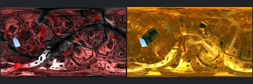
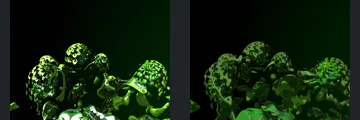
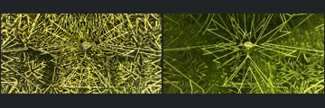
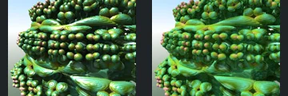

# Reviewed Scenes: Page 17

[Page 1](page-01.md) | [Page 2](page-02.md) | [Page 3](page-03.md) | [Page 4](page-04.md) | [Page 5](page-05.md) | [Page 6](page-06.md) | [Page 7](page-07.md) | [Page 8](page-08.md) | [Page 9](page-09.md) | [Page 10](page-10.md) | [Page 11](page-11.md) | [Page 12](page-12.md) | [Page 13](page-13.md) | [Page 14](page-14.md) | [Page 15](page-15.md) | [Page 16](page-16.md) | [Page 17](page-17.md) | [Page 18](page-18.md) | [Page 19](page-19.md) | [Page 20](page-20.md) | [Page 21](page-21.md) | [Page 22](page-22.md)

Each thumbnail: native left, FPT authored right. Open a scene for full neutral/beauty comparisons, limitations and capture settings.

## [574: icoastahedron](574.md)

accepted-with-limitations | refreshed-2026-09-11 | 32 SPP

Arched silhouette and triangular cavities align. Strong green/yellow material and reflection differences remain; exact glass transport is not certified.

## [575: mandelbox22_anim](575.md)

accepted-with-limitations | refreshed-2026-09-11 | 32 SPP

Tilted cube silhouette, framing and large cutouts align. FPT sky is lighter and cube highlights/material tones differ.

## [577: menger-BoxFold4D](577.md)

accepted-with-limitations | refreshed-2026-09-11 | 32 SPP

Central raised cube and nested square cavity align. FPT adds softer indirect shading and changes fine edge contrast, without an obvious large structural omission.

## [579: menger-Rotation4D](579.md)

accepted-with-limitations | refreshed-2026-09-11 | 32 SPP

Open rotated fractal lattice, silhouette and internal gaps align. Gold highlight intensity and background gradient differ.

## [580: menger-Scale4D](580.md)

accepted-with-limitations | refreshed-2026-09-11 | 32 SPP

Nine-panel perforated slab, central opening and repeated smaller holes align. FPT changes interior reflection tones and softens edge highlights.

## [581: menger-SphericalFold4Dtransform](581.md)

accepted-with-limitations | refreshed-2026-09-11 | 32 SPP

Perforated slab, central cavity and nested hole layout align. Pink material and interior highlights differ without obvious large missing regions.

## [584: menger-mod1_001_8k](584.md)

accepted-with-limitations | refreshed-2026-09-11 | 32 SPP

Panoramic curved block corridors and large openings align. FPT is gold rather than red/black with different sky and reflection colours, but the structure remains readable.

## [585: mountains_and_valleys](585.md)

accepted-with-limitations | refreshed-2026-09-11 | 32 SPP

Rounded peaks, foreground cavities and silhouette align. Both authored captures use dark green material; FPT loses the sharp bright reflective flecks but retains the principal forms.

## [587: neuron](587.md)

accepted-with-limitations | refreshed-2026-09-11 | 32 SPP

Central polyhedral hub and radiating struts align. FPT uses darker green/gold shading and reduces background highlight density; the principal structural connections remain readable.

## [588: pine-Bulb](588.md)

accepted-with-limitations | refreshed-2026-09-11 | 32 SPP

Layered disks, rounded beads and large silhouette gaps align closely. Green material reflections and highlight intensity differ without obscuring the forms.
