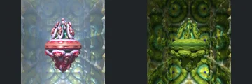
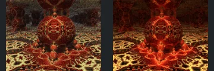
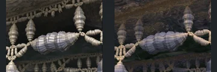
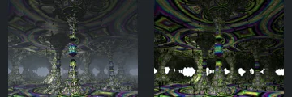
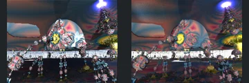
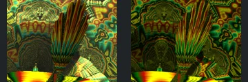

# Reviewed Scenes: Page 18

[Page 1](page-01.md) | [Page 2](page-02.md) | [Page 3](page-03.md) | [Page 4](page-04.md) | [Page 5](page-05.md) | [Page 6](page-06.md) | [Page 7](page-07.md) | [Page 8](page-08.md) | [Page 9](page-09.md) | [Page 10](page-10.md) | [Page 11](page-11.md) | [Page 12](page-12.md) | [Page 13](page-13.md) | [Page 14](page-14.md) | [Page 15](page-15.md) | [Page 16](page-16.md) | [Page 17](page-17.md) | [Page 18](page-18.md) | [Page 19](page-19.md) | [Page 20](page-20.md) | [Page 21](page-21.md) | [Page 22](page-22.md) | [Page 23](page-23.md) | [Page 24](page-24.md) | [Page 25](page-25.md) | [Page 26](page-26.md) | [Page 27](page-27.md) | [Page 28](page-28.md) | [Page 29](page-29.md) | [Page 30](page-30.md) | [Page 31](page-31.md) | [Page 32](page-32.md) | [Page 33](page-33.md) | [Page 34](page-34.md) | [Page 35](page-35.md) | [Page 36](page-36.md) | [Page 37](page-37.md) | [Page 38](page-38.md) | [Page 39](page-39.md) | [Page 40](page-40.md) | [Page 41](page-41.md) | [Page 42](page-42.md) | [Page 43](page-43.md) | [Page 44](page-44.md)

Each thumbnail: native left, FPT authored right. Open a scene for full neutral/beauty comparisons, limitations and capture settings.

## [201: blockifyV2_PseudoKlien](201.md)

accepted-with-limitations | captured-2026-09-12 | 32 SPP

Large circular openings, surrounding small spheres and receding central arrangement match. FPT has brighter green floor illumination and altered reflections, but the circular structure and interior remain readable.

## [202: boolean_boxFoldBulb_quat](202.md)

accepted-with-limitations | captured-2026-09-12 | 32 SPP

The pointed floating centrepiece, broad equatorial ring and patterned enclosure retain their shapes and placement. Native pink/blue reflective haze becomes green solid shading; accepted for recognisable foreground structure, not background optics or material parity.

## [204: boxFoldBulb_v2 radDEcolor](204.md)

accepted-with-limitations | captured-2026-09-12 | 32 SPP

Central patterned sphere, small supporting spheres and ornamented floor retain close framing and structure. FPT strengthens red illumination and reduces background reflectivity without hiding the defining forms.

## [205: boxFoldBulb_v2](205.md)

accepted-with-limitations | captured-2026-09-12 | 32 SPP

Segmented spindle shapes, connecting bead strings and upper/lower borders align clearly. FPT shifts reflective contrast and darkens distant surfaces slightly; the foreground structure remains intact and readable.

## [206: boxFoldBulb_v2_01](206.md)

accepted-with-limitations | captured-2026-09-12 | 32 SPP

Central paired pillars, repeated smaller pillars and ornate ceiling/floor retain their arrangement. Native haze becomes sharper bright background gaps and FPT increases colour contrast; accepted for the readable architecture, not atmospheric or background-light parity.

## [207: boxFoldBulb_v2_twice](207.md)

accepted-with-limitations | captured-2026-09-12 | 32 SPP

The large central disk, attached smaller ornaments, thin supports and upper bright source occupy matching positions. FPT has weaker metallic reflections and different transparency/colour layering, but the main geometry and illumination remain recognisable.

## [208: boxFoldBulb_v3 iridescene](208.md)

accepted-with-limitations | captured-2026-09-12 | 32 SPP

The foreground sphere on curved supports and distant branching columns align. Both authored views are dim blue/green; FPT reduces native iridescent reflections and noise, but the main foreground forms remain readable. Fine background detail is not certified.

## [209: boxFoldBulb_v3_001](209.md)

accepted-with-limitations | captured-2026-09-12 | 32 SPP

Concentric segmented arches and dense lower ornaments preserve close framing and shape. FPT changes metallic highlights and makes the tunnel warmer, while individual bands remain distinguishable.

## [210: boxFoldBulb_v3_a01](210.md)

accepted-with-limitations | captured-2026-09-12 | 32 SPP

Tall fan of curved ribs, left arched motif and bright lower band match broadly. FPT reduces the native upper highlights and changes pattern contrast, but the foreground geometry and composition remain clear.

## [211: boxFoldBulb_v3_benesiHybrid](211.md)

accepted-with-limitations | captured-2026-09-12 | 32 SPP

Symmetric flared panels, bead loops and central ornaments closely align. FPT lowers some metallic white highlights and changes green saturation, preserving the detailed layout and open side gaps.
