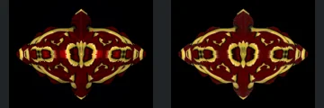
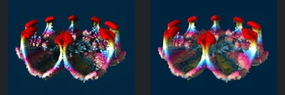
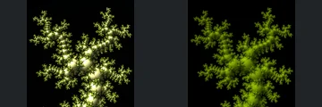
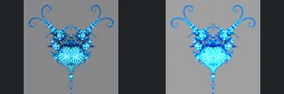
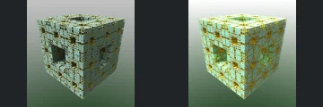

# Reviewed Scenes: Page 19

[Page 1](page-01.md) | [Page 2](page-02.md) | [Page 3](page-03.md) | [Page 4](page-04.md) | [Page 5](page-05.md) | [Page 6](page-06.md) | [Page 7](page-07.md) | [Page 8](page-08.md) | [Page 9](page-09.md) | [Page 10](page-10.md) | [Page 11](page-11.md) | [Page 12](page-12.md) | [Page 13](page-13.md) | [Page 14](page-14.md) | [Page 15](page-15.md) | [Page 16](page-16.md) | [Page 17](page-17.md) | [Page 18](page-18.md) | [Page 19](page-19.md) | [Page 20](page-20.md) | [Page 21](page-21.md) | [Page 22](page-22.md) | [Page 23](page-23.md) | [Page 24](page-24.md) | [Page 25](page-25.md) | [Page 26](page-26.md) | [Page 27](page-27.md) | [Page 28](page-28.md) | [Page 29](page-29.md) | [Page 30](page-30.md) | [Page 31](page-31.md) | [Page 32](page-32.md) | [Page 33](page-33.md) | [Page 34](page-34.md) | [Page 35](page-35.md) | [Page 36](page-36.md) | [Page 37](page-37.md) | [Page 38](page-38.md) | [Page 39](page-39.md) | [Page 40](page-40.md) | [Page 41](page-41.md) | [Page 42](page-42.md) | [Page 43](page-43.md)

Each thumbnail: native left, FPT authored right. Open a scene for full neutral/beauty comparisons, limitations and capture settings.

## [213: bristorbrot v2](213.md)

accepted-with-limitations | captured-2026-09-12 | 32 SPP

The symmetric pointed body and red/gold pattern match closely in silhouette, framing and internal arrangement. Only modest surface contrast and highlight differences remain at this resolution.

## [214: collatz mod hybrid1](214.md)

accepted-with-limitations | captured-2026-09-12 | 32 SPP

Interlocking curved forms, pointed central ridges and dark openings align. FPT is more saturated magenta and less smoothly reflective, but the main openings and ridged geometry remain clearly visible.

## [215: difsGreek_kochV4_asurfKlein_CUT](215.md)

accepted-with-limitations | captured-2026-09-12 | 32 SPP

Symmetric central spindle, horizontal tubes and layered rectangular framework align closely. FPT removes some glossy highlights and is dimmer, but the framework and individual tube ends remain readable.

## [217: foldbox sphereFoldParabolic ede6](217.md)

accepted-with-limitations | captured-2026-09-12 | 32 SPP

Large upper openings, central pointed feature and layered lower cavity align well. Native glossy gold becomes rougher muted gold; the major recesses and surface contours remain readable.

## [218: ifs_gen menger](218.md)

accepted-with-limitations | captured-2026-09-12 | 32 SPP

Clustered angular lobes, triangular tips and rounded patterned centres match closely in shape and framing. FPT has small highlight and saturation differences without obvious structural loss.

## [219: ifs_xy](219.md)

accepted-with-limitations | captured-2026-09-12 | 32 SPP

Paired open rounded lobes and repeated red-topped stalks preserve their silhouette and arrangement. FPT changes internal reflections and makes some surfaces more diffuse, but retains the distinctive open form.

## [221: jos_kleinian_v4 sphInv](221.md)

accepted-with-limitations | captured-2026-09-12 | 32 SPP

The branching central structure and repeated fine side branches retain their silhouette and placement. FPT lacks native sharp metallic glints and is more diffuse green, but the branches remain visible; subpixel twig and highlight parity is not certified.

## [222: jos_kleinian_v4 sphInv_2](222.md)

accepted-with-limitations | captured-2026-09-12 | 32 SPP

The blue central ornament, paired curled branches and tapering lower point align closely. FPT strengthens highlights and smooths small reflective details; broad silhouette and openings remain recognisable.

## [223: low_res_mode_menger](223.md)

accepted-with-limitations | captured-2026-09-12 | 32 SPP

Perforated cube silhouette, large face openings and fine square pattern align well. FPT is brighter on the top and side faces, but the major cavities remain visible. Subpixel cell and exact material parity are not certified.

## [224: mandalay_boxv1 meng3](224.md)

accepted-with-limitations | captured-2026-09-12 | 32 SPP

Layered mechanical blocks, tall right-hand column and receding ceiling bands retain close framing and structure. FPT has more diffuse, noisy reflections and lower metallic contrast without losing the major forms.
