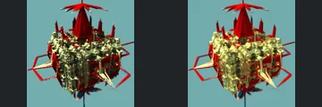

# Reviewed Scenes: Page 20

[Page 1](page-01.md) | [Page 2](page-02.md) | [Page 3](page-03.md) | [Page 4](page-04.md) | [Page 5](page-05.md) | [Page 6](page-06.md) | [Page 7](page-07.md) | [Page 8](page-08.md) | [Page 9](page-09.md) | [Page 10](page-10.md) | [Page 11](page-11.md) | [Page 12](page-12.md) | [Page 13](page-13.md) | [Page 14](page-14.md) | [Page 15](page-15.md) | [Page 16](page-16.md) | [Page 17](page-17.md) | [Page 18](page-18.md) | [Page 19](page-19.md) | [Page 20](page-20.md) | [Page 21](page-21.md) | [Page 22](page-22.md) | [Page 23](page-23.md) | [Page 24](page-24.md) | [Page 25](page-25.md) | [Page 26](page-26.md) | [Page 27](page-27.md) | [Page 28](page-28.md) | [Page 29](page-29.md) | [Page 30](page-30.md) | [Page 31](page-31.md) | [Page 32](page-32.md) | [Page 33](page-33.md) | [Page 34](page-34.md) | [Page 35](page-35.md) | [Page 36](page-36.md) | [Page 37](page-37.md) | [Page 38](page-38.md) | [Page 39](page-39.md) | [Page 40](page-40.md) | [Page 41](page-41.md) | [Page 42](page-42.md) | [Page 43](page-43.md) | [Page 44](page-44.md)

Each thumbnail: native left, FPT authored right. Open a scene for full neutral/beauty comparisons, limitations and capture settings.

## [224: mandalay_boxv1 meng3](224.md)

accepted-with-limitations | captured-2026-09-12 | 32 SPP

Layered mechanical blocks, tall right-hand column and receding ceiling bands retain close framing and structure. FPT has more diffuse, noisy reflections and lower metallic contrast without losing the major forms.

## [225: mandalay_boxv1](225.md)

accepted-with-limitations | captured-2026-09-12 | 32 SPP

Repeated gold rectangular frames and their receding perspective align well. FPT has softer metallic contrast and noisier interior shading, while open centres and frame edges remain readable.

## [226: mandalay_boxv2](226.md)

accepted-with-limitations | captured-2026-09-12 | 32 SPP

The compact block assembly, tall red central spire and thin red side frames match in silhouette and arrangement. FPT changes the fine reflective texture but preserves the major geometry.

## [227: mandalay_kifs](227.md)

accepted-with-limitations | captured-2026-09-12 | 32 SPP

Repeated rounded cubical modules, horizontal central gap and inset face panels align closely. Gold reflectance differs, with the full silhouette and major panel relief intact.

## [228: mandalay_tower](228.md)

accepted-with-limitations | captured-2026-09-12 | 32 SPP

The tall central decorated tower, thin connecting necks and pointed middle ornament align closely in framing and colour arrangement. Small specular and surface-noise differences remain.

## [229: mandelbarV2_sphereGrid](229.md)

accepted-with-limitations | captured-2026-09-12 | 32 SPP

The circular lattice, repeated oval openings and central triangular ornament retain close framing. FPT alters interior reflections and fine wire contrast; broad open structure remains readable.

## [230: mandelbarV3 ABa1](230.md)

accepted-with-limitations | captured-2026-09-12 | 32 SPP

Three-sided open frame, pointed corner ornaments and red central suspended surface align well. Sky saturation and metallic sparkle differ, without apparent loss of major openings.

## [231: mandelbarV3 BDA1](231.md)

accepted-with-limitations | captured-2026-09-12 | 32 SPP

Symmetric gold frame, open side loops and luminous blue centre match in placement and shape. FPT highlights are brighter and small branches have different sparkle; individual subpixel details are not certified.

## [232: mandelbarV3 DBA1](232.md)

accepted-with-limitations | captured-2026-09-12 | 32 SPP

The thin symmetric branching outline, central nested rings and lower pointed cluster align closely. FPT gives smoother coloured line shading; main gaps and silhouette remain preserved.

## [234: mandelbox_rot 001](234.md)

accepted-with-limitations | captured-2026-09-12 | 32 SPP

The large hood-like arch, repeated inner ribs and fine lower branching structure align. Native pink/blue becomes orange/green with different reflectance, but the arch and openings remain readable; palette and environment parity are not claimed.
