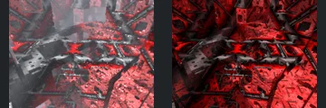
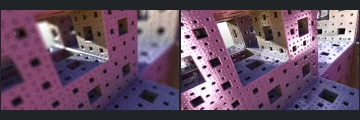

# Reviewed Scenes: Page 22

[Page 1](page-01.md) | [Page 2](page-02.md) | [Page 3](page-03.md) | [Page 4](page-04.md) | [Page 5](page-05.md) | [Page 6](page-06.md) | [Page 7](page-07.md) | [Page 8](page-08.md) | [Page 9](page-09.md) | [Page 10](page-10.md) | [Page 11](page-11.md) | [Page 12](page-12.md) | [Page 13](page-13.md) | [Page 14](page-14.md) | [Page 15](page-15.md) | [Page 16](page-16.md) | [Page 17](page-17.md) | [Page 18](page-18.md) | [Page 19](page-19.md) | [Page 20](page-20.md) | [Page 21](page-21.md) | [Page 22](page-22.md)

Each thumbnail: native left, FPT authored right. Open a scene for full neutral/beauty comparisons, limitations and capture settings.

## [675: mandelbulb_eye](675.md)

accepted-with-limitations | refreshed-2026-09-11 | 32 SPP

The faceted blue circular form, off-centre nested rings and silhouette align. FPT is darker and lacks the native bright upper highlight, but the principal facets remain readable. Exact shading is not certified.

## [682: menger cross mod1 001](682.md)

accepted-with-limitations | refreshed-2026-09-11 | 32 SPP

The nested spiral, repeated angular blocks and large foreground curl align closely. FPT has smoother pink/gold shading and fewer sparkling highlights; broad depth layering and framing remain readable.

## [688: menger smooth mod1](688.md)

accepted-with-limitations | refreshed-2026-09-11 | 32 SPP

The sweeping curved corridor, right-hand rounded slots and concentrated central illuminated feature align. Both are intentionally dark with green/gold highlights; FPT changes reflection and fine highlight distribution while keeping the structure readable.

## [690: menger-mod1_001](690.md)

accepted-with-limitations | refreshed-2026-09-11 | 32 SPP

The large crossing beams, repeated angular recesses and red panels broadly align. FPT removes the pale native veil/blur and has stronger dark red contrast, but the foreground structural layout stays readable. Distant optical effects and fine reflective detail are not certified.

## [691: monte carlo DOF 001](691.md)

accepted-with-limitations | refreshed-2026-09-11 | 32 SPP

The nested perforated frames, central bright opening and purple/pink surfaces align broadly. FPT is sharper and brighter while native strongly blurs the foreground, so depth-of-field and fine near-surface detail are not certified. The large-scale framing and structure remain readable.
