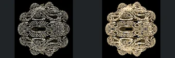
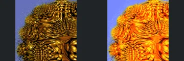
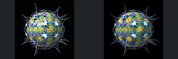

# Reviewed Scenes: Page 22

[Page 1](page-01.md) | [Page 2](page-02.md) | [Page 3](page-03.md) | [Page 4](page-04.md) | [Page 5](page-05.md) | [Page 6](page-06.md) | [Page 7](page-07.md) | [Page 8](page-08.md) | [Page 9](page-09.md) | [Page 10](page-10.md) | [Page 11](page-11.md) | [Page 12](page-12.md) | [Page 13](page-13.md) | [Page 14](page-14.md) | [Page 15](page-15.md) | [Page 16](page-16.md) | [Page 17](page-17.md) | [Page 18](page-18.md) | [Page 19](page-19.md) | [Page 20](page-20.md) | [Page 21](page-21.md) | [Page 22](page-22.md) | [Page 23](page-23.md) | [Page 24](page-24.md) | [Page 25](page-25.md) | [Page 26](page-26.md) | [Page 27](page-27.md) | [Page 28](page-28.md) | [Page 29](page-29.md) | [Page 30](page-30.md) | [Page 31](page-31.md) | [Page 32](page-32.md) | [Page 33](page-33.md) | [Page 34](page-34.md) | [Page 35](page-35.md) | [Page 36](page-36.md) | [Page 37](page-37.md) | [Page 38](page-38.md) | [Page 39](page-39.md) | [Page 40](page-40.md) | [Page 41](page-41.md) | [Page 42](page-42.md) | [Page 43](page-43.md) | [Page 44](page-44.md)

Each thumbnail: native left, FPT authored right. Open a scene for full neutral/beauty comparisons, limitations and capture settings.

## [245: mandelbulb_plusZ](245.md)

accepted-with-limitations | captured-2026-09-12 | 32 SPP

The pointed pink/gold ornament, central stacked features and broad lower rim retain close shape and framing. FPT is more diffuse in the bright inner panels; main creases and outline remain visible.

## [247: mandelbulb_pupuku pow2](247.md)

accepted-with-limitations | captured-2026-09-12 | 32 SPP

Four curling branches meeting at the centre preserve their layout and open gaps. FPT replaces sharp golden glitter with smoother surface shading; fine subpixel twigs are not certified.

## [248: mandelbulb_pupuku pow6](248.md)

accepted-with-limitations | captured-2026-09-12 | 32 SPP

The layered open oval loops and irregular rounded outer silhouette correspond. FPT is brighter and visually denser due to smoother reflectance, but major central openings and ring arrangement remain readable.

## [250: mandelbulb_sin_cos_v3 hairy](250.md)

accepted-with-limitations | captured-2026-09-12 | 32 SPP

Curled overlapping scale-like ridges and their dense outer fringe preserve framing and shape. FPT is strongly orange and less metallic; the major ridge boundaries remain visible. Fine hairs and highlights are not certified.

## [251: mandelbulb_sin_cos_v3](251.md)

accepted-with-limitations | captured-2026-09-12 | 32 SPP

The rounded layered body, dark central rectangular region and repeated side bands align. FPT increases pink brightness and surface smoothness, but preserves the main band boundaries and internal arrangement.

## [252: mandelbulb_tails](252.md)

accepted-with-limitations | captured-2026-09-12 | 32 SPP

Open circular side loops and stacked central gold/teal features align closely. FPT changes specular response and softens interior reflections without losing the defining openings.

## [253: mandelnest](253.md)

accepted-with-limitations | captured-2026-09-12 | 32 SPP

The open upper crown, central round feature and curved lower bands remain aligned. FPT has much brighter highlights, but the major forms remain distinguishable; fine relief within highlights is not certified.

## [254: mandelnest4D IQbulbV2](254.md)

accepted-with-limitations | captured-2026-09-12 | 32 SPP

The symmetric central disk, four satellite rings and outer pointed frame match closely. FPT brightens the pastel bands and reflective highlights while retaining the overall structure.

## [255: mandelnest4D boxframe](255.md)

accepted-with-limitations | captured-2026-09-12 | 32 SPP

Spherical open lattice, long corner spikes and visible interior grid retain their framing and form. FPT changes translucency/reflection intensity, but the large openings and internal arrangement remain readable.

## [257: mandelnestV2_boxTilingV3 bb1](257.md)

accepted-with-limitations | captured-2026-09-12 | 32 SPP

Long radial rays, small repeated side barbs and central ornate frame align closely. FPT brightens line shading; individual subpixel branches are not certified.
