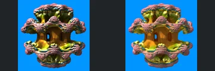
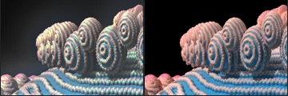
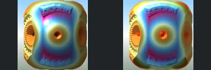
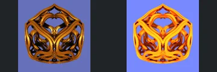

# Reviewed Scenes: Page 23

[Page 1](page-01.md) | [Page 2](page-02.md) | [Page 3](page-03.md) | [Page 4](page-04.md) | [Page 5](page-05.md) | [Page 6](page-06.md) | [Page 7](page-07.md) | [Page 8](page-08.md) | [Page 9](page-09.md) | [Page 10](page-10.md) | [Page 11](page-11.md) | [Page 12](page-12.md) | [Page 13](page-13.md) | [Page 14](page-14.md) | [Page 15](page-15.md) | [Page 16](page-16.md) | [Page 17](page-17.md) | [Page 18](page-18.md) | [Page 19](page-19.md) | [Page 20](page-20.md) | [Page 21](page-21.md) | [Page 22](page-22.md) | [Page 23](page-23.md) | [Page 24](page-24.md) | [Page 25](page-25.md) | [Page 26](page-26.md) | [Page 27](page-27.md) | [Page 28](page-28.md) | [Page 29](page-29.md) | [Page 30](page-30.md) | [Page 31](page-31.md) | [Page 32](page-32.md) | [Page 33](page-33.md) | [Page 34](page-34.md) | [Page 35](page-35.md) | [Page 36](page-36.md) | [Page 37](page-37.md) | [Page 38](page-38.md) | [Page 39](page-39.md) | [Page 40](page-40.md) | [Page 41](page-41.md) | [Page 42](page-42.md) | [Page 43](page-43.md) | [Page 44](page-44.md)

Each thumbnail: native left, FPT authored right. Open a scene for full neutral/beauty comparisons, limitations and capture settings.

## [260: mbulbCpixelInvert](260.md)

accepted-with-limitations | captured-2026-09-12 | 32 SPP

The open-sided central column, broad upper/lower rims and small bumpy lobes align. FPT softens reflections and changes metallic colour, but the central opening and layered geometry remain visible.

## [263: mbulbPow2_v2](263.md)

accepted-with-limitations | captured-2026-09-12 | 32 SPP

The thin red branching assembly, upper open loop and lower pointed cluster align closely. FPT differs in fine sparkle and slightly darkens the material without losing the main open structure.

## [264: mbulbRiemannV2](264.md)

accepted-with-limitations | captured-2026-09-12 | 32 SPP

Repeated red/blue curved panels and central gold inset preserve their close-up arrangement. FPT makes the gold areas more luminous and reflections rougher; main panel boundaries remain readable.

## [265: mbulbSinCos DifsSphGrd3](265.md)

accepted-with-limitations | captured-2026-09-12 | 32 SPP

Layered pink framework, open middle region and repeated small rings retain their shape and position. FPT reduces sharp glints and changes surface roughness while preserving large gaps.

## [266: mbulbTailsV2_TaddSphericalInvert;](266.md)

accepted-with-limitations | captured-2026-09-12 | 32 SPP

The open gold lattice and repeated rectangular/circular cutouts align well. FPT has subdued reflectance, but central and peripheral openings remain clear.

## [267: mbulb_noC_rotateFold](267.md)

accepted-with-limitations | captured-2026-09-12 | 32 SPP

Repeated concentric rounded discs and curved bead rows retain close alignment. FPT is less reflective with a darker environment, but the relief and foreground arrangement remain readable.

## [269: menger - poly fold](269.md)

accepted-with-limitations | captured-2026-09-12 | 32 SPP

The rounded square body, central circular opening and inset upper/lower curved panels align closely. Native small white highlight is absent and roughness differs; the major structure is retained.

## [270: menger - pyramid](270.md)

accepted-with-limitations | captured-2026-09-12 | 32 SPP

Stacked perforated triangular forms and the central open triangle match closely. FPT slightly changes red shading; silhouette, framing and large voids are preserved.

## [272: menger - smoothMod1](272.md)

accepted-with-limitations | captured-2026-09-12 | 32 SPP

Interwoven smooth ribs, upper point and open centre preserve their geometry. FPT changes dark gold to bright orange and alters highlights, while the intertwined layers and gaps remain readable.

## [273: menger addConstCond](273.md)

accepted-with-limitations | captured-2026-09-12 | 32 SPP

Close-up vertical rectangular columns and inset side panels align. FPT adds diffuse noise and softens hard shading, but preserves the corridor gaps and visible panel edges.
