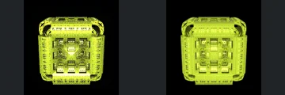
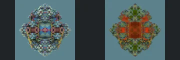
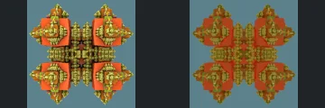

# Reviewed Scenes: Page 24

[Page 1](page-01.md) | [Page 2](page-02.md) | [Page 3](page-03.md) | [Page 4](page-04.md) | [Page 5](page-05.md) | [Page 6](page-06.md) | [Page 7](page-07.md) | [Page 8](page-08.md) | [Page 9](page-09.md) | [Page 10](page-10.md) | [Page 11](page-11.md) | [Page 12](page-12.md) | [Page 13](page-13.md) | [Page 14](page-14.md) | [Page 15](page-15.md) | [Page 16](page-16.md) | [Page 17](page-17.md) | [Page 18](page-18.md) | [Page 19](page-19.md) | [Page 20](page-20.md) | [Page 21](page-21.md) | [Page 22](page-22.md) | [Page 23](page-23.md) | [Page 24](page-24.md) | [Page 25](page-25.md) | [Page 26](page-26.md) | [Page 27](page-27.md) | [Page 28](page-28.md) | [Page 29](page-29.md) | [Page 30](page-30.md) | [Page 31](page-31.md) | [Page 32](page-32.md) | [Page 33](page-33.md) | [Page 34](page-34.md) | [Page 35](page-35.md) | [Page 36](page-36.md) | [Page 37](page-37.md) | [Page 38](page-38.md) | [Page 39](page-39.md) | [Page 40](page-40.md) | [Page 41](page-41.md) | [Page 42](page-42.md) | [Page 43](page-43.md)

Each thumbnail: native left, FPT authored right. Open a scene for full neutral/beauty comparisons, limitations and capture settings.

## [275: menger3 dotFold](275.md)

accepted-with-limitations | captured-2026-09-12 | 32 SPP

Perforated red cube silhouette, large cross-shaped recesses and smaller square holes align. FPT changes internal brightness and surface noise without obvious loss of the major cutouts.

## [276: menger3_difsSupershape](276.md)

accepted-with-limitations | captured-2026-09-12 | 32 SPP

The yellow rectangular assembly, rounded upper corners and central layered inset retain close framing. FPT is more diffuse and less sparkling, with the main panel relief still legible.

## [277: mengerV6](277.md)

accepted-with-limitations | captured-2026-09-12 | 32 SPP

The blocky open arch, separated lower feet and repeated small perforations retain their geometry. FPT changes blue/gold reflectance and softens highlights while preserving the central void.

## [278: mengerV7 aab1](278.md)

accepted-with-limitations | captured-2026-09-12 | 32 SPP

The diamond-shaped assembly and four decorated arms retain their outline and placement. Native reflective blue patterned panels become flatter orange surfaces; acceptance covers the readable geometry, not panel material or reflective pattern parity.

## [279: mengerV7 dab6](279.md)

accepted-with-limitations | captured-2026-09-12 | 32 SPP

Four orange cubical lobes, gold inset ornaments and narrow central connections align. FPT has flatter, dimmer gold reflectance, but the lobes and internal arrangement remain distinguishable.

## [280: msltoe_ToroidalBulb_V2-001](280.md)

accepted-with-limitations | captured-2026-09-12 | 32 SPP

Rounded pink body, radial upper fan and repeated curved lower details retain close framing and shape. FPT smooths specular glitter and changes colour contrast without obscuring the main relief.

## [281: msltoe_ToroidalBulb_V2](281.md)

accepted-with-limitations | captured-2026-09-12 | 32 SPP

Stacked pink bands, central circular inset and symmetric side panels retain their form. FPT is more saturated and brightens the centre, but the layered outlines remain clear.

## [282: msltoe_sym3_mod4 aa](282.md)

accepted-with-limitations | captured-2026-09-12 | 32 SPP

Central vertical bead strip and paired blue/gold side lobes align closely. FPT makes the materials more diffuse, preserving the silhouette and individual rounded features.

## [283: msltoe_sym3_mod4](283.md)

accepted-with-limitations | captured-2026-09-12 | 32 SPP

Open circular rim, suspended upper cap, central spindle and dangling lower rings match. Reflective gold becomes warmer and less glossy, with all major voids and thin connections retained.

## [284: msltoe_sym3_mod5 aa](284.md)

accepted-with-limitations | captured-2026-09-12 | 32 SPP

The pointed central body, paired pink circular details and separated gold side bands retain their placement. FPT softens glossy highlights while preserving the characteristic gaps and outline.
