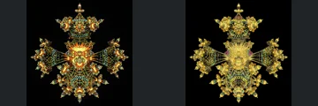
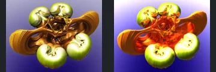
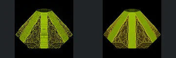
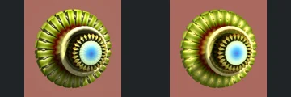
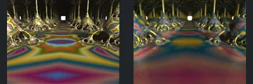

# Reviewed Scenes: Page 25

[Page 1](page-01.md) | [Page 2](page-02.md) | [Page 3](page-03.md) | [Page 4](page-04.md) | [Page 5](page-05.md) | [Page 6](page-06.md) | [Page 7](page-07.md) | [Page 8](page-08.md) | [Page 9](page-09.md) | [Page 10](page-10.md) | [Page 11](page-11.md) | [Page 12](page-12.md) | [Page 13](page-13.md) | [Page 14](page-14.md) | [Page 15](page-15.md) | [Page 16](page-16.md) | [Page 17](page-17.md) | [Page 18](page-18.md) | [Page 19](page-19.md) | [Page 20](page-20.md) | [Page 21](page-21.md) | [Page 22](page-22.md) | [Page 23](page-23.md) | [Page 24](page-24.md) | [Page 25](page-25.md) | [Page 26](page-26.md) | [Page 27](page-27.md) | [Page 28](page-28.md) | [Page 29](page-29.md) | [Page 30](page-30.md) | [Page 31](page-31.md) | [Page 32](page-32.md) | [Page 33](page-33.md) | [Page 34](page-34.md) | [Page 35](page-35.md) | [Page 36](page-36.md) | [Page 37](page-37.md) | [Page 38](page-38.md) | [Page 39](page-39.md) | [Page 40](page-40.md) | [Page 41](page-41.md) | [Page 42](page-42.md) | [Page 43](page-43.md)

Each thumbnail: native left, FPT authored right. Open a scene for full neutral/beauty comparisons, limitations and capture settings.

## [286: msltoe_sym3_mod6 mbulb](286.md)

accepted-with-limitations | captured-2026-09-12 | 32 SPP

Repeated colourful horizontal tiers, dark middle openings and upper/lower domes retain their arrangement. FPT strengthens bright highlights, but major tiers and openings remain distinguishable; highlight-region detail is not certified.

## [287: msltoe_sym4_mod1_sphGrd va](287.md)

accepted-with-limitations | captured-2026-09-12 | 32 SPP

The four-way gold lattice, delicate connecting strings and small terminal ornaments align. FPT alters surface sparkle and brightens the centre; the main open wire structure remains visible.

## [288: msltoe_sym4_mod1_sphGrd](288.md)

accepted-with-limitations | captured-2026-09-12 | 32 SPP

Decorated multi-lobed body, raised upper cap and round projecting lower forms align closely. FPT replaces noisy metallic sparkle with smoother patterned shading without obvious structural loss.

## [289: newtonPow3_mbulbTails](289.md)

accepted-with-limitations | captured-2026-09-12 | 32 SPP

Four rounded pale lobes, broad orange side loops and angular central opening retain their arrangement. FPT is brighter and redder in the centre, but the major surfaces and open gaps remain distinguishable.

## [290: platonicSolid_menger_hybrid](290.md)

accepted-with-limitations | captured-2026-09-12 | 32 SPP

The rounded triangular frame, central opening and small perforated face panels align closely. Material roughness differs modestly without obvious loss of the major holes.

## [291: poly fold atan mbulb kali](291.md)

accepted-with-limitations | captured-2026-09-12 | 32 SPP

Concentric rounded side discs and ribbed upper/lower surfaces match closely. FPT reduces native metallic highlights but preserves the depth-defined ribs and central circular recess.

## [292: polyfold kochIFS](292.md)

accepted-with-limitations | captured-2026-09-12 | 32 SPP

Truncated pyramidal silhouette and triangular side subdivisions align. FPT replaces native fine horizontal striping on broad bands with smoother shading; accepted for the broad structure, not exact band texture or subpixel relief.

## [293: polyfold polyhedra hexprism](293.md)

accepted-with-limitations | captured-2026-09-12 | 32 SPP

The tilted radial wheel, outer wedges, circular rim and blue centre match in framing and shape. Reflective intensity differs slightly while the separate wedge boundaries remain clear.

## [294: polyfold sierpinski gear](294.md)

accepted-with-limitations | captured-2026-09-12 | 32 SPP

Symmetric curved blades, inner pointed forms and lower suspended pieces retain close geometry and framing. FPT modestly changes the gold highlight response without hiding the open structure.

## [296: pseudo kleinian color tiling](296.md)

accepted-with-limitations | captured-2026-09-12 | 32 SPP

Symmetric corridor, repeated rounded column bases and distant bright square retain their framing. FPT softens the coloured floor pattern and metallic reflections, but the architecture and central opening remain readable.
