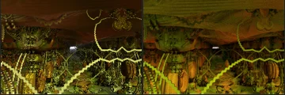
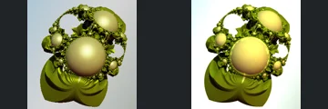
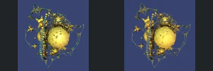
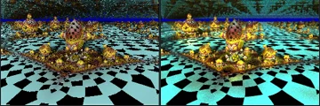
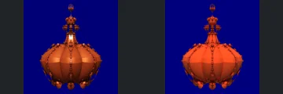
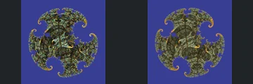

# Reviewed Scenes: Page 26

[Page 1](page-01.md) | [Page 2](page-02.md) | [Page 3](page-03.md) | [Page 4](page-04.md) | [Page 5](page-05.md) | [Page 6](page-06.md) | [Page 7](page-07.md) | [Page 8](page-08.md) | [Page 9](page-09.md) | [Page 10](page-10.md) | [Page 11](page-11.md) | [Page 12](page-12.md) | [Page 13](page-13.md) | [Page 14](page-14.md) | [Page 15](page-15.md) | [Page 16](page-16.md) | [Page 17](page-17.md) | [Page 18](page-18.md) | [Page 19](page-19.md) | [Page 20](page-20.md) | [Page 21](page-21.md) | [Page 22](page-22.md) | [Page 23](page-23.md) | [Page 24](page-24.md) | [Page 25](page-25.md) | [Page 26](page-26.md) | [Page 27](page-27.md) | [Page 28](page-28.md) | [Page 29](page-29.md) | [Page 30](page-30.md) | [Page 31](page-31.md) | [Page 32](page-32.md) | [Page 33](page-33.md) | [Page 34](page-34.md) | [Page 35](page-35.md) | [Page 36](page-36.md) | [Page 37](page-37.md) | [Page 38](page-38.md)

Each thumbnail: native left, FPT authored right. Open a scene for full neutral/beauty comparisons, limitations and capture settings.

## [297: pseudo kleinian maxiter10](297.md)

accepted-with-limitations | captured-2026-09-12 | 32 SPP

Stacked decorated rounded forms and their blue/gold radial pattern align. Native pale atmospheric wash becomes darker, sharper shading; accepted for the visible central structure, not fog or environmental parity.

## [299: pseudoKleinianMod3_DIFS](299.md)

accepted-with-limitations | captured-2026-09-12 | 32 SPP

Corridor ceiling, stepped luminous curved borders and distant central opening align. FPT changes fine metallic sparkle and diffuse shading, but retains the major architectural outlines.

## [302: pseudoKleinianMod3_torusTwist](302.md)

accepted-with-limitations | captured-2026-09-12 | 32 SPP

Large central sphere, upper loop and layered curved base retain their geometry. FPT brightens the backdrop and gold highlights, while the silhouette and individual surfaces remain readable.

## [303: pseudoKleinianMod4 invert rec](303.md)

accepted-with-limitations | captured-2026-09-12 | 32 SPP

Asymmetric gold spherical body, upper curved loops and thin surrounding strings align closely. FPT softens sparkle and some fine edges at screening resolution without an obvious major structural omission.

## [304: pseudoKleinianMod4 invert](304.md)

accepted-with-limitations | captured-2026-09-12 | 32 SPP

Paired coloured circular panels, large top and bottom holes and central bead chain match closely. FPT smooths native sparkle while preserving the rainbow pattern and broad openings.

## [305: pseudoKleinianMod4 invertSp](305.md)

accepted-with-limitations | captured-2026-09-12 | 32 SPP

Twin pointed upper forms and rainbow arch arms retain their framing and open centre. Surface bands and stepped inner edges differ in shading and contrast; the principal shape is preserved.

## [306: pseudoKleinianMod4 rec](306.md)

accepted-with-limitations | captured-2026-09-12 | 32 SPP

Central perforated upright body, surrounding small spheres and cyan checker floor retain their arrangement. FPT increases floor reflections and gold illumination but preserves the principal geometry and framing.

## [308: pseudoKleinianMod5 inv](308.md)

accepted-with-limitations | captured-2026-09-12 | 32 SPP

Rounded orange segmented body, delicate upper crown and lower beads align closely. FPT is more matte and saturated but preserves the silhouette, divisions and open upper details.

## [311: pseudoKleinian_trig aa2](311.md)

accepted-with-limitations | captured-2026-09-12 | 32 SPP

Three-lobed spiral silhouette and curled terminals match closely. FPT replaces noisy gold sparkle with darker textured shading, but the separate lobes, open gaps and main surface relief remain readable.

## [313: sinCosMax_sierp](313.md)

accepted-with-limitations | captured-2026-09-12 | 32 SPP

Long columned corridor, perforated triangular ceiling and repeated floor forms retain their framing. FPT brightens red surfaces and changes metallic response without an obvious large structural omission.
