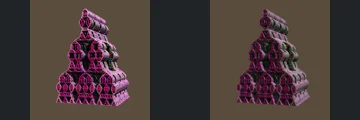
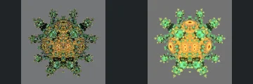
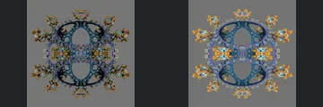
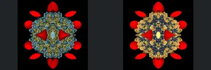

# Reviewed Scenes: Page 27

[Page 1](page-01.md) | [Page 2](page-02.md) | [Page 3](page-03.md) | [Page 4](page-04.md) | [Page 5](page-05.md) | [Page 6](page-06.md) | [Page 7](page-07.md) | [Page 8](page-08.md) | [Page 9](page-09.md) | [Page 10](page-10.md) | [Page 11](page-11.md) | [Page 12](page-12.md) | [Page 13](page-13.md) | [Page 14](page-14.md) | [Page 15](page-15.md) | [Page 16](page-16.md) | [Page 17](page-17.md) | [Page 18](page-18.md) | [Page 19](page-19.md) | [Page 20](page-20.md) | [Page 21](page-21.md) | [Page 22](page-22.md) | [Page 23](page-23.md) | [Page 24](page-24.md) | [Page 25](page-25.md) | [Page 26](page-26.md) | [Page 27](page-27.md) | [Page 28](page-28.md) | [Page 29](page-29.md) | [Page 30](page-30.md) | [Page 31](page-31.md) | [Page 32](page-32.md) | [Page 33](page-33.md) | [Page 34](page-34.md) | [Page 35](page-35.md) | [Page 36](page-36.md) | [Page 37](page-37.md) | [Page 38](page-38.md) | [Page 39](page-39.md) | [Page 40](page-40.md) | [Page 41](page-41.md) | [Page 42](page-42.md) | [Page 43](page-43.md) | [Page 44](page-44.md)

Each thumbnail: native left, FPT authored right. Open a scene for full neutral/beauty comparisons, limitations and capture settings.

## [313: sinCosMax_sierp](313.md)

accepted-with-limitations | captured-2026-09-12 | 32 SPP

Long columned corridor, perforated triangular ceiling and repeated floor forms retain their framing. FPT brightens red surfaces and changes metallic response without an obvious large structural omission.

## [314: sinCos_abox11](314.md)

accepted-with-limitations | captured-2026-09-12 | 32 SPP

Curved decorated walls and foreground toothed rims align closely. FPT strengthens yellow illumination and softens reflections, but the major cavities and wall outlines remain readable.

## [315: sinCos_pseudoKl](315.md)

accepted-with-limitations | captured-2026-09-12 | 32 SPP

Twisting ribbons, central convergence and rainbow side panels retain their positions. FPT is noisier and changes reflectance, with the principal open passages and curved surfaces preserved.

## [316: sinCos_xkifs](316.md)

accepted-with-limitations | captured-2026-09-12 | 32 SPP

Stepped triangular tower and repeated open circular tiers align. FPT dims the pink material and glints, but the silhouette and repeated voids remain clear.

## [317: sphereCluster 2p55 sym](317.md)

accepted-with-limitations | captured-2026-09-12 | 32 SPP

Radial branching sphere and its rounded central forms match in silhouette. FPT is substantially brighter and greener, but the perforations and major branches remain legible; subpixel sparkle is not certified.

## [318: sphereCluster 3p7](318.md)

accepted-with-limitations | captured-2026-09-12 | 32 SPP

Open symmetric blue frame, paired large holes and small outer ornaments align. Brighter gold edges and reduced sparkle change appearance without hiding the primary openings.

## [319: sphereCluster clip](319.md)

accepted-with-limitations | captured-2026-09-12 | 32 SPP

Repeated orange cut discs and central gold cluster retain their arrangement. FPT strengthens yellow highlights, but the disc spacing and dark centre details remain readable.

## [320: sphereClusterV2 baa1](320.md)

accepted-with-limitations | captured-2026-09-12 | 32 SPP

Perforated round body, central hole and outer terminals align. FPT fills out the bright yellow shading and changes fine hole contrast; acceptance covers the visible larger openings, not subpixel pore fidelity.

## [321: sphereClusterV2 baa2](321.md)

accepted-with-limitations | captured-2026-09-12 | 32 SPP

Pointed radial silhouette and repeated rounded terminals retain their positions. FPT changes sparse native sparkle into more solid blue/pink shading; the main forms remain readable, while fine transparency-like gaps are not certified at this sampling.

## [324: sphereClusterV3 aaa2](324.md)

accepted-with-limitations | captured-2026-09-12 | 32 SPP

Red outer petals and opposing central cones align. FPT changes the blue/gold inner cluster and reflection pattern, but the radial layering and principal forms remain distinguishable.
