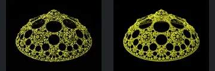
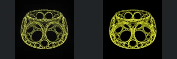
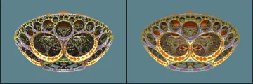
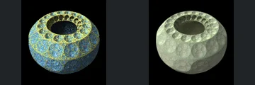
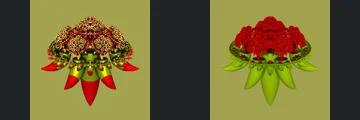
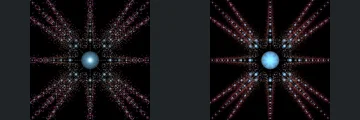
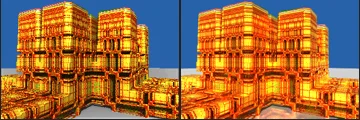
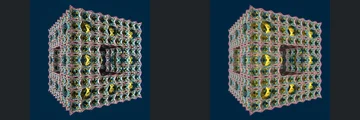
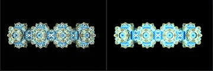

# Reviewed Scenes: Page 28

[Page 1](page-01.md) | [Page 2](page-02.md) | [Page 3](page-03.md) | [Page 4](page-04.md) | [Page 5](page-05.md) | [Page 6](page-06.md) | [Page 7](page-07.md) | [Page 8](page-08.md) | [Page 9](page-09.md) | [Page 10](page-10.md) | [Page 11](page-11.md) | [Page 12](page-12.md) | [Page 13](page-13.md) | [Page 14](page-14.md) | [Page 15](page-15.md) | [Page 16](page-16.md) | [Page 17](page-17.md) | [Page 18](page-18.md) | [Page 19](page-19.md) | [Page 20](page-20.md) | [Page 21](page-21.md) | [Page 22](page-22.md) | [Page 23](page-23.md) | [Page 24](page-24.md) | [Page 25](page-25.md) | [Page 26](page-26.md) | [Page 27](page-27.md) | [Page 28](page-28.md) | [Page 29](page-29.md) | [Page 30](page-30.md) | [Page 31](page-31.md) | [Page 32](page-32.md) | [Page 33](page-33.md) | [Page 34](page-34.md) | [Page 35](page-35.md) | [Page 36](page-36.md) | [Page 37](page-37.md) | [Page 38](page-38.md) | [Page 39](page-39.md) | [Page 40](page-40.md) | [Page 41](page-41.md) | [Page 42](page-42.md) | [Page 43](page-43.md)

Each thumbnail: native left, FPT authored right. Open a scene for full neutral/beauty comparisons, limitations and capture settings.

## [327: sphere_invert_pseudoKleinian](327.md)

accepted-with-limitations | captured-2026-09-12 | 32 SPP

Four blue framed lobes, central ornament and cardinal pointed terminals align. FPT adds a stronger red background glow and softer blue shading, while the open frame geometry remains clear.

## [328: spheretreeV4 aaa1](328.md)

accepted-with-limitations | captured-2026-09-12 | 32 SPP

Rounded triangular wire shell and its large circular holes match closely. FPT fills out thin yellow lines and modifies small-pore contrast; principal openings and silhouette are retained.

## [329: spheretreeV4 aaa2](329.md)

accepted-with-limitations | captured-2026-09-12 | 32 SPP

Open rounded cubical cage and repeated large circular apertures align closely. Native sparkle becomes more continuous yellow linework; thin-line brightness is not exact parity.

## [330: spheretreeV4 aaa3](330.md)

accepted-with-limitations | captured-2026-09-12 | 32 SPP

Shallow bowl outline, central ring and repeated orange circular frames retain their arrangement. FPT makes interior reflected detail more visible and less sparkling, with the main rim geometry unchanged.

## [331: spheretreeV5 aaa5](331.md)

accepted-with-limitations | captured-2026-09-12 | 32 SPP

Rounded body, large top opening and surrounding repeated circular dimples align. Blue/gold sparkle becomes softer translucent-looking pale shading; broad geometry is readable, but dielectric/material appearance is not certified.

## [332: spheretreeV5 fjb1](332.md)

accepted-with-limitations | captured-2026-09-12 | 32 SPP

Layered upper crown and hanging curved lower spikes retain their arrangement. FPT changes red/gold reflectance to red/green and flattens the upper shading, but the main cutouts and separated lower forms remain distinguishable.

## [335: sym4_mod1_boxTilingV3 aa2](335.md)

accepted-with-limitations | captured-2026-09-12 | 32 SPP

Central blue sphere, radial bead lines and smaller branching strings align closely. FPT has modestly different sparkle and edge intensity; the large open structure remains intact.

## [336: transfAbsRecFoldXY - sierpinski](336.md)

accepted-with-limitations | captured-2026-09-12 | 32 SPP

Stepped architectural towers and repeated vertical insets retain their framing. Both versions are brightly orange-lit; FPT changes floor reflection and fine contrast, but major architectural relief remains readable.

## [337: transfAddSphericalInvert menger](337.md)

accepted-with-limitations | captured-2026-09-12 | 32 SPP

Perforated rectangular body, large inset opening and repeated rounded cells align. Reflective sparkle becomes smoother multicoloured edges, without obvious loss of the major cavity.

## [338: transfBoxTilingV3_mandelnest](338.md)

accepted-with-limitations | captured-2026-09-12 | 32 SPP

Four ornate repeated bodies retain their horizontal spacing and outline. FPT is brighter and more cyan; acceptance covers the repeated large forms, not highlight-region microdetail at this small framing.
