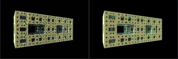
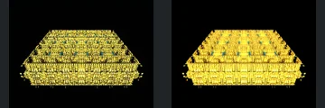
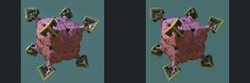

# Reviewed Scenes: Page 29

[Page 1](page-01.md) | [Page 2](page-02.md) | [Page 3](page-03.md) | [Page 4](page-04.md) | [Page 5](page-05.md) | [Page 6](page-06.md) | [Page 7](page-07.md) | [Page 8](page-08.md) | [Page 9](page-09.md) | [Page 10](page-10.md) | [Page 11](page-11.md) | [Page 12](page-12.md) | [Page 13](page-13.md) | [Page 14](page-14.md) | [Page 15](page-15.md) | [Page 16](page-16.md) | [Page 17](page-17.md) | [Page 18](page-18.md) | [Page 19](page-19.md) | [Page 20](page-20.md) | [Page 21](page-21.md) | [Page 22](page-22.md) | [Page 23](page-23.md) | [Page 24](page-24.md) | [Page 25](page-25.md) | [Page 26](page-26.md) | [Page 27](page-27.md) | [Page 28](page-28.md) | [Page 29](page-29.md) | [Page 30](page-30.md) | [Page 31](page-31.md) | [Page 32](page-32.md) | [Page 33](page-33.md) | [Page 34](page-34.md) | [Page 35](page-35.md) | [Page 36](page-36.md) | [Page 37](page-37.md) | [Page 38](page-38.md) | [Page 39](page-39.md) | [Page 40](page-40.md) | [Page 41](page-41.md) | [Page 42](page-42.md) | [Page 43](page-43.md)

Each thumbnail: native left, FPT authored right. Open a scene for full neutral/beauty comparisons, limitations and capture settings.

## [339: transfBoxTilingV3_mengerPyramid](339.md)

accepted-with-limitations | captured-2026-09-12 | 32 SPP

Receding perforated rectangular frame, large central opening and nested square holes align closely. FPT changes edge brightness and fine reflection while preserving the principal voids.

## [340: transfDiagonalFold - asurf](340.md)

accepted-with-limitations | captured-2026-09-12 | 32 SPP

Slanted rainbow cavity, rounded rim and recessed circular features retain their geometry and framing. FPT adds stronger internal illumination and noise, with the larger recess boundaries still clear.

## [341: transfDiagonalFold - pseudoKleinian](341.md)

accepted-with-limitations | captured-2026-09-12 | 32 SPP

Gold foreground curves, central narrow opening and repeated rear column details align. FPT reduces native blue haze and alters reflections, but foreground and background structure remain readable; atmosphere is not matched.

## [342: transfMengerFoldV2 difsBox](342.md)

accepted-with-limitations | captured-2026-09-12 | 32 SPP

Receding stepped rectangular stack and repeated small blocks align. FPT increases gold brightness and changes microcontrast; acceptance is limited to the visible stepped structure rather than highlight-region fine detail.

## [343: transfMengerFoldV2 difsDonut](343.md)

accepted-with-limitations | captured-2026-09-12 | 32 SPP

Central blue pillar, paired curved side bands and ornate outer branches retain their arrangement. FPT is more matte and less sparkling, but the main blue surfaces and cutouts remain readable.

## [344: transfRotationChebychev - torusGrid](344.md)

accepted-with-limitations | captured-2026-09-12 | 32 SPP

White square lattice and concentric layers of oval holes align closely, including the small central square opening. Minor edge shading changes do not obscure the pattern.

## [345: transfSinCos_mengOcto](345.md)

accepted-with-limitations | captured-2026-09-12 | 32 SPP

White twisted perforated surface retains its pointed silhouette, curved folds and major holes. Minor edge shading and diffuse noise differ.

## [347: transfSinYm3d_menger3_001](347.md)

accepted-with-limitations | captured-2026-09-12 | 32 SPP

Stacked yellow rectangular structures, narrow gaps and blue inset windows retain close alignment. FPT adds diffuse noise and stronger light on distant blocks while keeping the architectural relief readable.

## [349: transfSphereInvV3_menger](349.md)

accepted-with-limitations | captured-2026-09-12 | 32 SPP

Cross-shaped coloured petals, smaller diagonal perforated leaves and central ornament align. FPT reduces reflective sparkle and changes saturation while retaining the main open pattern.

## [350: transfSphericalFoldSmooth Octo Menger](350.md)

accepted-with-limitations | captured-2026-09-12 | 32 SPP

Rough decorated cube and projecting square-ended corner forms align closely. FPT changes fine pink reflectance and brightness, with the overall volume and attached shapes preserved.
