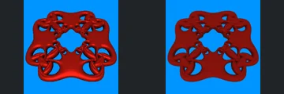
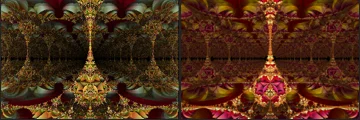
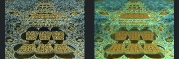
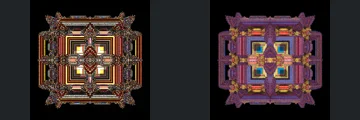
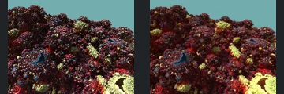

# Reviewed Scenes: Page 30

[Page 1](page-01.md) | [Page 2](page-02.md) | [Page 3](page-03.md) | [Page 4](page-04.md) | [Page 5](page-05.md) | [Page 6](page-06.md) | [Page 7](page-07.md) | [Page 8](page-08.md) | [Page 9](page-09.md) | [Page 10](page-10.md) | [Page 11](page-11.md) | [Page 12](page-12.md) | [Page 13](page-13.md) | [Page 14](page-14.md) | [Page 15](page-15.md) | [Page 16](page-16.md) | [Page 17](page-17.md) | [Page 18](page-18.md) | [Page 19](page-19.md) | [Page 20](page-20.md) | [Page 21](page-21.md) | [Page 22](page-22.md) | [Page 23](page-23.md) | [Page 24](page-24.md) | [Page 25](page-25.md) | [Page 26](page-26.md) | [Page 27](page-27.md) | [Page 28](page-28.md) | [Page 29](page-29.md) | [Page 30](page-30.md) | [Page 31](page-31.md) | [Page 32](page-32.md) | [Page 33](page-33.md) | [Page 34](page-34.md) | [Page 35](page-35.md) | [Page 36](page-36.md) | [Page 37](page-37.md) | [Page 38](page-38.md) | [Page 39](page-39.md) | [Page 40](page-40.md) | [Page 41](page-41.md) | [Page 42](page-42.md) | [Page 43](page-43.md)

Each thumbnail: native left, FPT authored right. Open a scene for full neutral/beauty comparisons, limitations and capture settings.

## [351: transf_Zvec_axis_swap](351.md)

accepted-with-limitations | captured-2026-09-12 | 32 SPP

Angled triangular cutout frame and adjoining perforated walls align. FPT shifts gold lighting toward orange and reveals different reflections, but the main cavities and framing remain readable.

## [352: transf_absAddConstantV2_mbulb](352.md)

accepted-with-limitations | captured-2026-09-12 | 32 SPP

Symmetric stacked blue/gold forms and repeated square gaps match closely. FPT is more matte and resolves less sparkle; larger openings and silhouette are retained.

## [355: transf_cayley2_v1 Torus](355.md)

accepted-with-limitations | captured-2026-09-12 | 32 SPP

Red four-way frame, large central hole and intertwined corner loops align closely. FPT is matte rather than glossy, but surface separation and major openings remain visible.

## [356: transf_cayley2_v1 sphereGrid](356.md)

accepted-with-limitations | captured-2026-09-12 | 32 SPP

Central orange interlocking rings and four broad outward surfaces preserve their geometry. FPT removes strong specular highlights and alters shadow contrast; the ring arrangement remains readable.

## [358: transf_juliaBox](358.md)

accepted-with-limitations | captured-2026-09-12 | 32 SPP

Symmetric ornate corridor and narrow central vertical ornament retain their arrangement. FPT changes green/gold reflections to red/gold and strengthens lower illumination without an obvious large structural omission.

## [359: transf_juliaBoxV2](359.md)

accepted-with-limitations | captured-2026-09-12 | 32 SPP

Stacked cut rounded forms and distant central arrangement align. FPT brightens the cyan background structure and changes sparkle; the foreground separations remain clear despite noise.

## [360: transf_mandalay_foldv1_asurf](360.md)

accepted-with-limitations | captured-2026-09-12 | 32 SPP

Central tiered pedestal, repeated surrounding bases and rectangular floor bands align closely. FPT softens metallic highlights but retains the stepped geometry and central relief.

## [361: transf_mandalay_foldv1_sphereClusterV2](361.md)

accepted-with-limitations | captured-2026-09-12 | 32 SPP

Square nested frames, four centre openings and decorated cardinal forms align. FPT replaces bright reflective banding with a darker blue/red palette; main frame layers remain visible, but reflected-band material parity is not established.

## [362: transf_mandalay_foldv2_asurf](362.md)

accepted-with-limitations | captured-2026-09-12 | 32 SPP

Repeated gold pedestals and stepped rectangular corridor surfaces retain their placement. FPT is softer and less reflective, but the foreground and rear structural layers remain readable.

## [363: transf_sin_add_asurf](363.md)

accepted-with-limitations | captured-2026-09-12 | 32 SPP

Rough rounded landscape, isolated bright patches and skyline align closely. FPT changes sparkle and small-scale shading but preserves the visible foreground masses and openings.
