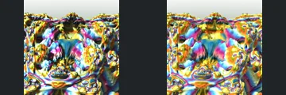
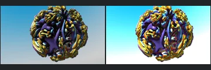
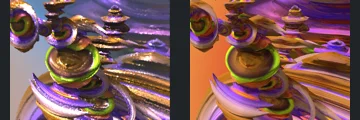

# Reviewed Scenes: Page 30

[Page 1](page-01.md) | [Page 2](page-02.md) | [Page 3](page-03.md) | [Page 4](page-04.md) | [Page 5](page-05.md) | [Page 6](page-06.md) | [Page 7](page-07.md) | [Page 8](page-08.md) | [Page 9](page-09.md) | [Page 10](page-10.md) | [Page 11](page-11.md) | [Page 12](page-12.md) | [Page 13](page-13.md) | [Page 14](page-14.md) | [Page 15](page-15.md) | [Page 16](page-16.md) | [Page 17](page-17.md) | [Page 18](page-18.md) | [Page 19](page-19.md) | [Page 20](page-20.md) | [Page 21](page-21.md) | [Page 22](page-22.md) | [Page 23](page-23.md) | [Page 24](page-24.md) | [Page 25](page-25.md) | [Page 26](page-26.md) | [Page 27](page-27.md) | [Page 28](page-28.md) | [Page 29](page-29.md) | [Page 30](page-30.md) | [Page 31](page-31.md)

Each thumbnail: native left, FPT authored right. Open a scene for full neutral/beauty comparisons, limitations and capture settings.

## [708: msltoesym2_mod_002](708.md)

accepted-with-limitations | captured-2026-09-12 | 32 SPP

The large central circular opening, crossing diagonal foreground bar and clustered surrounding forms align broadly. FPT changes the red/orange reflections and sharpens details blurred in native, but preserves readable major structure. Fine reflection and depth-of-field parity are not certified.

## [709: msltoesym3_mod_001](709.md)

accepted-with-limitations | captured-2026-09-12 | 32 SPP

The upper angular layered form, lower diamond-like curved body and left sweeping background align. FPT replaces the native gold/brown environment response with strong rainbow reflections, but the principal geometry remains legible. Palette, reflective environment and fine optical parity are not certified.

## [711: nebula 002](711.md)

accepted-with-limitations | captured-2026-09-12 | 32 SPP

The symmetric rounded landscape, central recessed form and foreground lobes align. Both views are strongly reflective and colourful; FPT redistributes highlights but retains the major geometry and authored crop. Exact reflection patterns are not certified.

## [713: nebula 004](713.md)

accepted-with-limitations | captured-2026-09-12 | 32 SPP

The decorated rounded body, central vertical divisions and clustered gold forms align closely. FPT changes the blue background gradient and intensifies reflections while retaining the main surface structure and camera framing.

## [726: quaternion_3DE_001](726.md)

accepted-with-limitations | captured-2026-09-12 | 32 SPP

The stacked rounded forms, large foreground bowl and layered crossing bands align. FPT removes native reflective sparkle and changes the background to orange, but the main silhouettes, overlaps and surface structure remain readable. Environment and exact reflection patterns are not certified.

## [727: quick-dudley_001](727.md)

accepted-with-limitations | captured-2026-09-12 | 32 SPP

The sweeping layered foreground, central recessed form and upper-left vertical structure align. FPT changes reflective colour toward brighter orange and cyan while retaining the principal contours, openings and authored crop. Exact reflective transport is not certified.

## [728: quick-dudley_mod_001](728.md)

accepted-with-limitations | captured-2026-09-12 | 32 SPP

The layered crossing foreground band, curved upper forms and right-hand folded structure align. FPT changes the native pink metallic reflections to darker gold/brown and sharper background detail, but retains the main geometry and framing. Fine optical transport is not certified.

## [733: sierpinski 3D 002](733.md)

accepted-with-limitations | captured-2026-09-12 | 32 SPP

The diagonal layered lattice and large curved upper-right band retain their framing and visible openings. Native blue atmospheric softness becomes a sharp multicoloured high-contrast lattice; broad structure remains visible, but haze, highlights and subpixel strands are not matched.

## [734: smooth_mandelbox_001](734.md)

accepted-with-limitations | captured-2026-09-12 | 32 SPP

The repeated rectangular tunnel, curved side walls and central bright region remain recognisable and aligned. FPT is greener and reveals different reflective inner bands; optical reflection and highlight intensity are not matched, but the main form remains readable.

## [737: stereoscopic 003](737.md)

accepted-with-limitations | captured-2026-09-12 | 32 SPP

The central bead-covered protrusion, left rods and rounded background forms remain recognisable. Native red/cyan stereo is not reproduced and FPT reflections differ; acceptance is for broad monocular structure and readable illumination, not stereo or exact optical parity.
